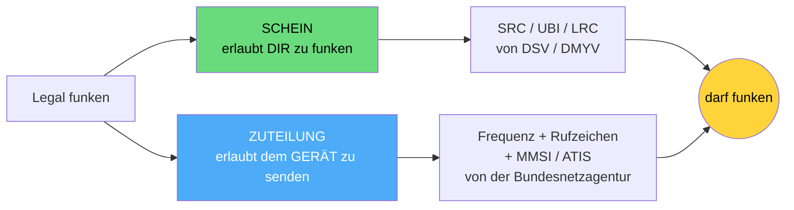
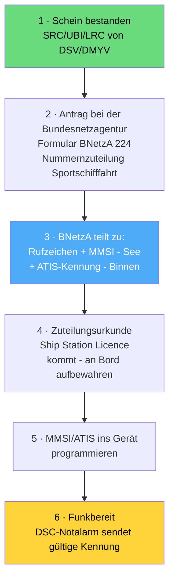

## Rechtliche Grundlagen (Pflicht, Behörden, Zuständigkeiten)

> [!info]- Teil des [[00 Funkkurs SRC & UBI – Online Lernunterlagen für Funkzeugnis|Funkzeugnis-Kurs SRC & UBI]] · Modul 1 · Grundlagen & Recht

Ob du funken darfst, hängt nicht von der Bootsgröße ab, sondern von ein paar Regeln: wann ein Sprechfunkzeugnis Pflicht ist, welches du brauchst und welche Behörde was zuständig ist. Besonders wichtig ist dabei der oft verwechselte Unterschied zwischen dem Schein (für dich) und der Frequenzzuteilung (für das Gerät).

Es geht um die Frage: Wann brauche ich was, und welche Behörde macht was?

---

### Die Grundregel: Gerät an Bord → Zeugnis Pflicht

Wer eine Seefunk- oder Binnenfunkanlage betreibt, braucht ein gültiges **Sprechfunkzeugnis**. Maßgeblich ist dabei nicht die Bootsgröße, sondern ob eine Funkanlage an Bord ist und betrieben wird. Der Schiffsführer muss Inhaber eines ausreichenden Zeugnisses sein – egal, wer sonst noch an Bord einen Schein hat.

Eine Funkstelle darf grundsätzlich nur bedienen, wer das passende Zeugnis hat. Fehlt es, ist das eine Ordnungswidrigkeit und kann ein Bußgeld nach sich ziehen. Schon das Betriebsbereithalten eines Geräts zählt dabei – selbst reines Zuhören oder Empfangen rechtfertigt den Betrieb nur mit Zeugnis und Frequenzzuteilung.

> [!important] Die Grundregel
> Kein Funk ohne Schein, kein Gerät ohne Zuteilung.

---

### Welches Zeugnis wofür? (rechtlich)
| Zeugnis | Voller Name | Wofür vorgeschrieben |
|---|---|---|
| **SRC** | Beschränkt Gültiges Funkbetriebszeugnis (Short Range Certificate) | UKW-Seefunk mit DSC auf Sportbooten (Seegebiet A1) |
| LRC | Allgemeines Funkbetriebszeugnis (Long Range Certificate) | GMDSS weltweit - zusätzlich Grenzwelle/Kurzwelle/Satellit (MF/HF/Inmarsat) |
| UBI | UKW-Sprechfunkzeugnis für den Binnenschifffahrtsfunk | UKW-Binnenfunk auf Binnenwasserstraßen (mit ATIS) |

Als Faustregel gilt: nur UKW-See → SRC, See plus Langstrecke → LRC, Binnen → UBI. Wer Küste und Fluss fährt, braucht SRC und UBI.

---

### Rechtsgrundlagen (zum Nennen, nicht Auswendiglernen)
- SRC / LRC (See): beruhen auf der Schiffssicherheitsverordnung (SchSV); Durchführung über die *Durchführungsrichtlinien Funkbetriebszeugnisse*.
- UBI (Binnen): Binnenschifffahrt-Sprechfunkverordnung (BinSchSprFunkV); Rahmen zusätzlich RAINWAT (Regionales Abkommen über den Binnenschifffahrtsfunk) – schreibt u. a. ATIS vor.
- Frequenznutzung: Telekommunikationsgesetz (TKG) → Zuteilung durch die BNetzA.

---

### Rufzeichen (Call Sign) – wichtig zu wissen
Das **Rufzeichen** identifiziert die Funkstelle eindeutig im Sprechfunk. Deutsche Seefunkstellen nennen sich mit Schiffsname und Rufzeichen. Je nach Registereintrag gibt es zwei Fälle:

- Kleinfahrzeug / Sportboot (ohne Seeschiffsregister): 2 Buchstaben + 4 Ziffern (sechsstellig). Der 1. Buchstabe ist immer D, der 2. Buchstabe A-R; die 1. Ziffer 2-9, die restlichen 0-9. Beispiel: DA4711 → „Delta Alfa - Four Seven One One". Vergabe durch die Bundesnetzagentur.
- In das Seeschiffsregister eingetragenes Schiff: 4-Buchstaben-Rufzeichen (Unterscheidungssignal), z. B. DDTW. Zuteilung über das Seeschiffsregister des Amtsgerichts.

Die Zuteilung erfolgt durch die Bundesnetzagentur – zusammen mit der Frequenzzuteilung und der MMSI (See) bzw. der ATIS-Kennung (Binnen). Aus dem Rufzeichen leiten sich die anderen Kennungen ab: So steckt das Rufzeichen in der ATIS-Kennung (9 + MID + 2 Ziffern + 4 Ziffern aus dem Rufzeichen, siehe [[09 Funkkurs — UBI Binnenfunk|Funkkurs — UBI Binnenfunk]]).

Wichtig ist die Unterscheidung **MMSI ≠ Rufzeichen**: Das Rufzeichen ist die Sprechfunk-Kennung (Buchstaben und Ziffern), die MMSI die 9-stellige digitale Kennung für DSC/AIS. Beide gehören zur selben Funkstelle.

### Nach dem Schein: Was muss konkret passieren?
Der Schein allein reicht nicht – er erlaubt *dir* zu funken, aber das Gerät braucht noch seine eigene „Zulassung". So läuft es Schritt für Schritt:

1. Persönliches Zeugnis (SRC/UBI/LRC) – von DSV/DMYV. Das hast du nach der Prüfung.
2. Antrag stellen bei der Bundesnetzagentur, Außenstelle Hamburg – Formular „BNetzA 224 – Nummernzuteilung Sportschifffahrt" (seefunk@bnetza.de). Gilt für Erstzuteilung und Änderungen.
3. Die BNetzA teilt zu: Rufzeichen (immer), MMSI (für See/DSC/AIS) und/oder ATIS-Kennung (für Binnen) – nur die tatsächlich benötigten Nummern.
4. Du erhältst die Zuteilungsurkunde (Ship Station Licence) – sie enthält deine MMSI/Rufzeichen und muss an Bord sein.
5. MMSI bzw. ATIS ins Funkgerät programmieren (teils einmalig, je nach Gerät nur durch den Fachhändler).
6. Erst jetzt ist das Funkgerät vollständig betriebsbereit.

Zu den Kosten: Für die Nummernzuteilung fallen Gebühren an, für die Frequenzzuteilung Beiträge. Die Zuteilung gehört zur Funkstelle des Schiffes, nicht zum einzelnen Gerät. Über Bremen Rescue / DGzRS werden Schiffsname und Kennungen zusätzlich für die Sicherheit registriert.

> [!important] Häufigster Praxisfehler
> Schein gemacht, aber MMSI nie beantragt oder nie ins Gerät programmiert → der DSC-Notalarm sendet dann keine gültige Kennung. Das solltest du unbedingt im Hinterkopf behalten.

---

Behörden-Zuständigkeiten und Verordnungen können sich ändern. Vor der Prüfung lohnt sich deshalb ein kurzer Gegencheck gegen bundesnetzagentur.de/seefunk, elwis.de (Sprechfunkzeugnisse) und dmyv.de / dsv.org.

---
**Kurs-Navigation:** [[00 Funkkurs SRC & UBI – Online Lernunterlagen für Funkzeugnis|↑ Kursübersicht]] · [[02 Funkkurs — Wichtige Stellen & Behörden|02 · Wichtige Stellen & Behörden →]]

*Superlink:* [[00 Funkkurs SRC & UBI – Online Lernunterlagen für Funkzeugnis|Funkzeugnis-Kurs SRC & UBI]]

