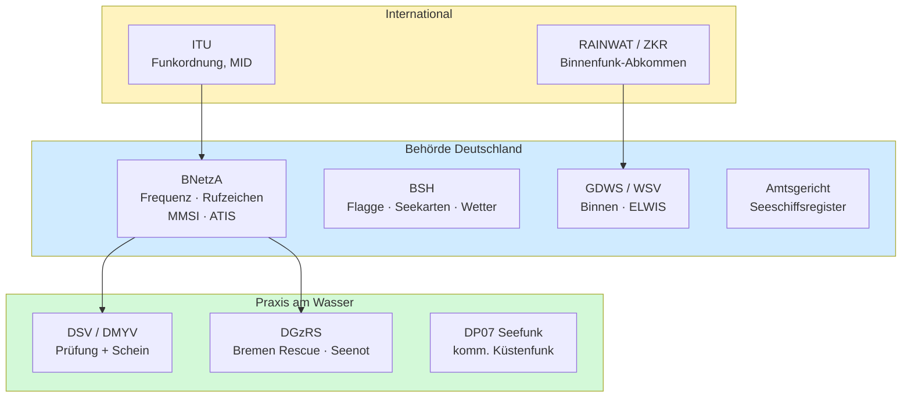

## Wichtige Stellen & Behörden

> [!info]- Teil des [[00 Funkkurs SRC & UBI – Online Lernunterlagen für Funkzeugnis|Funkzeugnis-Kurs SRC & UBI]] · Modul 1 · Grundlagen & Recht

---

### Schnell-Übersicht: Wer macht was?
| Stelle                                        | Kürzel     | Zuständig für (Funk-relevant)                                                                               |
| --------------------------------------------- | ---------- | ----------------------------------------------------------------------------------------------------------- |
| Bundesnetzagentur, Außenstelle Hamburg        | **BNetzA** | Frequenzzuteilung, Rufzeichen, MMSI, ATIS-Kennung, Kontakt: seefunk@bnetza.de; bundesnetzagentur.de/seefunk |
| Deutscher Segler-Verband / Motoryachtverband  | DSV / DMYV | Prüfung & Ausstellung der Funkzeugnisse (SRC, LRC, UBI)                                                     |
| Bundesamt für Seeschifffahrt und Hydrographie | BSH        | Flaggenzertifikat, GMDSS-Hintergrund, Seekarten, Wetter-/Warnfunk                                           |
| Seeschiffsregister (Amtsgericht)              | -          | Registrierung von Seeschiffen (Eigentum, Heimathafen)                                                       |
| DGzRS / Seenotleitung Bremen                  | MRCC       | Seenotrettung (SAR), „Bremen Rescue"                                                                        |
| Generaldirektion Wasserstraßen u. Schifffahrt | GDWS / WSV | Binnenwasserstraßen, Verkehr, Aufsicht; betreibt ELWIS                                                      |
| Internationale Fernmeldeunion                 | ITU        | Weltweite Frequenz-/Funkordnung, vergibt MID-Länderblöcke                                                   |
| RAINWAT-Komitee / ZKR (CCNR)                  | -          | Binnenschifffahrtsfunk-Abkommen, Handbuch Binnenfunk                                                        |
| DP07 Seefunk                                  | -          | Privater kommerzieller UKW-Küstenfunk (Ostsee/Nordsee)                                                      |

> [!important] Kern-Unterscheidung
> Befähigung (Schein) kommt von **DSV / DMYV**, die Erlaubnis fürs Gerät (Frequenz, Rufzeichen, MMSI, ATIS) von der **BNetzA**. Zwei getrennte Stellen, zwei getrennte Dinge.

---

### Die Stellen im Detail

#### Bundesnetzagentur (BNetzA) – die Funk-Behörde
Sie ist die zentrale Stelle für alles, was das Gerät senden darf: Frequenzzuteilung sowie Vergabe von Rufzeichen, MMSI und ATIS-Kennung. Zuständig ist die Außenstelle Hamburg (seefunk@bnetza.de). Sie führt außerdem die Datenbank der Schiffsnamen, Rufzeichen und Kennungen. Der Schein erlaubt *dir* zu funken – die BNetzA-Zuteilung erlaubt *dem Gerät*, auf den Frequenzen zu senden.

#### DSV / DMYV – Prüfung & Zeugnisse
Der Deutsche Segler-Verband (DSV) und der Deutsche Motoryachtverband (DMYV) nehmen im amtlichen Auftrag die Funkprüfungen ab und stellen die Zeugnisse aus (SRC, LRC, UBI). Rechtsbasis ist für See die Schiffssicherheitsverordnung, für Binnen die BinSchSprFunkV (Details: [[01 Funkkurs — Rechtliche Grundlagen|Funkkurs — Rechtliche Grundlagen]]).

#### BSH – Bundesamt für Seeschifffahrt und Hydrographie
Das BSH stellt das **Flaggenzertifikat** für Sportboote aus (Nachweis der deutschen Flagge; gilt 8 Jahre) und ist Fachstelle für GMDSS-Hintergrund und Seefunk-Anfragen von Berufs- und Sportschifffahrt. Es gibt zudem Seekarten und Sicherheitspublikationen heraus – u. a. „Wetter- und Warnfunk" (Sendezeiten/Kanäle der Seewetterberichte) und das Handbuch Nautischer Funkdienst (siehe unten).

Dieses **Handbuch Nautischer Funkdienst (BSH 5000)** ist das amtliche Nachschlagewerk für den Seefunk. Es enthält unter anderem die Frequenzen und Sendezeiten aller Küstenfunkstellen, NAVTEX und Wetterfunk, dazu den Seenot-/SAR-Dienst, die funkärztliche Beratung (MEDICO), MARPOL-Meldungen sowie Frequenztabellen und Kommunikationswege. Für Sportboote gibt es die schlanke Ausgabe „Funkdienst für die Klein- und Sportschifffahrt" (früher *Yacht-Funkdienst*) – genau das Richtige für Skipper:innen. Hier stehen die konkreten Kanäle und Zeiten, die im [[16 Funkkurs — Revierkanäle Ostsee & Mittelmeer|Revierkanäle-Modul]] nur beispielhaft genannt sind.

#### Seeschiffsregister (beim Amtsgericht)
Es gibt kein bundeseinheitliches Register – es wird bei den Amtsgerichten (z. B. Hamburg, Bremen) am Heimathafen geführt. Eine Eintragungspflicht besteht für Seeschiffe ab 15 m Rumpflänge; darunter ist die Eintragung freiwillig. Kleinere Boote nutzen oft das Flaggenzertifikat (BSH) statt eines Registereintrags. Der Bezug zum Funk: Schiffsname und Heimathafen sind die Grundlage für die Rufzeichen- und MMSI-Zuteilung.

#### DGzRS / MRCC Bremen – „Bremen Rescue"
Die Deutsche Gesellschaft zur Rettung Schiffbrüchiger betreibt die Seenotleitung Bremen als **MRCC** (Maritime Rescue Coordination Centre). Die Küstenfunkstelle „Bremen Rescue" hört 24/7 auf UKW Kanal 16, DSC Kanal 70 und Grenzwelle 2187,5 kHz. Erreichbar ist sie über MMSI 00 211 1240, Telefon +49-421-53687-0, Seenot-Mobilfunk 124 124 und mrcc@seenotretter.de. Sie koordiniert alle SAR-Einsätze im deutschen Teil von Nord- und Ostsee (→ [[16 Funkkurs — Revierkanäle Ostsee & Mittelmeer|Funkkurs — Revierkanäle Ostsee & Mittelmeer]]). Ganz nebenbei: Die DGzRS wird aus Spendengeldern finanziert. Du findest in vielen Hafenbüros oder maritimen Einrichtungen die Sammelschiffchen:
![[funkkurs-sammelschiffchen.jpeg|340]]

#### GDWS / WSV – Binnen & Wasserstraßen
Die Wasserstraßen- und Schifffahrtsverwaltung des Bundes (Generaldirektion GDWS) übernimmt hoheitliche Aufgaben auf Bundeswasserstraßen – Verkehr, Genehmigungen, Schifffahrtspolizei und Unterhaltung. Für den Funk relevant sind Rahmen und Aufsicht des Binnenschifffahrtsfunks (Revierzentralen, Schleusenfunk); die ABVT Koblenz ist für Binnen-Funkfragen zuständig. Betrieben wird außerdem **[ELWIS](https://www.elwis.de/DE/Sportschifffahrt/Sportschifffahrt-node.html)**  (Elektronisches Wasserstraßen-Informationssystem), ein Nachschlagewerk für Sprechfunkzeugnisse und Schifffahrtsrecht (und z.B. auch Schleusenbetriebs- und öffnungszeiten).

#### ITU – International Telecommunication Union
Die UN-Sonderorganisation legt die weltweite Funkordnung (Radio Regulations) fest. Sie vergibt die MID-Länderblöcke (Deutschland 211/218), aus denen MMSI und ATIS gebildet werden, und sorgt dafür, dass Seefunk weltweit kompatibel ist (Kanäle, Verfahren, GMDSS).

#### RAINWAT-Komitee / ZKR (CCNR)
RAINWAT ist das Regionale Abkommen über den Binnenschifffahrtsfunk; es harmonisiert den Binnenfunk in den Vertragsstaaten und schreibt ATIS vor. Die Zentralkommission für die Rheinschifffahrt (ZKR / CCNR) gibt das Handbuch Binnenschifffahrtsfunk heraus.

#### DP07 Seefunk
DP07 ist der private Betreiber des kommerziellen UKW-Küstenfunks (Nachfolge des früheren staatlichen Seefunks). Stationen gibt es u. a. in Kiel, Lübeck, Rostock und Arkona; angeboten werden Wetterberichte und Gesprächsvermittlung (→ [[16 Funkkurs — Revierkanäle Ostsee & Mittelmeer|Funkkurs — Revierkanäle Ostsee & Mittelmeer]]). DP07 wird durch Mitgliedsbeiträge finanziert, die Mitgliedsbeiträge und Kosten findest du [hier](https://www.dp07.com/tarife-dp07.html). Dennoch kannst du auch ohne zu zahlen DP07 abhören. 
Hier findest du Kanäle, auf denen DP07 erreichbar ist: https://www.dp07.com/aktuelles/87-neue-frequenzen-fuer-die-kuestenfunkstellen.html
Wann sendet DP07?: https://www.dp07.com/rund-um-funk/35-wie-sie-uns-erreichen.html

> [!callout] Diese Seewetterberichte von DP07 haben echten Kultstatus. Der Bericht wird jedes Mal durch Bach's Minuet in G eingeleitet und endet ab und zu mit einem leckeren Rezept von DP07. Es lohnt sich, reinzuhören! 

Den Seewetterbericht sendet DP07 in der Saison (Apr-Okt) gegen 07:45 / 09:45 / 12:45 / 16:45 / 19:45 Uhr auf den Stationskanälen, mit Ansage vorab auf Kanal 16. 

---

### Die Stellen in 3 Ebenen (Diagramm)

Das Ganze lässt sich in drei Ebenen denken: International stehen die ITU (Regeln, MID) sowie RAINWAT/ZKR (Binnen). Auf Behördenebene in Deutschland kommen die BNetzA (Frequenz und Kennungen), das BSH (Flagge, Karten, Wetter), die GDWS-WSV (Binnen) und das Amtsgericht (Register) hinzu. In der Praxis am Wasser begegnest du schließlich DSV/DMYV (Schein), der DGzRS mit „Bremen Rescue" (Seenot) und DP07 (kommerzieller Küstenfunk).

---
**Kurs-Navigation:** [[01 Funkkurs — Rechtliche Grundlagen|← 01 · Rechtliche Grundlagen]] · [[00 Funkkurs SRC & UBI – Online Lernunterlagen für Funkzeugnis|↑ Kursübersicht]] · [[03 Funkkurs — Glossar (Abkürzungen)|03 · Glossar (Abkürzungen) →]]

*Superlink:* [[00 Funkkurs SRC & UBI – Online Lernunterlagen für Funkzeugnis|Funkzeugnis-Kurs SRC & UBI]]

