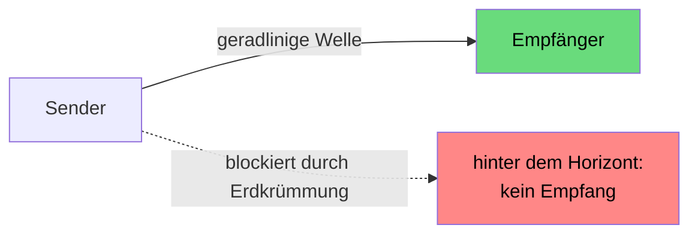
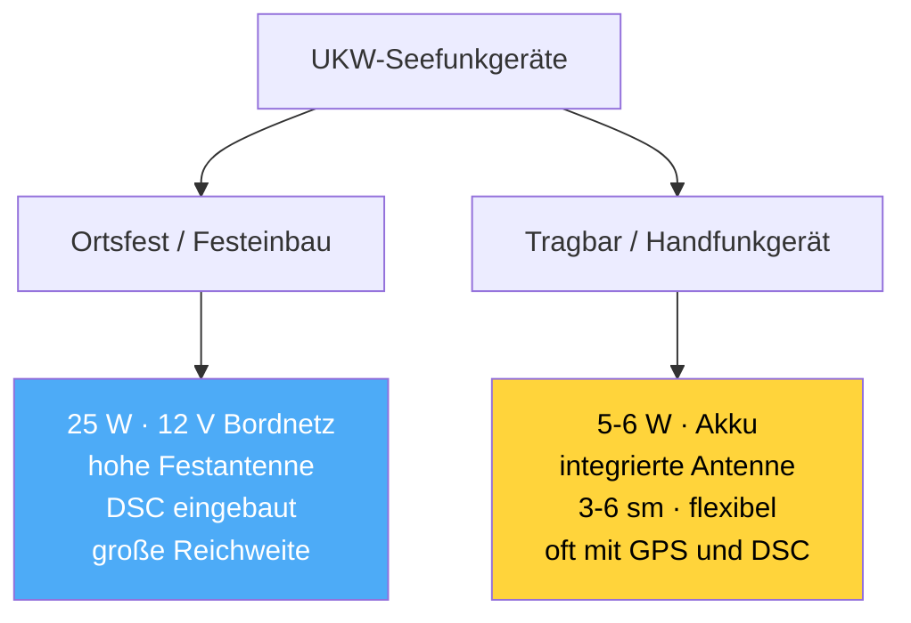
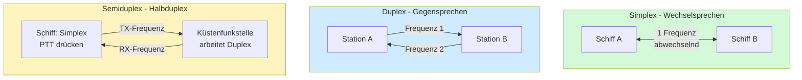

## Technik: Wellen, Frequenzen, Reichweite, Geräte, Praxis

> [!info]- Teil des [[00 Funkkurs SRC & UBI – Online Lernunterlagen für Funkzeugnis|Funkzeugnis-Kurs SRC & UBI]] · Modul 2 · SRC Seefunk (Technik)

---

### 1. Funkwellen – UKW (Ultrakurzwelle / VHF)
- Seefunk nutzt **Ultrakurzwelle (UKW / VHF)**. Die Ausbreitung ist quasi-optisch, also nahezu geradlinig – daher der Name „Sichtweite-Funk" (line of sight).
- UKW folgt nicht der Erdkrümmung und wird kaum gebeugt. Hinter dem Horizont ist deshalb Schluss.
- Die Wellenlänge λ = c / f ≈ 300 / 156 ≈ ~1,9 m (deshalb sind UKW-Antennen kurz). Polarisation vertikal.



### 2. Frequenzen
- Der mobile Seefunkdienst belegt auf UKW den Bereich 156-162 MHz.
- Ein Kanal ist eine feste Frequenz (Simplex) oder ein Frequenzpaar (Duplex: getrennte Sende-/Empfangsfrequenz).
- Wichtige feste Frequenzen, die du auswendig kennen solltest:

| Kanal/Dienst | Frequenz | Art | Funktion |
|---|---|---|---|
| Kanal 16 | 156,800 MHz | Simplex | Anruf · Not · Dringlichkeit · Sicherheit |
| Kanal 70 | 156,525 MHz | (DSC) | digitaler Selektivruf – nur DSC, kein Sprechfunk |
| Grenzwelle (Not) | 2187,5 kHz | - | DSC-Not auf Mittelwelle (z. B. Bremen Rescue) |
| NAVTEX international | 518 kHz | Text | Sicherheitsmeldungen in Englisch |
| AIS 1 / AIS 2 | 161,975 / 162,025 MHz | - | AIS-Datenfunk (Kanal 87/88) – kein Sprechfunk |

**Kanal 16** ist bewusst ein Simplex-Kanal – genau deshalb können ihn alle Seefunkstellen mithören, was für einen Not- und Anrufkanal gewollt ist.

Das **AIS** überträgt keine Sprache, sondern laufend Position, Kennung und Kurs jedes Schiffs als Datenfunk. Genau diese Daten kannst du live im Netz mitverfolgen – z. B. auf [VesselFinder](https://www.vesselfinder.com/) siehst du in Echtzeit, welche Schiffe gerade wo unterwegs sind.

### 3. Reichweite & Funkhorizont
Weil UKW nur bis zum Funkhorizont reicht, hängt die Reichweite vor allem von der **Antennenhöhe** ab (und zwar beider Stationen) – **nicht in erster Linie von der Sendeleistung**.

Aus der Praxis: Antenne hoch schlägt Watt. Ich hab mal mit der Handfunke vom Cockpit aus kaum 3 sm weit gefunkt, mit der Festantenne im Masttop war derselbe Spruch plötzlich glasklar.

Die Faustformel für die Reichweite über den Funkhorizont lautet:
Reichweite [km] ≈ 3,84 × (√h₁ + √h₂) – mit h₁, h₂ = Antennenhöhen in Metern.

Ein Beispiel: Masttop-Antenne 16 m (√16 = 4) und Küstenfunkstelle 100 m (√100 = 10) ergeben 3,84 × (4 + 10) ≈ 54 km ≈ 29 sm.

Typische Reichweiten:

| Verbindung                      | grobe Reichweite                                |
| ------------------------------- | ----------------------------------------------- |
| Handfunke ↔ Handfunke (niedrig) | ~3-6 sm                                         |
| Yacht-Masttop ↔ Yacht-Masttop   | ~15-20 sm                                       |
| Yacht ↔ hohe Küstenfunkstelle   | deutlich mehr: ~30 sm (Küstenantenne sehr hoch) |

![[funkkurs-reichweite.png]]
<sub>Die Reichweite kommt von der Antennenhöhe, nicht von Watt. UKW breitet sich aus wie Licht – die Rechnung ähnelt der „Feuersichtweite in der Kimm". 

### 4. Antenne
- Die Antenne sollte so hoch wie möglich montiert sein (auf der Segelyacht im Masttop), denn Höhe bedeutet Reichweite.
- Saubere Installation und Kabel sind wichtig; eine defekte Antenne kostet Reichweite – die eingestellten 25 W bringen nur etwas mit funktionierender Antenne.

### 5. Spannung, Strom (Ampere) & Batterie
Das Festgerät hängt am 12-V-Bordnetz (Gleichspannung), die Handfunke am Akku.

Typische Werte für die Stromaufnahme des Festgeräts (12 V):

| Zustand           | Stromaufnahme | Leistungsaufnahme          |
| ----------------- | ------------- | -------------------------- |
| Standby / Empfang | ~0,3-1 A      | wenige Watt                |
| Senden mit 1 W    | ~1 A          | ~12 W                      |
| Senden mit 25 W   | ~5 A          | ~60 W (Wirkungsgrad ~40 %) |


Senden ist der Stromfresser: 25 W entsprechen etwa 5 A, während Zuhören fast nichts kostet. Da Funk meist gehört und selten gesendet wird, ist der Durchschnittsverbrauch niedrig.

Ein Rechenbeispiel für das Festgerät zeigt das deutlich: Es liegt fast immer auf Empfang/Standby (~0,5 A). An einer 100-Ah-Bordbatterie läuft es so theoretisch ~200 h – in der Praxis weniger, weil andere Verbraucher dazukommen und man die Batterie nicht leer fährt. Jede Sendung mit 25 W zieht kurz ~5 A, aber die einzelnen Sprechsekunden fallen kaum ins Gewicht.

> [!danger] Batterie nie komplett entladen
> **Tiefentladung** schädigt die Batterie dauerhaft (Kapazitätsverlust, bei Blei-/AGM-Batterien irreversibel) – und eine leergefahrene Bordbatterie heißt: kein Funk, kein Notruf.
- Faustregel: Blei/AGM max. ~50 % entnehmen, rechtzeitig nachladen.
- Das Funkgerät als sicherheitskritischen Verbraucher nie an einer fast leeren Batterie betreiben.
- Die akkubetriebene Handfunke ist die Reserve.

### 6. Gerätearten
![[funkkurs-icom-seefunkgeraet.jpeg|440]]
Ein Funkgerät, wie es auf den meisten Yachten vorzufinden ist. Es gibt verschiedene Hersteller und Geräte, doch alle funktionieren sehr ähnlich. Man sollte sich vor der ersten Fahrt mit einem neuen Funkgerät mit den wichtigsten Funktionen vertraut machen: DSC, Volumen, Squelch und Dual Watch. Es empfiehlt sich, mit einer Küstenfunkstelle einen Radio Check durchzuführen → [[13 Funkkurs — Funkverfahren & Buchstabieralphabet#Funkprobe / Radio Check – wie sende ich eine Testnachricht?]]

![[funkkurs-ukw-geraet.jpg|340]]

Hier ein Oldtimer: Dieses fest eingebaute UKW-Gerät (Sailor RT144) ist ein echtes Museumsstück – Jahrzehnte alt (ab 1974), noch ohne DSC und mit reiner Drehknopf-/Tasten-Bedienung. Moderne Festgeräte sehen schicker aus und haben DSC-Controller, Display und GPS-Anschluss eingebaut – die Funktion (25 W/1 W, Kanäle, Hörer mit Sprechtaste) ist aber bis heute dieselbe.


- Ortsfeste Seefunkstelle (Festeinbau): das „Hauptgerät" – 25 W, DSC, hohe Antenne, am Bordnetz.
- Tragbares Handfunkgerät: akkubetrieben, ideal bei Stromausfall oder im Beiboot; geringere Reichweite. Moderne Modelle haben DSC-Controller und GPS eingebaut.
![[funkkurs-icom-handfunkgeraet.jpg|340]]
<sub>Tragbares UKW-Handfunkgerät (icom)</sub>

### 7. Sprechverfahren: Simplex · Duplex · Semiduplex
Der Kanal bestimmt, wie gesprochen wird. Ein Kanal liegt auf einer Frequenz (Simplex) oder auf zwei Frequenzen (Duplex).

| Verfahren                 | Frequenzen                                  | Sprechen                                  | Typisch für               |
| ------------------------- | ------------------------------------------- | ----------------------------------------- | ------------------------- |
| Simplex (Wechselsprechen) | 1 Frequenz                                  | abwechselnd (nur einer zugleich → „OVER") | Schiff-Schiff             |
| Duplex (Gegensprechen)    | 2 Frequenzen pro Kanal                      | gleichzeitig (wie Telefon)                | Küstenfunk-Verbindungen   |
| Semiduplex (Halbduplex)   | 2 Frequenzen (Küste duplex, Schiff simplex) | Schiff per Sprechtaste, Küste duplex      | Schiff ↔ Küstenfunkstelle |



Semiduplex funktioniert so: Die Küstenfunkstelle sendet und empfängt gleichzeitig (zwei Frequenzen = Duplex). Das Schiff arbeitet dagegen Simplex – es liegt normal auf der Empfangsfrequenz (RX) der Küstenfunkstelle und schaltet nur beim Drücken der Sprechtaste auf seine Sendefrequenz (TX).

Noch kurz zu den Duplex-Kanälen: Ein Duplexkanal hat zwei verschiedene Frequenzen (eine zum Senden, eine zum Empfangen) und ist für den Verkehr Schiff ↔ Küstenfunkstelle gedacht (z. B. Anruf bei DP07, früher öffentliche Telefonvermittlung). Viele Kanäle im oberen Bereich (ca. 60-88) und Teile von 18-28 sind Duplexkanäle. Die Schiff-Schiff-Kanäle (06, 08, 72, 77 …) und vor allem Kanal 16 sind dagegen Simplex – eine Frequenz, von allen mithörbar, weshalb der Notkanal simplex ist. Auf einem Duplexkanal kannst du ein anderes Schiff nicht direkt hören, weil es auf der anderen Frequenz sendet; Duplexkanäle laufen praktisch immer über die Küstenfunkstelle.

### 8. Wichtige Bedienelemente: Squelch · Dual Watch · Scan

Der Squelch (Rauschsperre) unterdrückt das Hintergrundrauschen, wenn kein Signal anliegt. Man stellt ihn ein, indem man ihn langsam aufdreht, bis das Rauschen gerade verstummt, und dort stehen lässt. Ist er zu hoch eingestellt, werden schwache oder ferne Signale mit weggesperrt; ist er zu niedrig, rauscht es dauernd. Die Faustregel lautet: so weit zu wie nötig, so weit offen wie möglich.

> [!important] Squelch VOR jedem Senden öffnen
> Vor jeder Aussendung kurz den **Squelch** öffnen (Monitor-/Squelch-Taste) und hören, ob der Kanal wirklich frei ist – ein zu hoch eingestellter Squelch könnte einen schwachen, aber laufenden Funkverkehr unterdrücken. Erst wenn der Kanal frei ist, sendest du. Das ist die technische Umsetzung von „erst hören, dann senden" – und essentiell, um in der Praxisprüfung zu bestehen.

Ausnahme: im laufenden Gespräch nicht jedes Mal, da bist du bereits Teil des Funkverkehrs auf dem Arbeitskanal. Das Squelch-Öffnen gilt für den Erstanruf bzw. den Beginn einer Aussendung.

Dual Watch (Zweikanalwache) überwacht zwei Kanäle gleichzeitig: deinen Arbeitskanal und Kanal 16. Das Gerät springt im Sekundentakt hin und her und bleibt stehen, sobald Verkehr läuft. So hältst du Hörwache auf 16, obwohl du auf einem Arbeitskanal stehst. Tri-Watch überwacht entsprechend drei Kanäle.

Der Scan (Suchlauf) durchsucht automatisch alle bzw. gespeicherten Kanäle der Reihe nach und stoppt, wenn auf einem Kanal gesendet wird. Praktisch, um mitzubekommen, wo gerade Verkehr läuft.

Fürs Üben hat sich der Praxis-Standard bewährt: Arbeitskanal vorwählen, Dual Watch einschalten, Kanal 16 bleibt mitgehört. Den Squelch vor jedem Törn neu justieren, weil sich die Bedingungen ändern.

### 9. DSC-Controller
- Erzeugt die digitalen Selektivrufe und sendet sie auf Kanal 70 (Notalarm, Routine-/Gruppenruf).
- Eingebaut (moderne Festgeräte, manche Handfunken) oder als separates Zusatzgerät.
- Braucht zwingend die programmierte MMSI und – für sinnvolle Notalarme – eine Positionsquelle (GPS).
- *Funktionsweise Kanal 70* → [[04 Funkkurs — SRC Seefunk (GMDSS)#Wie DSC auf Kanal 70 wirklich funktioniert (häufiges Missverständnis!)|hier]].

### 10. Praxis – richtig funken
Die wichtigsten Praxisregeln, die du beherrschen solltest:
1. Erst hören, dann senden. Vor dem Anruf prüfen, ob der Kanal frei ist – niemals reinquatschen.
2. Deutlich und nicht zu schnell sprechen; Zahlen und Namen gegebenenfalls buchstabieren ([[13 Funkkurs — Funkverfahren & Buchstabieralphabet|Funkkurs — Funkverfahren & Buchstabieralphabet]]).
3. So kurz wie möglich, so umfassend wie nötig. Kanal 16 ist Anrufkanal, also nach Kontakt sofort auf einen Arbeitskanal wechseln.
4. Hörwache halten und Kanal 16 möglichst immer mithören. Mit der Dual-Watch-Taste überwacht das Gerät gleichzeitig den Arbeitskanal und Kanal 16 (springt im Sekundentakt hin und her).
5. Gesprächsaufbau: beim ersten Kontakt Name von Gegenstation und sich selbst je 3× (mit Rufzeichen/MMSI); danach nur noch 1×, ohne Rufzeichen.
6. Leistung anpassen: im Nahbereich/Hafen 1 W, sonst und zur Küstenfunkstelle 25 W.

Muster für einen Routine-Anruf mit Kanalwechsel: 
```
"Marina Nord, Marina Nord, Marina Nord — This is Albatros, Albatros, Albatros, OVER"
"Albatros — This is Marina Nord, switch to Channel 71, OVER"
→ beide auf 71: Anliegen … OVER … Abschluss mit OUT
```
In Deutschland ist es üblich, deutsche Häfen auf Deutsch anzufunken (mache ich auch so) – Englisch ist aber genauso akzeptiert. 

---

## Links
- Video, welches Funken in der Praxis nochmal erklärt:  https://www.youtube.com/watch?v=**txt0WccHZi4**
- Wikipedia – *Mobiler Seefunkdienst (Ultrakurzwelle)* – https://de.wikipedia.org/wiki/Mobiler_Seefunkdienst_(Ultrakurzwelle)
- Bootspruefung.de – *Technische Grundlagen UKW-Seefunk* – https://www.bootspruefung.de/theorie/src/technik
- DL4CS – *Berechnung von Funk-Reichweiten im UKW-Bereich* – https://dl4cs.de/funktechnik/various/distances/index.htm
- 50ohm.de – *Funkhorizont* – https://50ohm.de/N_funkhorizont.html
- src-lrc-ubi.de – *UKW-Funkgerät Boot: Kanäle, DSC, Reichweite & Praxis* – https://src-lrc-ubi.de/glossar-ukw-funkgeraet-boot/
- HanseNautic / SVB – Geräte-Ratgeber (Festeinbau vs. Handfunke, 12 V, Leistung) – https://www.svb.de/de/ratgeber/ratgeber-handfunkgeraete.html
- Scansail – *Seefunk in der Charterpraxis* (Hörwache, Dual-Watch, Gesprächsaufbau) – https://blog.scansail.com/de/seefunk-in-der-charterpraxis/
- YACHT – *Bloß nicht „Over and Out"* – https://www.yacht.de/

---
**Kurs-Navigation:** [[03 Funkkurs — Glossar (Abkürzungen)|← 03 · Glossar (Abkürzungen)]] · [[00 Funkkurs SRC & UBI – Online Lernunterlagen für Funkzeugnis|↑ Kursübersicht]] · [[06 Funkkurs — DSC (Digital Selective Calling)|05 · DSC – Digital Selective Calling →]]

*Superlink:* [[00 Funkkurs SRC & UBI – Online Lernunterlagen für Funkzeugnis|Funkzeugnis-Kurs SRC & UBI]]

