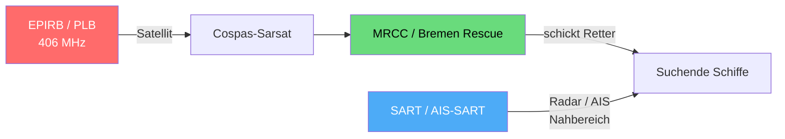

## Notfunkgeräte: EPIRB, SART & Co.

> [!info]- Teil des [[00 Funkkurs SRC & UBI – Online Lernunterlagen für Funkzeugnis|Funkzeugnis-Kurs SRC & UBI]] · Modul 2 · SRC Seefunk (Technik)

Hier lernst du den Unterschied zwischen der EPIRB (weltweite Alarmierung via Satellit) und SART (Nahbereich-Ortung für die Retter) kennen. Du erfährst, wie und wann die einzelnen Geräte ausgelöst werden, also manuell, per Wasserkontakt oder Float-free. Und du lernst, einen Fehlalarm korrekt zu widerrufen und die Wartungsintervalle einzuordnen.

Die Grundidee in einem Satz: Die **EPIRB** alarmiert und löst die Rettungskette aus, **SART** ortet und hilft den Rettern, uns im Nahbereich genau zu finden. Beides ergänzt den UKW- und DSC-Funk.

---

### EPIRB – Emergency Position-Indicating Radio Beacon
 ![[funkkurs-epirb2.jpg|260]]![[funkkurs-EPIRB.jpeg|240]]
Zwei EPIRB-Bauformen (Seenotfunkbaken).

Die EPIRB ist eine Seenot-Funkbake, die auf **406 MHz** über die **Cospas-Sarsat**-Satelliten alarmiert – weltweit, auch fernab jeder Küstenfunkstelle. Sie sendet ihre Kennung (ID) und Position (mit eingebautem GPS/GNSS sehr genau) und löst damit die internationale Rettungskette aus. Beim Sinken können sich manche Modelle per Wasserdruck selbst auslösen und schwimmt automatisch auf (Float-free-Halterung). Das Gerät ist schiffsgebunden und muss **registriert** sein (Halter/Schiff hinterlegt) – sonst weiß niemand, zu wem der Alarm gehört. Moderne Geräte haben zusätzlich ein AIS-Homing-Signal für die Feinortung.

Für weltweites Fahren ist die EPIRB das primäre Alarmgerät – unabhängig von UKW-Reichweite und Bordstrom, denn sie hat eine eigene Batterie (also essenziell für deine nächste Weltumseglung).

#### Wie die EPIRB alarmiert – und das 121,5-MHz-Homing
Die EPIRB sendet auf zwei Frequenzen mit zwei verschiedenen Aufgaben.

406 MHz ist der digitale Alarm über Satellit:
1. Die EPIRB wird aktiviert und sendet alle ~50 s einen digitalen Burst mit eindeutiger Kennung und (mit GPS) der Position.
2. Die Cospas-Sarsat-Satelliten empfangen den Burst – LEOSAR (niedrige Umlaufbahn), GEOSAR (geostationär) und modern MEOSAR (auf GPS-/Galileo-Satelliten).
3. Die Satelliten leiten das Signal an Bodenstationen (LUT) weiter; ohne GPS-Position wird sie über den Doppler-Effekt der bewegten Satelliten berechnet.
4. Diese Meldung wird dann an das zuständige MRCC (z. B. Bremen Rescue) weitergegeben. MRCC leitet dann die Rettung ein. 

121,5 MHz ist das **Homing-Signal** für die Feinortung vor Ort. Die EPIRB sendet dazu zusätzlich ein schwaches, durchgehendes Peilsignal. Die anrückenden SAR-Einheiten (Flugzeug, Hubschrauber, Schiff) peilen es mit einem Funkpeiler an und finden so im Nahbereich den genauen Standort – den „letzten Kilometer" zum Havaristen. Wichtig dabei: 121,5 MHz wird seit 2009 nicht mehr von Satelliten überwacht (Cospas-Sarsat hat das eingestellt) und dient nur noch dem lokalen Homing, nicht der Alarmierung. Die eigentliche Alarmierung läuft ausschließlich über 406 MHz. Moderne EPIRBs ergänzen das Homing per AIS (UKW), damit Schiffe in der Nähe die Bake als Ziel auf dem Plotter sehen.

> [!important] 406 vs. 121,5 MHz
> 406 MHz alarmiert weltweit über Satellit, 121,5 MHz peilt nur noch vor Ort an, ganz ohne Satellit.

#### Wie löst die EPIRB aus?
Es gibt drei Auslösewege:
1. Manuell – über einen Schalter oder eine Taste am Gerät (mit Sicherungskappe gegen versehentliches Drücken).
2. Automatisch durch Wasserkontakt – ein Wassersensor aktiviert die Bake, sobald sie im Wasser schwimmt.
3. Float-free (selbstausschwimmend) – die Halterung hat eine hydrostatische Auslösevorrichtung (HRU), die die EPIRB beim Sinken des Schiffs (Wasserdruck ~4 m Tiefe) freigibt. Sie schwimmt auf, der Wassersensor schaltet sie ein (nicht alle haben diese Funktion).

Bei den Bauarten unterscheidet man zwei Kategorien: Kategorie 1 ist float-free (automatisch ausschwimmend plus Wasserkontakt), Kategorie 2 nur manuell auslösbar. Für ernsthaftes Seerevier ist die selbstausschwimmende Variante sinnvoll, weil sie auch dann funktioniert, wenn die Crew es nicht mehr selbst schafft.

Versehentlich ausgelöst – was tun?

> [!danger] Fehlalarm immer widerrufen
> Nicht einfach wegstecken und hoffen! Die Alarmierung kann längst beim MRCC sein.
> 1. Sofort ausschalten (deaktivieren).
> 2. MRCC / Seenotleitung verständigen – in DE Bremen Rescue (Telefon +49 421 53687 0 oder per UKW), dass es ein Fehlalarm war und keine Seenot vorliegt.
> 3. Beaken-Kennung (Hex-ID) und Schiffsnamen angeben, damit der SAR-Einsatz abgebrochen wird.

Ein nicht widerrufener Fehlalarm bindet echte Rettungsressourcen – deshalb immer melden (genau wie beim [[06 Funkkurs — DSC (Digital Selective Calling)|DSC-Fehlalarm]]).

Zur Bedienung im manuellen Fall: Antenne aufrichten, Sicherung bzw. Kappe entfernen, auf ON schalten und die EPIRB senkrecht ins Wasser legen oder hochhalten, mit freier Sicht zum Himmel – nicht unter Deck oder in der Hand „verstecken". Eingeschaltet lassen, bis die Rettung da ist.

### PLB – Personal Locator Beacon
Die **PLB** ist die persönliche, kleine Variante der EPIRB (am Körper oder an der Rettungsweste), ebenfalls auf 406 MHz über Cospas-Sarsat. Sie ist personengebunden, während die EPIRB schiffsgebunden ist – eine PLB ergänzt die EPIRB also, ersetzt sie aber nicht.

Zur Bedienung: aus der Tasche oder Halterung nehmen, Antenne ausklappen, Knopf drücken und halten. Senkrecht halten, Antenne frei zum Himmel. Die PLB löst nur manuell aus (kein Float-free) und sendet kürzer als eine EPIRB.
![[funkkurs-plb.jpg|340]]
Auf hoher See gibt es ein deutlich sichereres Gefühl, eine PLB an der Rettungsweste zu haben, denn wenn man einmal über Bord geht (vor allem nachts), ist man kaum aufzufinden.<ub>

Auf toplicht.com kannst du auch nach PLBs suchen und bestellen: [Link](https://www.toplicht.com/search?search=plb)

### SART – Search and Rescue Radar Transponder
![[funkkurs-sart-stab.jpg|340]]
Search & Rescue Radar Transponder SAILOR SART II. Wie auf der Abbildung haben die SARTs auf Sportbooten auch eine schwarze Teleskopstange, um die Reichweite zu erhöhen.

Die **SART** dient der Nahbereich-Ortung, wenn die Retter schon im Gebiet sind. Sie reagiert auf das **9-GHz-X-Band-Radar** von Schiffen und erzeugt auf deren Radarschirm eine typische Kette von 12 Punkten, die zum Standort weist.

Zur Bedienung: aus der Wandhalterung nehmen und mit in die Rettungsinsel nehmen. Auf den schwarzen Teleskopstab stecken und so hoch wie möglich aufstellen oder halten (durch eine Öffnung im Inseldach), denn die Höhe bestimmt die Reichweite – ein SART auf 1 m wird viel früher vom Radar erfasst. Schalter auf ON (Standby); sobald ein Schiffsradar es trifft, schaltet sie automatisch auf Senden, und ein Lämpchen oder ein Ton signalisiert den Radarkontakt („Hilfe ist in Radar-Reichweite"). Die TEST-Stellung nur kurz zur Funktionsprüfung nutzen.

### AIS-SART
Die **AIS-SART** ist eine Weiterentwicklung: Sie sendet neben der Radar-Kennung noch zusätzlich eine GPS-Position als AIS Signal, welches in der Regel auch auf dem Radar großer Schiffe angezeigt wird.

### MOB-Sender (Mensch über Bord)
Persönliche AIS-MOB- bzw. DSC-MOB-Geräte an der Rettungsweste lösen bei „Mensch über Bord" einen AIS-Alarm und/oder DSC-Alarm aus und senden die GPS-Position ans eigene Schiff.

Zur Bedienung: an der Rettungsweste befestigen; das Gerät aktiviert sich automatisch beim Aufblasen oder bei Wasserkontakt (oder manuell). Die Antenne klappt aus, und es geht sofort ein MOB-Alarm samt Position ans Schiff bzw. AIS. 

---

### Überblick: Wer macht was?
| Gerät       | Frequenz/System         | Aufgabe               | Wo?           |
| ----------- | ----------------------- | --------------------- | ------------- |
| EPIRB       | 406 MHz · Cospas-Sarsat | alarmieren (weltweit) | Schiff        |
| PLB         | 406 MHz · Cospas-Sarsat | alarmieren (klein)    | Person        |
| SART        | 9 GHz Radar             | orten (Radarbild)     | Rettungsinsel |
| AIS-SART    | UKW / AIS               | orten (AIS-Ziel)      | Rettungsinsel |
| AIS/DSC-MOB | UKW / AIS / DSC         | MOB-Alarm + Position  | Person        |

### Wartung, Batterie & Lebensdauer
| Gerät | Batterie (Lager) | Sendedauer (aktiv) | typische Wartung |
|---|---|---|---|
| EPIRB | ~10 Jahre wartungsfrei | ≥ 48 h | Batteriewechsel ~alle 5-10 J. (Hersteller); HRU alle 2 Jahre tauschen |
| PLB | ~5-7 Jahre | ≥ 24 h | Batteriewechsel zum Ablaufdatum |
| SART / AIS-SART | ~5 Jahre | Standby ~96 h + Senden ~8 h | Batteriewechsel, Funktionstest |
| AIS/DSC-MOB | ~5-7 Jahre | ~24 h | Batterie-/Ablaufcheck |

Regelmäßig gehört zur Wartung: ein Selbsttest per Test-Funktion (am besten vor dem Törn – verbraucht kaum Batterie), der Blick auf das Batterie-Ablaufdatum und das Erneuern der HRU (hydrostatische Auslösung der EPIRB) alle 2 Jahre, da sie ein eigenes Verfallsdatum hat. Außerdem sollte die Registrierung (Eigner, Kontakt, Schiff) aktuell bleiben, sonst ist der Alarm anonym.

Hier sind grobe, aktuelle Preise (2026) für Sportboote: eine EPIRB kostet etwa 500–1000 € (kompakte Sportboot-Modelle), Voll-Profi-Geräte bis ~1200 €; eine PLB ca. 300–500 €; SART (Radar) bzw. AIS-SART ca. 500–800 €; AIS-MOB-Sender ca. 300–550 €. Die Preise schwanken je nach Hersteller und Händler – vor dem Kauf ggf. kurz aktuell prüfen.

Zur Einordnung für den SRC: EPIRB und SART sind GMDSS-Ausrüstung und gehören eher ins LRC-Umfeld (küstenfern). Für den SRC reicht es zu wissen, was sie tun – die EPIRB alarmiert via Satellit, SART und AIS-SART helfen beim Orten. Im Küstenbereich (A1) bleibt DSC plus UKW das Hauptwerkzeug.

---
Bilder: Wikimedia Commons (EPIRB; SART „SART radar transponder", Jotron), CC BY-SA.

## Links

> [!danger] Person über Bord mit Todesfolge, Seeunfallbericht:
> Link: [Seeunfall mit Todesfolge auf der Segelyacht Speedy Go](https://www.bsu-bund.de/SharedDocs/pdf/DE/Unfallberichte/2023/Untersuchungsbericht_138_22.pdf?__blob=publicationFile&v=1) (Meiner Meinung nach eine Pflicht-Lektüre für alle Segler:innen)

- src-lrc-ubi.de - *LRC: EPIRB, SART & AIS-SART* - https://src-lrc-ubi.de/glossar-lrc-epirb-sart-ais-sart/
- Wikipedia - *EPIRB* / *Search and rescue transponder* - https://en.wikipedia.org/wiki/Emergency_position-indicating_radio_beacon
- Compass24 / SVB / Ocean Signal / ACR - Ratgeber Notfunkbaken (Batterie, HRU, Preise) - https://www.compass24.de/ratgeber/epirb
- on-yacht.com - *Batteriewechsel & Wartung (zertifizierter Service)* - https://on-yacht.com/batteriewechsel-wartung

---

> [!tip] Kurz gemerkt
> - Die EPIRB alarmiert weltweit über Satellit (406 MHz/Cospas-Sarsat); 121,5 MHz dient nur noch dem lokalen Homing durch SAR-Einheiten vor Ort.
> - SART und AIS-SART orten im Nahbereich – so hoch wie möglich halten für maximale Reichweite.
> - Fehlalarm immer sofort beim MRCC widerrufen – nicht einfach ausschalten und schweigen.
> - HRU der EPIRB alle 2 Jahre tauschen, Registrierung aktuell halten.

---
**Kurs-Navigation:** [[06 Funkkurs — DSC (Digital Selective Calling)|← 05 · DSC – Digital Selective Calling]] · [[00 Funkkurs SRC & UBI – Online Lernunterlagen für Funkzeugnis|↑ Kursübersicht]] · [[07 Funkkurs — NAVTEX & NAVAREA|07 · NAVTEX & NAVAREA →]]

*Superlink:* [[00 Funkkurs SRC & UBI – Online Lernunterlagen für Funkzeugnis|Funkzeugnis-Kurs SRC & UBI]]

