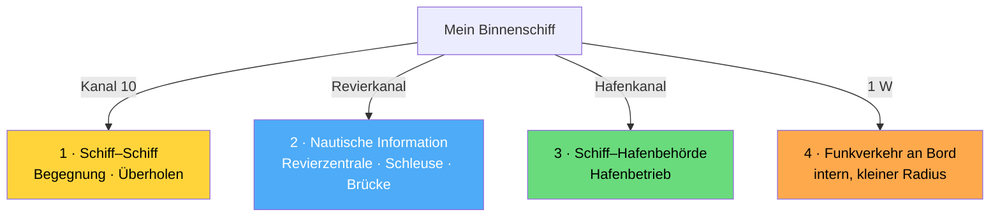

## UBI: UKW-Binnenschifffahrtsfunk

> [!info]- Teil des [[00 Funkkurs SRC & UBI – Online Lernunterlagen für Funkzeugnis|Funkzeugnis-Kurs SRC & UBI]] · Modul 3 · UBI Binnenfunk

So wie ich es sehe, fühlt Binnen sich an wie ein Festnetz mit fester Nummer: jedes Mal, wenn du die Taste loslässt, „unterschreibt" dein Gerät per ATIS – die Revierzentrale weiß sofort, wer du bist.

### Was darf man mit dem UBI?
Bedienung von UKW-Sprechfunkanlagen im Binnenschifffahrtsfunk. Pflicht beim Betrieb einer Funkanlage auf Binnenwasserstraßen.

### Rechtsrahmen
- RAINWAT – Regionales Abkommen über den Binnenschifffahrtsfunk (regelt einheitliche Nutzung in den Vertragsstaaten).
- Handbuch Binnenschifffahrtsfunk – das maßgebliche Nachschlagewerk.
- Mehr zu Zuständigkeiten/Pflicht → [[01 Funkkurs — Rechtliche Grundlagen|Funkkurs — Rechtliche Grundlagen]].

### ATIS - genau erklärt (der zentrale Binnenfunk-Unterschied)
**ATIS** steht für Automatic Transmitter Identification System (automatisches Sender-Identifizierungs-System).

Was ATIS macht: Es hängt an jede Aussendung automatisch eine digitale Kennung an, die das sendende Gerät eindeutig identifiziert. So lässt sich immer nachvollziehen, wer gefunkt hat – besonders wichtig, um Störer auf den dicht genutzten Binnenkanälen zu finden. Aber wir als Sportschiffe können die ATIS nicht auslesen – das können leider nur die Revierzentralen und offizielle Stellen. 

Gesendet wird die Kennung **automatisch beim Loslassen der Sprechtaste (PTT)**, also am Ende jeder Sendung. Es ist ein kurzer digitaler Datenburst (Bruchteil einer Sekunde), keine hörbare Sprache – der Funker tut nichts dafür, das Gerät macht es selbst. Man stellt ATIS einmal ein bzw. programmiert die richtige Kennung, danach läuft es bei jedem Drücken und Loslassen mit.

Vorgeschrieben ist ATIS durch das Abkommen **RAINWAT** für den Binnenschifffahrtsfunk. Es ersetzt im Binnenbereich die Identifikations- und Anruffunktion, die im Seefunk das DSC übernimmt.

Aufbau der ATIS-Kennung (10 Ziffern):
```
9 211 01 2345
│ │   │  │
│ │   │  └─ 4 Ziffern aus dem Rufzeichen
│ │   └─ 2 Ziffern für den 2. Buchstaben des Rufzeichens
│ └─ MID (Länderkennung, Deutschland 211)
└─ feste führende 9 (= ATIS-Kennung)
```
*Beispiel:* Rufzeichen DA2345 → ATIS 9 211 01 2345. Jede ATIS-Kennung beginnt mit 9, gefolgt von der MID (DE = 211).

Ein paar wichtige Abgrenzungen: Die ATIS-Kennung wird von der Bundesnetzagentur zugeteilt (wie MMSI und Rufzeichen) → [[01 Funkkurs — Rechtliche Grundlagen|Funkkurs — Rechtliche Grundlagen]]. ATIS ist nicht dasselbe wie DSC – es ist nur eine automatische Senderkennung, kein Notalarm und kein Selektivruf, es kann also niemanden gezielt anrufen. Im Seefunk ist ATIS sogar verboten, im Binnenfunk dagegen Pflicht; deshalb muss man Kombigeräte umschalten ([[09 Funkkurs — UBI Binnenfunk#Kombianlagen — und warum ein Seefunkgerät im Binnenfunk nicht zulässig ist|siehe oben]]). Und im Binnenfunk gibt es kein DSC und keinen Kanal 70.

Als Merksatz: DSC ruft (Seefunk, K70). ATIS verrät nur, wer gesendet hat (Binnenfunk, automatisch beim Loslassen der Taste).

Kann man die ATIS anderer Schiffe auslesen? Normalerweise nicht – ein normales Funkgerät zeigt die ATIS nicht im Klartext. Hörbar ist nur ein kurzer, „kratziger" Datenton am Ende jeder Aussendung; viele Geräte blenden ihn aus („ATIS-Killer" – Lautsprecher kurz stumm). Zum Auslesen und Anzeigen braucht man einen ATIS-Decoder (manche Geräte haben eine ATIS-Readout-Funktion, sonst PC + Soundkarte + Software). Vor allem Behörden nutzen das: Revierzentralen, Schleusen- und NIF-Funkstellen sowie die Wasserschutzpolizei haben Decoder und können jede Aussendung eindeutig einem Schiff zuordnen (Störer-Erkennung). Kurz: Du hörst nur den Piepton – lesen kann es nur, wer einen Decoder hat (vor allem die Behörden).

### Kombianlagen — und warum ein Seefunkgerät im Binnenfunk nicht zulässig ist
Eine Kombianlage bzw. ein Kombigerät ist ein UKW-Gerät, das beide Welten kann: Seefunk (mit DSC) und Binnenfunk (mit ATIS). Man schaltet zwischen zwei Betriebsarten um: See-Modus (DSC an, ATIS aus) und Binnen-Modus (ATIS an, DSC aus).

Warum geht ein reines Seefunkgerät nicht für den Binnenfunk?

| | Seefunk | Binnenfunk |
|---|---|---|
| ATIS | nicht gestattet | vorgeschrieben (Pflicht!) |
| DSC | genutzt (K70) | nicht erlaubt (gehört zum Seefunk) |
| Kennung | MMSI | ATIS-Kennung |

Der Binnenfunk verlangt ATIS (automatische Senderkennung bei jedem Loslassen der Sprechtaste). Ein reines Seefunkgerät sendet kein ATIS – und im Seefunk ist ATIS sogar verboten. Damit erfüllt es die Binnen-Pflicht nicht. Umgekehrt darf im Binnenfunk nicht mit dem DSC-Controller gearbeitet werden, denn DSC gehört zum Seefunk. Das Gerät muss zudem für den Binnenschifffahrtsfunk zugelassen sein.

Als Merksatz: See = DSC, kein ATIS. Binnen = ATIS, kein DSC. Ein Kombigerät kann beides – aber nur, wenn man es korrekt umschaltet. Ein reines Seefunkgerät darf am Binnenfunk nur im Notfall teilnehmen.

### Die 4 Verkehrskreise (auswendig - Prüfungsklassiker!)
> [!important] Prüfungsklassiker: die 4 Verkehrskreise
> Der Binnenfunk kennt genau **vier Verkehrskreise**: Schiff-Schiff, Nautische Information, Schiff-Hafenbehörde, Funkverkehr an Bord. Auswendig lernen.

Der Binnenfunk kennt genau vier Verkehrskreise:
1. Schiff-Schiff – Verkehr zwischen Fahrzeugen (Nautik, Begegnung, Überholen).
2. Nautische Information – Schiff ↔ Land, Revierzentralen / Verkehrsposten (Schleusen, Brücken, Verkehrslenkung).
3. Schiff-Hafenbehörde – Hafenbetrieb.
4. Funkverkehr an Bord (Bordfunk) – interne Kommunikation an Bord (niedrige Leistung).

Zum Merken: „Schiff-Schiff, Nautische Info, Hafen, Bord." (vier, nicht fünf!)



### Kanal 10 - der wichtigste Binnen-Kanal
**Kanal 10** ist der Anruf- und Sicherheitskanal Schiff-Schiff. Auf ihm muss während der Fahrt **Dauerhörwache** gehalten werden – unabhängig von der befahrenen Strecke.

### Sendeleistung Binnen
- Regulär bis max. 25 W, der Lage angepasst herunterregeln.
- Örtlich kann reduzierte Leistung von 1 W verlangt werden (z. B. im Schleusenbereich).
- Bordfunk: nur 1 W (kleiner Radius gewollt). *Warum 1 W? →* [[04 Funkkurs — SRC Seefunk (GMDSS)#Warum 1 W im Hafen?|gleiche Logik wie im Seehafen]].

### Notverkehr Binnen
- Auch hier MAYDAY / PAN PAN / SÉCURITÉ, aber per Sprechfunk (kein DSC).
- Der Notruf ist zweigeteilt: MAYDAY auf Kanal 10 (Schiff-Schiff, 1 W) an umliegende Schiffe und Anruf der Revierzentrale auf ihrem Revierkanal (25 W). → [[11 Funkkurs — UBI Notruf & warum Kanal 16 verboten|Funkkurs — UBI Notruf & warum Kanal 16 verboten]].
- Aufbau des MAYDAY-Spruchs analog zum Seefunk, nur mit ATIS-Identifikation statt MMSI.


---
**Kurs-Navigation:** [[04 Funkkurs — SRC Seefunk (GMDSS)|← 08 · SRC – Seefunk (GMDSS)]] · [[00 Funkkurs SRC & UBI – Online Lernunterlagen für Funkzeugnis|↑ Kursübersicht]] · [[10 Funkkurs — UBI Revierfunk & Nautische Information|10 · UBI – Revierfunk & Nautische Information →]]

*Superlink:* [[00 Funkkurs SRC & UBI – Online Lernunterlagen für Funkzeugnis|Funkzeugnis-Kurs SRC & UBI]]

