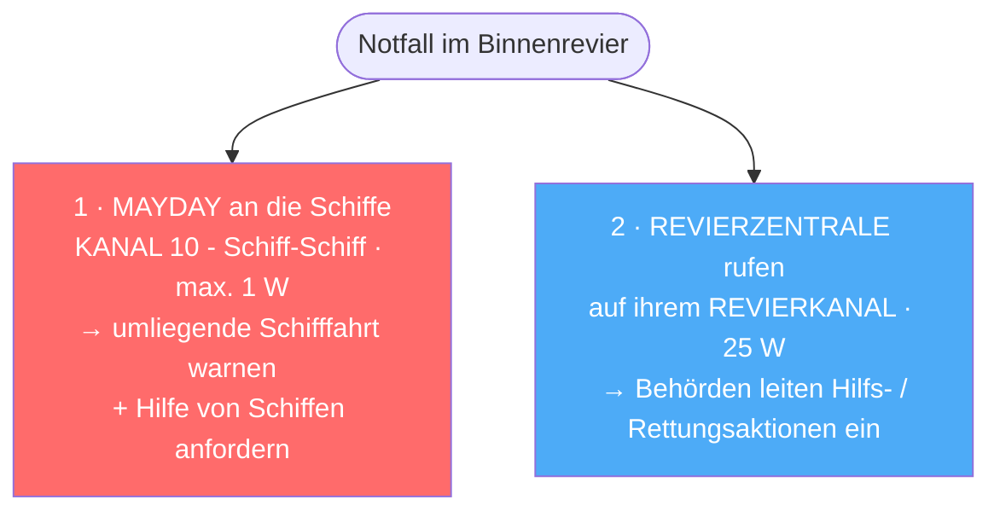

## UBI – Notruf & warum Kanal 16 verboten ist

> [!info]- Teil des [[00 Funkkurs SRC & UBI – Online Lernunterlagen für Funkzeugnis|Funkzeugnis-Kurs SRC & UBI]] · Modul 3 · UBI Binnenfunk

Hier geht es darum, warum Kanal 16 im Binnenfunk verboten ist und welche Kanäle stattdessen gelten. Du lernst den zweistufigen Notruf-Ablauf über Kanal 10 und den Revierkanal kennen und weißt danach, wann du was sendest. Außerdem baust du den Notspruch auf Deutsch auf und kannst die Unterschiede zum Seefunk benennen.

> [!danger] Kernpunkt: Kanal 16 ist im Binnenfunk verboten
> Im Binnenfunk gibt es keinen einheitlichen Not- und Anrufkanal wie im Seefunk. **Kanal 16 ist im Binnenschifffahrtsfunk verboten.** Der Notruf läuft über **Kanal 10 + die Revierzentrale**.

---

### 1. Warum ist Kanal 16 im Binnenfunk verboten?
- **Kanal 16 (156,800 MHz)** ist der internationale Seefunk-Not-, Dringlichkeits- und Anrufkanal. Er ist dem Seefunk vorbehalten.
- Der Binnenfunk hat ein eigenes System mit eigenen Kanälen (Verkehrskreise, Revierkanäle). Es gibt dort bewusst keinen gemeinsamen Not- und Anrufkanal wie K16.
- Würde man im Binnenbereich auf K16 funken, würde man den Seenotverkehr stören und das Binnen-System durcheinanderbringen.

Zum Merken: Im Seefunk ist Kanal 16 Not-, Anruf- und Hörwachekanal. Im Binnenfunk ist Kanal 16 verboten – der Notruf läuft über Kanal 10 und die Revierzentrale.

### 2. Der Notruf im Binnenfunk – so geht's
Bei einem Notfall sind zwei Dinge zu tun:



| Schritt | Kanal | Leistung | An wen / wozu |
|---|---|---|---|
| 1 · MAYDAY | Kanal 10 (Schiff-Schiff) | max. 1 W | umliegende Schiffe warnen + um Hilfe bitten |
| 2 · Anruf | Revierkanal der zuständigen Revierzentrale | 25 W | Behörde organisiert Rettung |

Es ist **NICHT alles Kanal 10**!
Kanal 10 ist nur für den Schiff-Schiff-MAYDAY (umliegende Schiffe, 1W). Die Revierzentrale rufst du auf ihrem eigenen Revierkanal (25 W) – und der hängt vom Streckenabschnitt ab (steht im Handbuch Binnenschifffahrtsfunk / auf Ufer-Schildern). → [[10 Funkkurs — UBI Revierfunk & Nautische Information|Funkkurs — UBI Revierfunk & Nautische Information]].

Warum diese Aufteilung? Kanal 10 mit 1 W erreicht die direkt umliegenden Schiffe, die am schnellsten helfen – lokal, ohne weit zu stören. Die Revierzentrale mit 25 W erreicht die Landstelle, die offiziell Rettung organisiert. Die ATIS-Kennung wird automatisch mitgesendet.

### 3. Notspruch-Aufbau (auf Deutsch)
```
MAYDAY – MAYDAY – MAYDAY
hier ist <Schiffsname 3x>
Position: ...
Art der Not: ...
benötige Hilfe: ...
Personen an Bord: ...
kommen
```
Es sind dieselben Kennwörter wie im Seefunk – MAYDAY / PAN PAN / SÉCURITÉ –, aber per Sprechfunk auf Deutsch, ohne DSC, mit ATIS statt MMSI.

### 4. Wichtige Sonderregel: Handfunkgeräte
**Handfunkgeräte** sind im Binnenfunk nur im Verkehrskreis „Funkverkehr an Bord" (Kanal 15/17) zugelassen – und dieser ist auf **Kleinfahrzeugen (Sportbooten) unzulässig**. Praktisch heißt das: Für den eigentlichen Revier- und Notverkehr brauchst du die fest eingebaute Anlage.

---

## Links
- DP07 - *Hörwache Kanal 16* - https://dp07.com/rund-um-funk/36-hoerwache-kanal-16.html
- UTDX-Wiki - *Binnenschifffahrtsfunk* - https://wiki.utdx.de/index.php/Binnenschifffahrtsfunk
- ZKR/CCNR - *Handbuch Binnenschifffahrtsfunk, Allgemeiner Teil* - https://www.ccr-zkr.org/files/documents/reglementRP/rp41a_pg_062017.pdf


---
**Kurs-Navigation:** [[10 Funkkurs — UBI Revierfunk & Nautische Information|← 10 · UBI – Revierfunk & Nautische Information]] · [[00 Funkkurs SRC & UBI – Online Lernunterlagen für Funkzeugnis|↑ Kursübersicht]] · [[12 Funkkurs — Notverfahren & Funkschema (alle Fälle)|12 · Notverfahren & Funkschema →]]

*Superlink:* [[00 Funkkurs SRC & UBI – Online Lernunterlagen für Funkzeugnis|Funkzeugnis-Kurs SRC & UBI]]

