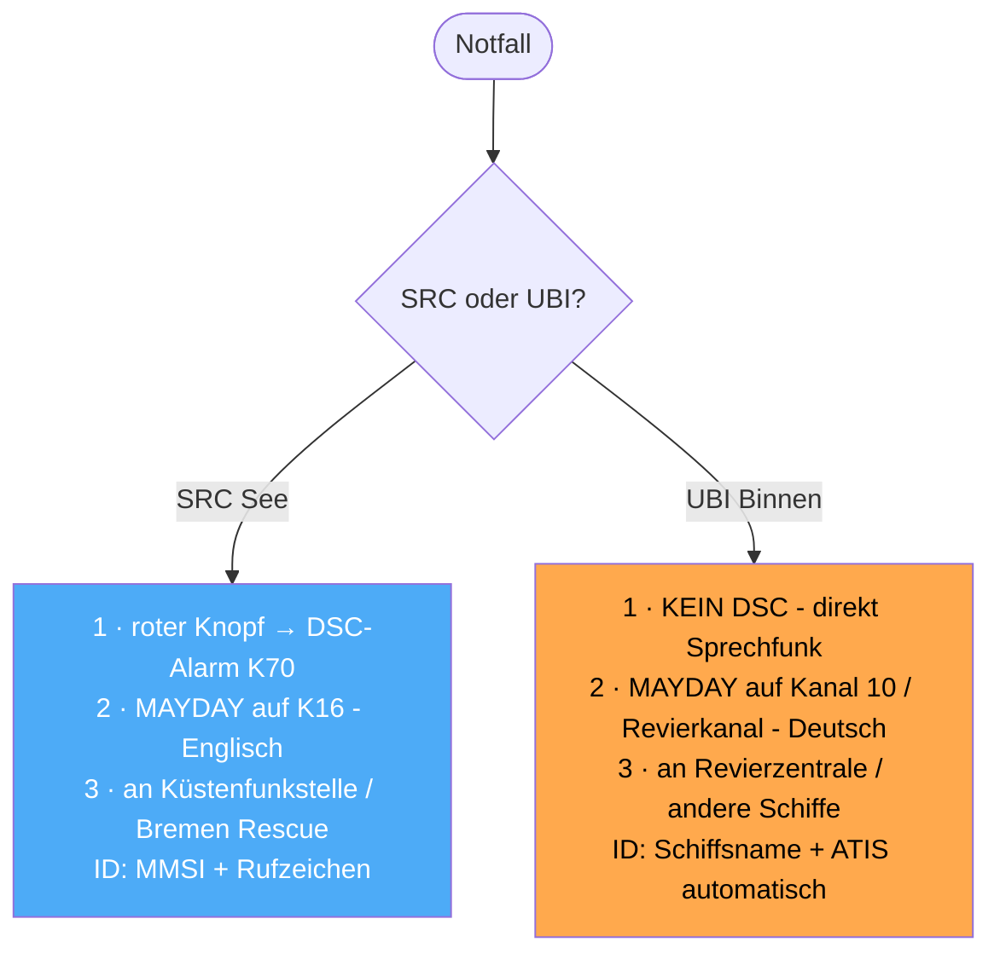
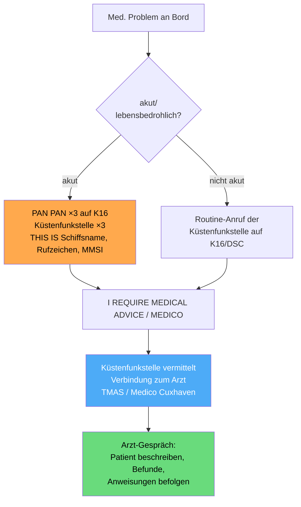
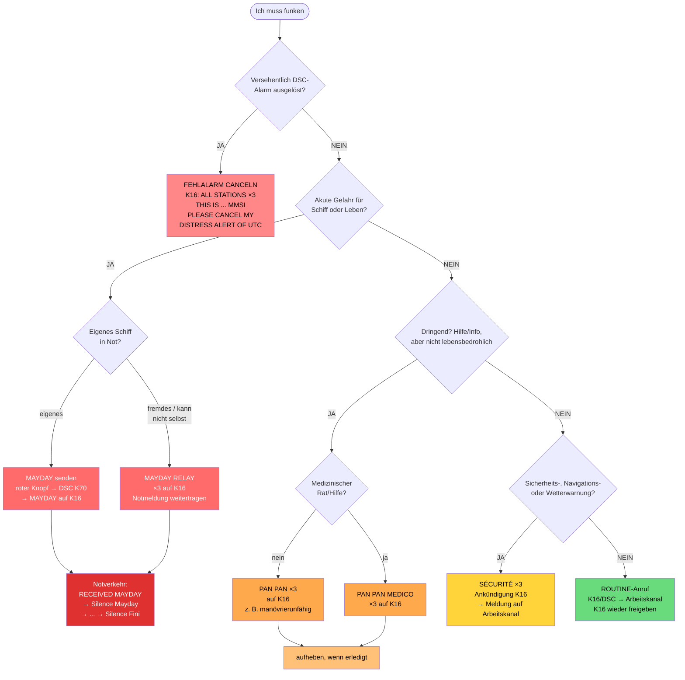
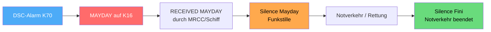

## Notverfahren & Funkschema (alle Fälle)

> [!info]- Teil des [[00 Funkkurs SRC & UBI – Online Lernunterlagen für Funkzeugnis|Funkzeugnis-Kurs SRC & UBI]] · Modul 4 · Funkpraxis


Funkschema – alle Fälle auf einen Blick:

![[Funkschema-GMDSS-Matrix-alle-Faelle.png]]

Am besten einlaminieren und auf jeden Törn mitnehmen! 

> [!tip] Reflexkette im Ernstfall
> Mein wichtigster Tipp fürs Notverfahren: Im Ernstfall vergisst man die Hälfte von dem hier – das ist normal, der Puls geht hoch. Deshalb übe ich mit der Crew genau eine Reflexkette ein: **roter Knopf → Kanal 16** → „MAYDAY, this is …, Position, was los ist, wie viele wir sind". Den Rest macht das Gerät oder die Küstenfunkstelle. Lieber holprig den Notruf raushauen als perfekt zu schweigen.

Dieses Schema gilt für SRC (Seefunk/GMDSS).
Im UBI (Binnenfunk) läuft der Notfall anders , das schauen wir uns jetzt an: 

---

### SRC vs. UBI – der Unterschied im Notverfahren
| | SRC (Seefunk/GMDSS) | UBI (Binnenfunk) |
|---|---|---|
| DSC / Kanal 70 | Ja - DSC-Notalarm auf K70 zuerst | Nein - kein DSC, kein K70 |
| Sprechfunk-Kanal | K16 (Anruf/Not) | Kanal 10 (Schiff-Schiff) / Revierkanal |
| Empfänger | Küstenfunkstelle / MRCC „Bremen Rescue" | Revierzentrale (Verkehrsposten) / andere Schiffe |
| Identifikation | MMSI + Rufzeichen + Schiffsname | Schiffsname (+ automatische ATIS-Kennung) |
| Sprache | Englisch | Deutsch |
| Kennwörter | **MAYDAY · PAN PAN · SÉCURITÉ** (+ Silence …) | gleiche Kennwörter, aber nur Sprechfunk |



Die Kennwörter (MAYDAY/PAN PAN/SÉCURITÉ) sind in beiden Fällen gleich. Der Unterschied liegt im Weg: SRC macht erst den DSC-Alarm auf K70, dann den MAYDAY auf K16 auf Englisch. UBI läuft direkt per Sprechfunk auf Kanal 10 bzw. dem Revierkanal auf Deutsch – ohne DSC und mit ATIS statt MMSI.

Das ausführliche Schema unten (Matrix und Wortlaute) ist das SRC/GMDSS-Verfahren; die UBI-Kurzform steht oben.

---

### Die 3 Dringlichkeitsstufen auf einen Blick

| Stufe         | Kennwort (3×) | Wann                                                   | Sprich auf                     |
| ------------- | ------------- | ------------------------------------------------------ | ------------------------------ |
| Not           | MAYDAY        | unmittelbare Gefahr für Schiff/Person, sofortige Hilfe | DSC K70 → Sprechfunk K16       |
| Dringlichkeit | PAN PAN       | dringend, aber (noch) keine akute Gefahr               | K16, dann Arbeitskanal         |
| Sicherheit    | SÉCURITÉ      | Sicherheits-/Navigations-/Wetterwarnung                | Ankündigung K16 → Arbeitskanal |

Aussprache: PAN PAN = „pann pann", SÉCURITÉ = „ßeküritä".

Zur Einordnung zweier oft verwechselter Begriffe: SOS ist das Morse-Seenotzeichen `· · · — — — · · ·` (drei kurz, drei lang, drei kurz), ohne Pausen als ein durchgehendes Zeichen gesendet. Es ist keine Abkürzung – 1906 wurde diese Morsefolge gewählt, weil sie einfach, eindeutig und auch bei schlechtem Empfang sofort erkennbar ist. „Save Our Souls" oder „Save Our Ship" sind nachträgliche Eselsbrücken (Backronyme), nicht der Ursprung. Im Sprechfunk entspricht SOS dem **MAYDAY** (von frz. *m'aider* = „helft mir"). Also: SOS in Morse/Telegrafie, MAYDAY gesprochen.

SAR steht für Search and Rescue, den Such- und Rettungsdienst auf See. Der Funkverkehr vor Ort läuft auf Kanal 06 (On-Scene); ein OSC (On-Scene Coordinator) leitet die Einsatzkräfte.

Dazu passt, wer die Rettung koordiniert: Ein RCC (Rescue Co-ordination Centre) ist die allgemeine Rettungsleitstelle, die einen SAR-Einsatz leitet und koordiniert. Das MRCC (Maritime Rescue Co-ordination Centre) ist das RCC für die Seefahrt; in Deutschland ist das die Seenotleitung Bremen (Funkrufname „Bremen Rescue", betrieben von der DGzRS) → [[02 Funkkurs — Wichtige Stellen & Behörden|Funkkurs — Wichtige Stellen & Behörden]]. Der OSC (On-Scene Coordinator) ist der Einsatzleiter vor Ort – das Schiff, Boot oder Luftfahrzeug, das die Rettung direkt am Unglücksort koordiniert. Bestimmt wird er vom MRCC, oft das erste geeignete Schiff vor Ort oder ein Rettungskreuzer (könntest auch du sein). Seine Aufgaben: Suchmuster organisieren und die eintreffenden Helfer einteilen, als Funk-Bindeglied zwischen den Einheiten vor Ort und dem MRCC dienen und den On-Scene-Funkverkehr meist auf Kanal 06 (oder 16) bündeln, um Doppelarbeit zu vermeiden. Der OSC darf auch Silence anordnen, wenn er den Notverkehr leitet. Kurz: Der DSC-Notalarm bzw. MAYDAY landet beim MRCC (Bremen Rescue), das den Gesamteinsatz plant und einen OSC bestimmt, der die Helfer vor Ort dirigiert.

---

### Die vier Verkehrsarten – Beschreibung & Beispiele
Der Seefunk kennt vier Verkehrsarten, streng nach Priorität geordnet – Not geht immer vor:

#### 1. Notverkehr (Distress) – Kennwort MAYDAY
Wird abgesetzt, wenn ein Schiff oder eine Person in unmittelbarer Gefahr ist und sofortige Hilfe braucht. Hat höchste Priorität, alles andere schweigt. Typische Fälle: das Schiff sinkt oder macht schwer Wasser, Feuer an Bord, Mensch über Bord, den man nicht selbst bergen kann, das Schiff ist aufgelaufen und in der Brandung in Gefahr, oder schwerer Wassereinbruch nach einer Kollision.

#### 2. Dringlichkeitsverkehr (Urgency) – Kennwort PAN PAN
Eine dringende Meldung zur Sicherheit eines Schiffes oder einer Person, aber (noch) ohne unmittelbare Lebensgefahr. Beispiele sind Manövrierunfähigkeit (Motorschaden, Ruderbruch) ohne akute Gefahr, leerer Treibstoff bei stabiler Lage, ein medizinischer Notfall an Bord (→ MEDICO, siehe unten), eine vermisste Person bei noch nicht lebensbedrohlicher Lage oder ein gebrochener Mast bei weiter schwimmfähigem Schiff.

#### 3. Sicherheitsverkehr (Safety) – Kennwort SÉCURITÉ
Eine Sicherheitsmeldung über Gefahren für die Schifffahrt oder über Wetter und Navigation: ein treibendes Hindernis (Container, Baumstamm, verlorene Ladung), eine Navigationswarnung (ausgefallenes Seezeichen, vertriebene Tonne), eine Sturm- oder Wetterwarnung der Küstenfunkstelle oder militärische Sperrgebiete und Schießübungen.

#### 4. Routineverkehr (Routine) – kein Kennwort
Normaler Funkverkehr ohne Sicherheitsbezug: eine Marina oder einen Hafen anrufen (Liegeplatz reservieren), Schleuse oder Brücke kontaktieren, Schiff-Schiff-Absprachen (Überholen, Treffpunkt) oder einen Wetterbericht abfragen.

![[funkkurs-verkehrsarten-prio.png]]

Die Prioritätsfolge lautet also **Not → Dringlichkeit → Sicherheit → Routine**. Eine höhere Stufe hat immer Vorrang; bei Notverkehr müssen alle anderen schweigen (Silence).

---

### MEDICO – Funkärztliche Beratung (Radio Medical Advice)
MEDICO ist ein kostenloser, weltweiter und rund um die Uhr erreichbarer funkärztlicher Beratungsdienst für medizinische Notfälle an Bord. In Deutschland übernimmt das TMAS Germany – „Medico Cuxhaven" (Telemedical Maritime Assistance Service), seit 1931 am Krankenhaus Cuxhaven, im Auftrag der Bundesrepublik.

Man nutzt ihn bei Krankheit oder Verletzung an Bord, bei der man ärztlichen Rat braucht – vom Sonnenstich bis zum Verdacht auf Herzinfarkt. In akuten Fällen wird das Gespräch als Dringlichkeit (PAN PAN) abgesetzt.

Ablauf über UKW:


Für die Praxis lohnt es sich, die Patientin oder den Patienten vorher so gut wie möglich zu untersuchen, den MEDICO-Untersuchungsbogen (See-BG/DGUV, zweisprachig) auszufüllen und nach Möglichkeit vorab zu mailen – das verbessert die Diagnose. Am Funk gibt man dann eine knappe, klare Beschreibung der Krankheit oder Verletzung. Kontakt in Deutschland: TMAS Germany / Medico Cuxhaven, Notruf +49 4721 78-0 (24 h), medico@tmas-germany.de. Wichtig ist, dass MEDICO eine **Dringlichkeit (PAN PAN)** ist und **kein MAYDAY** – außer es besteht zusätzlich akute Lebensgefahr.

> [!tip] mein Tipp zur richtigen Vorbereitung
> Bevor ich mit einer Crew losfahre, bitte ich immer alle Crewmitglieder, mir (oder dem/der Skipper:in) alle medizinisch relevanten Belange mitzuteilen (z.B. Diabetes, Medikamente etc.). 
> 
> So können wir im schlimmsten Fall mit dem MEDICO die richtigen Schritte einleiten (man stelle sich vor, die betroffene Person ist ohnmächtig geworden).


---

### Master-Schema: Welcher Fall? (Entscheidungsbaum)



Zum Baum noch die Kanäle: Alle Not-, Dringlichkeits- und Sicherheitsankündigungen laufen über K16 (der DSC-Teil über K70). Die eigentliche Sicherheits- oder Routine-Meldung wandert dann auf einen Arbeitskanal, und K16 wird freigehalten.

---

### 1) MAYDAY – eigene Notmeldung
Ablauf: roter DISTRESS-Knopf → DSC-Alarm automatisch auf K70 → Gerät springt auf K16 → Sprech-MAYDAY (auf Englisch – am besten laut üben!):

```
MAYDAY – MAYDAY – MAYDAY
THIS IS <Schiffsname 3×> I spell <Schiffsname 1x> <Call Sign> <MMSI>
MAYDAY <Schiffsname 1×> <Call Sign> <MMSI>
POSITION: ...
NATURE OF DISTRESS: ... (sinking / fire / man overboard / aground …)
ASSISTANCE REQUIRED: ...
PERSONS ON BOARD: ...
OTHER INFORMATION: ...
OVER
```

### 2) RECEIVED MAYDAY – Bestätigung einer empfangenen Notmeldung
Wenn du einen MAYDAY hörst und (nahe genug) helfen kannst, erst kurz warten, ob eine Küstenfunkstelle oder das MRCC quittiert. Tut das niemand, bestätigst du auf K16:

```
MAYDAY
<Schiffsname der Notmeldung 3×>
THIS IS <eigener Schiffsname 3×>
RECEIVED MAYDAY
```

### 3) MAYDAY RELAY – fremde Notmeldung weiterleiten
Wenn ein Schiff in Not selbst nicht (mehr) senden kann oder du den Notruf weitertragen musst:

```
MAYDAY RELAY – MAYDAY RELAY – MAYDAY RELAY
ALL STATIONS (oder Name Küstenfunkstelle) 3×
THIS IS <eigener Schiffsname 3×> I spell <Schiffsname 1x> <Call Sign> <MMSI>
... es folgt die Notmeldung des havarierten Schiffes
OVER
```

### 4) Funkstille anordnen – Silence Mayday / Silence Distress
Damit der Notverkehr nicht gestört wird, wird auf K16 Funkstille geboten:
- Silence Mayday (Aussprache: „Seelonce Mäidäi") – gesprochen vom Schiff in Not oder der leitenden Station (MRCC/OSC).
- Silence Distress (Aussprache: „Seelonce Distress") – gesprochen von jeder anderen Station, die Störungen bemerkt.

```
Silence Mayday (Aussprache: „Seelonce Mäidäi")
```
→ Alle, die nicht am Notverkehr beteiligt sind, dürfen auf diesen Frequenzen nicht senden.

### 5) Notverkehr beenden – Silence Fini
Wenn der Notfall abgeschlossen ist und der Verkehr wieder frei läuft (nur leitende Station / MRCC / Schiff in Not):
```
MAYDAY
ALL STATIONS – ALL STATIONS – ALL STATIONS
THIS IS <Schiffsname 3×>
<Uhrzeit UTC>
<Name + Rufzeichen des havarierten Schiffes>
Silence Fini (Aussprache: „Seelonce Feenee" — Stille beendet)
```

### 6) Fehlalarm widerrufen – Cancel Distress Alert

> [!danger] Fehlalarm niemals einfach ausschalten
> Einen versehentlichen DSC-Notalarm **nicht einfach ausschalten**, sondern **sofort per Sprechfunk auf K16 widerrufen** – sonst läuft ein echter Such- und Rettungseinsatz ins Leere.

```
ALL STATIONS – ALL STATIONS – ALL STATIONS
THIS IS <Schiffsname 3×> <Call Sign> <MMSI>
PLEASE CANCEL MY DISTRESS ALERT OF <Uhrzeit UTC>
OUT
```

### 7) PAN PAN – Dringlichkeitsmeldung
```
PAN PAN – PAN PAN – PAN PAN
ALL STATIONS (oder Name Station) 3×
THIS IS <Schiffsname 3×> <Call Sign> <MMSI>
POSITION / Problem / benötigte Hilfe
OVER
```
Typisch: manövrierunfähig ohne akute Gefahr, medizinischer Rat (PAN PAN MEDICO), Person vermisst aber Lage stabil.

### 8) SÉCURITÉ – Sicherheitsmeldung
```
SÉCURITÉ – SÉCURITÉ – SÉCURITÉ
ALL STATIONS 3×
THIS IS <Schiffsname 3×> <Call Sign> <MMSI>
... auf Arbeitskanal XX wechseln ...
```
Dann auf dem angekündigten Arbeitskanal die eigentliche Meldung (Navigationswarnung, treibendes Hindernis, Wetterwarnung). K16 freihalten.

---

### Lebenszyklus einer Notlage (Überblick)



---
**Kurs-Navigation:** [[11 Funkkurs — UBI Notruf & warum Kanal 16 verboten|← 11 · UBI – Notruf & warum Kanal 16 verboten]] · [[00 Funkkurs SRC & UBI – Online Lernunterlagen für Funkzeugnis|↑ Kursübersicht]] · [[13 Funkkurs — Funkverfahren & Buchstabieralphabet|13 · Funkverfahren & Buchstabieralphabet →]]

*Superlink:* [[00 Funkkurs SRC & UBI – Online Lernunterlagen für Funkzeugnis|Funkzeugnis-Kurs SRC & UBI]]

