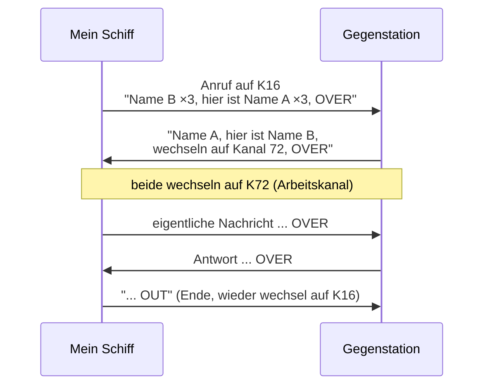

## Funkverfahren & Buchstabieralphabet

> [!info]- Teil des [[00 Funkkurs SRC & UBI – Online Lernunterlagen für Funkzeugnis|Funkzeugnis-Kurs SRC & UBI]] · Modul 4 · Funkpraxis

In diesem Teil lernst du das internationale Buchstabieralphabet (ICAO/NATO) und wann du buchstabierst und wann nicht. Dazu kommen die Zeitangaben im Seefunk, also UTC und Date-Time-Group, samt korrekter Aussprache. Und du beherrschst danach den Grundaufbau jedes Funkspruchs aus Anruf, Meldung und Abschluss und kennst die wichtigsten Verkehrsfloskeln.

### Internationales Buchstabieralphabet (ICAO/NATO) – Pflicht!
Beim SRC wird auf Englisch buchstabiert. Das muss flüssig sitzen – am besten laut üben!

|           |            |           |         |
| --------- | ---------- | --------- | ------- |
| A Alpha   | B Bravo    | C Charlie | D Delta |
| E Echo    | F Foxtrot  | G Golf    | H Hotel |
| I India   | J Juliett  | K Kilo    | L Lima  |
| M Mike    | N November | O Oscar   | P Papa  |
| Q Quebec  | R Romeo    | S Sierra  | T Tango |
| U Uniform | V Victor   | W Whiskey | X X-ray |
| Y Yankee  | Z Zulu     |           |         |

Zahlen werden englisch und deutlich gesprochen (Three = Tree, Nine = Niner, Four = Fower im Funk).

Lerngrafik zum Ausdrucken oder für den Beamer:

![[Funk-Buchstabieralphabet-NATO.png]]

![[Funk-Alphabet-Morse.png]]

### Was buchstabiert man – und was nicht?
Den **Schiffsnamen** muss man nicht immer buchstabieren – normalerweise wird er normal gesprochen. 
Bei komplizierten Namen und in der ersten MAYDAY-Meldung empfiehlt es sich, den Namen einmal zu buchstabieren. 

| Buchstabieren                                                 | Normal sprechen (nicht buchstabieren)                  |
| ------------------------------------------------------------- | ------------------------------------------------------ |
| Rufzeichen (immer einzeln: „Delta Alfa…")                     | (In der Regel) Schiffsname als Wort (z. B. „Albatros") |
| Schwierige / ausländische Eigennamen (z.B."Gorch Fock"), Orte | gängige, klar verständliche Wörter                     |
| Wenn die Gegenstation darum bittet („spell, please")          | Standard-Floskeln (OVER, MMSI …)                       |
| Bei schlechtem Empfang zur Sicherheit                         |                                                        |

Zahlen (MMSI, Position, Kanal) werden einzeln und deutlich gesprochen („One - Six"), nicht als Gesamtzahl – das ist aber kein Buchstabieren.

Als Faustregel: Namen sprechen, Rufzeichen buchstabieren, Zahlen einzeln nennen. Ist dein Schiffsname ungewöhnlich, buchstabiere ihn beim ersten Kontakt einmal zusätzlich – danach reicht das gesprochene Wort.

Buchstabieren in der MELDUNG (nicht im Anruf) – Lehrbuch-Regel
Die Radio Regulations empfehlen, innerhalb von Meldungen (nicht im Anruf) Orts- und Eigennamen, Kilometer-/Positionsangaben, Zahlen und Uhrzeiten nach internationalem Alphabet zu buchstabieren und/oder die Angabe zu wiederholen. Der Wortlaut mit „I spell" und „new word":
```
"... a container, marked with HAPAG LLOYD -
I repeat and spell HAPAG LLOYD:
Hotel Alpha Papa Alpha Golf - new word - Lima Lima Oscar Yankee Delta"

"... in position 4.8 nautical miles south-easterly of Cape Arkona -
I repeat: four decimal eight nautical miles south-easterly of Cape Arkona -
I spell CAPE ARKONA: Charlie Alpha Romeo Kilo Oscar - new word - Alpha Romeo Kilo Oscar November Alpha"
```
Diese Empfehlung solltest du unbedingt befolgen: Eine mündlich übertragene wichtige Info oder Position wird deutlich sicherer verstanden, wenn du sie buchstabierst und wiederholst.

### Zeitangaben: UTC & Date-Time-Group
Im Seefunk gilt **UTC**, nicht Lokalzeit. Alle Zeiten (Notruf, Cancel, Wetter, Logbuch) werden in UTC (Universal Time Coordinated) angegeben, im 24-Stunden-Format, vierstellig. Das Kürzel **Z** („Zulu") bedeutet „= UTC".

Beispiele:
- `1530 UTC` = 15:30 Uhr Weltzeit (gesprochen: „one five three zero").
- Im Cancel-Spruch: *„PLEASE CANCEL MY DISTRESS ALERT OF 1530 UTC"*.

Die Date-Time-Group (DTG) ist das volle Datum-Zeit-Format:
```
D D H H M M Z
│ │ │ │ │ │ └─ Zeitzone: Z = Zulu = UTC
│ │ └─┴─┴─┴──── Uhrzeit (HHMM, 24 h)
└─┴──────────── Tag des Monats
```
Ein Beispiel: 041530Z steht für den 4. Tag des Monats, 15:30 UTC. Sie begegnet dir unter anderem in NAVTEX-Meldungen und im Funklogbuch.

Warum UTC? Auf See treffen Schiffe aus allen Zeitzonen aufeinander, und eine gemeinsame Zeit verhindert Verwechslungen. In Mitteleuropa gilt MEZ = UTC+1, MESZ (Sommer) = UTC+2 – im Sommer also 2 Stunden abziehen, um auf UTC zu kommen.

### Wichtige Verkehrsfloskeln
> [!important] OVER vs. OUT
> - **OVER** – Ende meiner Aussendung, Antwort erwartet.
> - **OUT** – Ende des Funkverkehrs, keine Antwort erwartet. (Nie „Over and Out" – das ist falsch.)

- ROGER – verstanden / empfangen.
- AFFIRMATIVE / NEGATIVE – ja / nein.
- STATION CALLING – Anruf von unbekannter Station.
- RADIO CHECK – Empfangsprüfung; Antwort z. B. „loud and clear".
- WAIT / STAND BY – warten.
- CORRECTION – Korrektur folgt.
- I REPEAT – Ich wiederhole

### Funkprobe / Radio Check – wie sende ich eine Testnachricht?
Es gibt zwei Wege, je nachdem, was du testen willst.

A) Sprechfunk-Funkprobe (Radio Check): Nicht einfach auf Kanal 16 „testen", der bleibt frei. Stattdessen eine Küstenfunkstelle (z. B. DP07 / Kiel Radio / Verkehrszentrale) oder ein Schiff bzw. eine Marina auf einem Arbeitskanal rufen. Der Wortlaut:
```
[Station ×3] THIS IS [eigener Name ×3, Rufzeichen]
RADIO CHECK
OVER
```
Die Antwort gibt die Empfangsqualität an, meist als Readability 1-5 oder im Klartext:
 - „loud and clear" (laut und deutlich, = 5)
 - „readability three" usw. (1 = unverständlich … 5 = ausgezeichnet)

Hört dich eine Küstenfunkstelle auf Kanal 16/DSC, kannst du sicher sein, dass auch dein DSC-Notruf funktioniert.

B) **DSC-Testanruf (Test Call)**: Moderne Geräte haben im Menü eine Funktion „Test Call" an eine Küstenfunkstellen-MMSI – die Station bestätigt automatisch.

> [!danger] Niemals einen DSC-Notalarm zum Testen auslösen
> Zum Testen niemals einen **DSC-Notalarm** auslösen; ein versehentlicher Alarm muss sofort widerrufen werden ([[12 Funkkurs — Notverfahren & Funkschema (alle Fälle)|Funkkurs — Notverfahren & Funkschema (alle Fälle)]]).

### Anruf und Meldung – der Grundaufbau jedes Funkspruchs
Jeder Sprechfunkruf folgt demselben System und besteht aus Anruf und Meldung.

Der Anruf nennt, wer mit wem spricht: dreimal der Empfänger (Name der Gegenstation), dann „this is" bzw. „hier ist", dann dreimal der Aussender (eigener Name). Die Meldung beantwortet, wo du bist und was du möchtest. Den Abschluss bildet „OVER" (= „bitte kommen"), wenn eine Antwort erwartet wird, oder „OUT" (= „Ende"), wenn keine Antwort gewünscht ist.

```
[Name Gegenstation 3×] THIS IS / HIER IST [eigener Name 3×]
... Meldung (wo / was) ...
OVER (oder OUT)
```
Danach auf einen Arbeitskanal wechseln und Kanal 16 als Anrufkanal freihalten.

### Sammelanrufe: „All ships" vs. „All stations"
| Anruf | An wen? | Deutsch / Englisch |
|---|---|---|
| „All ships" | an alle Schiffsfunkstellen (Sport- + Berufsschiffe) in Reichweite | „An alle Schiffsfunkstellen" / „All ships" |
| „All stations" | an alle Funkstellen – auch Landstellen/Küstenfunkstellen – in Reichweite | „An alle Funkstellen" / „All stations" |

Der Unterschied lässt sich leicht merken: „All ships" meint nur Schiffe, „All stations" meint alle (auch an Land). Not-, Dringlichkeits- und Sicherheitsmeldungen gehen an ALL STATIONS, weil sie alle hören sollen.


<sub>K16 ist nur zum Anrufen da – das Gespräch immer auf einen Arbeitskanal verlegen.</sub>

### Funk-Vokabeln (Englisch ↔ Deutsch)
Im SRC wird auf Englisch gefunkt. Die wichtigsten Wörter solltest du laut üben, damit sie im Ernstfall sitzen. Zahlen werden dabei immer einzeln gesprochen.

#### Notlage & Gefahr
| Englisch | Deutsch |
|---|---|
| sinking | sinkend |
| fire / explosion | Feuer / Explosion |
| flooding | Wassereinbruch |
| leak | Leck |
| collision | Kollision |
| grounding / aground | Grundberührung / aufgelaufen |
| capsizing | Kentern |
| man overboard | Mensch über Bord |
| disabled / adrift | manövrierunfähig / treibend |
| engine failure | Maschinenausfall |
| injured / person sick | verletzt / Person krank |
| abandon ship | Schiff verlassen |

#### Hilfe & Rettung
| Englisch | Deutsch |
|---|---|
| I require assistance | ich benötige Hilfe |
| immediate assistance | sofortige Hilfe |
| I require a tow | ich benötige Schlepphilfe |
| persons on board | Personen an Bord |
| crew | Besatzung |
| lifejacket / liferaft | Rettungsweste / -insel |
| medical advice (MEDICO) | funkärztliche Beratung |
| rescue / safe | Rettung / in Sicherheit |
| I am proceeding to assist | ich komme zu Hilfe |
| stand by to assist | zur Hilfe bereithalten |
| ETA (estimated time of arrival) | voraussichtliche Ankunft |
| search and rescue (SAR) | Suche und Rettung |
| how many persons? | wie viele Personen? |

#### Navigation & Manöver
| Englisch | Deutsch |
|---|---|
| position | Position |
| course | Kurs |
| speed (over ground) | Fahrt (über Grund) |
| knots | Knoten |
| bearing | Peilung |
| nautical miles | Seemeilen |
| port / starboard | Backbord / Steuerbord |
| ahead / astern | voraus / achteraus |
| vessel | Fahrzeug / Schiff |
| at anchor | vor Anker |
| fairway | Fahrwasser |
| buoy | Tonne / Boje |
| depth / shallow water | Wassertiefe / flaches Wasser |
| visibility / fog | Sicht / Nebel |

#### Verfahrenswörter
| Englisch | Deutsch |
|---|---|
| say again | wiederholen Sie |
| I spell … | ich buchstabiere … |
| new word | neues Wort |
| affirmative / negative | ja / nein |
| correction | Berichtigung |
| stand by (on channel …) | bereithalten (auf Kanal …) |
| how do you read me? | wie hören Sie mich? |
| loud and clear | laut und deutlich |
| what is your position? | wie ist Ihre Position? |
| nothing more / out | nichts weiter / Ende |

Die Zahlen-Aussprache: 0 ZE-RO · 1 WUN · 2 TOO · 3 TREE · 4 FOW-ER · 5 FIFE · 6 SIX · 7 SEV-EN · 8 AIT · 9 NIN-ER, Komma = DECIMAL, 1000 = TOU-SAND. Zahlen immer einzeln sprechen: 156,8 → „one five six decimal eight", Kanal 16 → „channel one six", die MMSI Ziffer für Ziffer.

---
**Kurs-Navigation:** [[12 Funkkurs — Notverfahren & Funkschema (alle Fälle)|← 12 · Notverfahren & Funkschema]] · [[00 Funkkurs SRC & UBI – Online Lernunterlagen für Funkzeugnis|↑ Kursübersicht]] · [[14 Funkkurs — Funkbeispiele & Muster-Funksprüche|14 · Funkbeispiele SRC (Seefunk, Englisch) →]]

*Superlink:* [[00 Funkkurs SRC & UBI – Online Lernunterlagen für Funkzeugnis|Funkzeugnis-Kurs SRC & UBI]]

