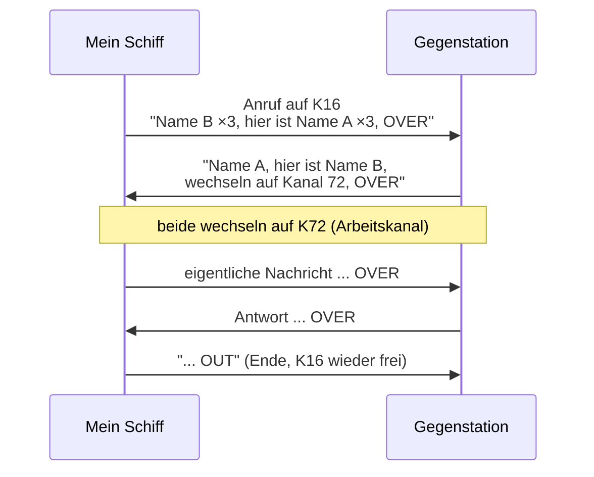

## Funkkurs — Funkverfahren & Buchstabieralphabet

Gemeinsame Grundlagen für **SRC und UBI**. Modul des [[Funkzeugnis-Kurs SRC und UBI|Funkzeugnis-Kurs SRC & UBI]].

### Internationales Buchstabieralphabet (ICAO/NATO) — Pflicht!
Beim SRC wird auf Englisch buchstabiert. Muss flüssig sitzen — am besten im Kurs laut durchgehen lassen.

| | | | |
|---|---|---|---|
| A Alpha | B Bravo | C Charlie | D Delta |
| E Echo | F Foxtrot | G Golf | H Hotel |
| I India | J Juliett | K Kilo | L Lima |
| M Mike | N November | O Oscar | P Papa |
| Q Quebec | R Romeo | S Sierra | T Tango |
| U Uniform | V Victor | W Whiskey | X X-ray |
| Y Yankee | Z Zulu | | |

**Zahlen:** englisch und deutlich (Three = Tree, Nine = Niner im Funk).

**Lerngrafik (zum Ausdrucken / Beamer):**

![[Funk-Buchstabieralphabet-NATO.png]]

![[Funk-Alphabet-Morse.png]]

<sub>Grafiken: Wikimedia Commons, CC BY-SA 4.0 (PhoneticAlphabet.svg; NATO Phonetic And Morse Code Alphabet).</sub>

### Was buchstabiert man — und was nicht?
> [!question] Muss ich den Schiffsnamen immer buchstabieren?
> **Nein.** Der **Schiffsname wird normal als Wort gesprochen**, nicht buchstabiert. Buchstabiert wird nur, wo Verwechslung droht.

| Buchstabieren ✅ | Normal sprechen ❌ (nicht buchstabieren) |
|---|---|
| **Rufzeichen** (immer einzeln: „Delta Alfa…") | **Schiffsname** als Wort (z. B. „Albatros") |
| Schwierige / ausländische **Eigennamen**, Orte | gängige, klar verständliche Wörter |
| Wenn die **Gegenstation darum bittet** („spell, please") | Standard-Floskeln (OVER, ROGER …) |
| Bei **schlechtem Empfang** zur Sicherheit | |

**Zahlen** (MMSI, Position, Kanal) werden **einzeln und deutlich** gesprochen („One – Six"), nicht als Gesamtzahl — aber das ist *kein* Buchstabieren.

> [!tip] Faustregel
> **Namen sprechen, Rufzeichen buchstabieren, Zahlen einzeln nennen.** Ist dein Schiffsname ungewöhnlich, buchstabiere ihn beim **ersten** Kontakt einmal zusätzlich — danach reicht das gesprochene Wort.

> [!important] Buchstabieren in der MELDUNG (nicht im Anruf) — Lehrbuch-Regel
> Die Radio Regulations empfehlen, **innerhalb von Meldungen** (nicht im Anruf) **Orts- und Eigennamen, Kilometer-/Positionsangaben, Zahlen und Uhrzeiten** nach internationalem Alphabet zu **buchstabieren** *und/oder* die Angabe zu **wiederholen**. Wortlaut mit **„I spell"** und **„new word"**:
> ```
> "... a container, marked with HAPAG LLOYD —
>  I repeat and spell HAPAG LLOYD:
>  Hotel Alpha Papa Alpha Golf — new word — Lima Lima Oscar Yankee Delta"
>
> "... in position 4.8 nautical miles south-easterly of Cape Arkona —
>  I repeat: four decimal eight nautical miles south-easterly of Cape Arkona —
>  I spell CAPE ARKONA: Charlie Alpha Romeo Kilo Oscar — new word — Alpha Romeo Kilo Oscar November Alpha"
> ```
> 🔴 **Diese Empfehlung unbedingt befolgen!** Eine mündlich übertragene wichtige Info/Position wird **deutlich sicherer verstanden**, wenn man sie buchstabiert/wiederholt, als ohne.

### Zeitangaben: UTC & Date-Time-Group
> [!important] Im Seefunk gilt UTC — nicht Lokalzeit
> Alle Zeiten (Notruf, Cancel, Wetter, Logbuch) werden in **UTC** (Universal Time Coordinated) angegeben, **24-Stunden-Format, vierstellig**. Das Kürzel **Z** („**Zulu**") bedeutet „= UTC".

**Beispiele:**
- `1530 UTC` = 15:30 Uhr Weltzeit (gesprochen: „one five three zero").
- Im Cancel-Spruch: *„PLEASE CANCEL MY DISTRESS ALERT OF **1530 UTC**"*.

**Date-Time-Group (DTG)** — das volle Datum-Zeit-Format:
```
D D H H M M  Z
│ │ │ │ │ │  └─ Zeitzone: Z = Zulu = UTC
│ │ └─┴─┴─┴──── Uhrzeit (HHMM, 24 h)
└─┴──────────── Tag des Monats
```
*Beispiel:* **041530Z** = **4. Tag** des Monats, **15:30 UTC**. Begegnet dir u. a. in **NAVTEX-Meldungen** und im **Funklogbuch**.

> [!tip] Warum UTC?
> Auf See treffen Schiffe aus allen Zeitzonen aufeinander — eine **gemeinsame Zeit** verhindert Verwechslungen. Mitteleuropa: **MEZ = UTC+1**, MESZ (Sommer) = UTC+2. Also im Sommer **2 Stunden** abziehen, um auf UTC zu kommen.

### Wichtige Verkehrsfloskeln
- **OVER** — Ende meiner Aussendung, Antwort erwartet.
- **OUT** — Ende des Funkverkehrs, keine Antwort erwartet. (**Nie „Over and Out" — das ist falsch!**)
- **ROGER** — verstanden / empfangen.
- **AFFIRMATIVE / NEGATIVE** — ja / nein.
- **STATION CALLING** — Anruf von unbekannter Station.
- **RADIO CHECK** — Empfangsprüfung; Antwort z. B. „loud and clear".
- **WAIT / STAND BY** — warten.
- **CORRECTION** — Korrektur folgt.

### Funkprobe / Radio Check — wie sende ich eine Testnachricht?
Es gibt **zwei** Wege, je nachdem, was man testen will:

**A) Sprechfunk-Funkprobe (Radio Check):**
1. **Nicht** einfach auf **Kanal 16** „testen" — der bleibt frei. Stattdessen eine **Küstenfunkstelle** (z. B. DP07 / Kiel Radio / Verkehrszentrale) oder ein **Schiff/eine Marina** auf einem **Arbeitskanal** rufen.
2. Wortlaut:
```
[Station ×3]   THIS IS   [eigener Name ×3, Rufzeichen]
RADIO CHECK
OVER
```
3. Antwort = Empfangsqualität, meist als **Readability 1–5** oder Klartext:
   - **„loud and clear"** (laut und deutlich, = 5)
   - „readability three" usw. (1 = unverständlich … 5 = ausgezeichnet)

> 💡 Hört dich eine **Küstenfunkstelle auf Kanal 16/DSC**, kannst du sicher sein, dass auch dein **DSC-Notruf** funktioniert.

**B) DSC-Testanruf (Test Call):**
- Moderne Geräte haben im Menü eine Funktion **„Test Call"** an eine **Küstenfunkstellen-MMSI** — die Station **bestätigt automatisch**.
- **Niemals** zum Testen einen **DSC-Notalarm** auslösen! Ein versehentlicher Alarm muss sofort widerrufen werden ([[Funkkurs — Notverfahren & Funkschema (alle Fälle)]]).

### Anruf und Meldung — der Grundaufbau jedes Funkspruchs
Jeder Sprechfunkruf folgt **demselben System** und besteht aus **Anruf + Meldung**:

> [!abstract] Aufbau
> **1. Anruf** — nennt *wer mit wem*:
> - **3× der Empfänger** (Name der Gegenstation)
> - **„this is" / „hier ist"**
> - **3× der Aussender** (eigener Name)
>
> **2. Meldung** — beantwortet *Wo bin ich? / Was möchte ich?*
>
> **3. Abschluss:**
> - **„OVER" (= „bitte kommen")** — wenn eine **Antwort erwartet** wird
> - **„OUT" (= „Ende")** — wenn **keine Antwort** gewünscht ist

```
[Name Gegenstation 3×]   THIS IS / HIER IST   [eigener Name 3×]
... Meldung (wo / was) ...
OVER   (oder OUT)
```
Dann auf einen **Arbeitskanal** wechseln (Kanal 16 / Anrufkanal freihalten).

### Sammelanrufe: „All ships" vs. „All stations"
| Anruf | An wen? | Deutsch / Englisch |
|---|---|---|
| **„All ships"** | an **alle Schiffsfunkstellen** (Sport- + Berufsschiffe) in Reichweite | „An alle Schiffsfunkstellen" / „All ships" |
| **„All stations"** | an **alle Funkstellen** — auch **Landstellen/Küstenfunkstellen** — in Reichweite | „An alle Funkstellen" / „All stations" |

> [!tip] Unterschied merken
> **„All ships" = nur Schiffe. „All stations" = alle (auch an Land).** Not-/Dringlichkeits-/Sicherheitsmeldungen gehen an **ALL STATIONS** (alle sollen es hören).


<sub>K16 ist nur zum **Anrufen** da — Gespräch immer auf einen Arbeitskanal verlegen.</sub>

---
*Superlink:* [[Funkzeugnis-Kurs SRC und UBI]]
Created: 04/06/26
