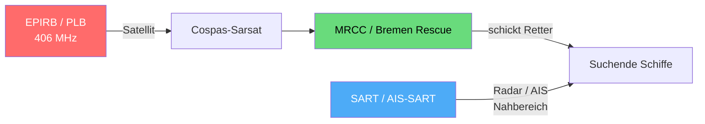

## Funkkurs — Notfunkgeräte: EPIRB, SART & Co.

Modul des [[Funkzeugnis-Kurs SRC und UBI|Funkzeugnis-Kurs SRC & UBI]]. Die **zusätzlichen Seenot-Geräte** neben dem UKW-Funk — was alarmiert, was hilft beim Orten.

> [!abstract] Die Kernidee
> **EPIRB = alarmiert** (löst die Rettungskette aus). **SART / AIS-SART = orten** (helfen den Rettern, dich im Nahbereich genau zu finden). Beides ergänzt den UKW-/DSC-Funk.

---

### EPIRB — Emergency Position-Indicating Radio Beacon
![[funkkurs-epirb.jpg|260]] ![[funkkurs-epirb2.jpg|260]]
Zwei EPIRB-Bauformen (Seenotfunkbaken). Bilder: Wikimedia Commons.

- **Seenot-Funkbake**, die auf **406 MHz** über die **Cospas-Sarsat-Satelliten** alarmiert — **weltweit**, auch fernab jeder Küstenfunkstelle.
- Sendet **Kennung (ID) + Position** (mit eingebautem GPS/GNSS sehr genau); löst damit die **internationale Rettungskette** aus.
- **Schwimmt automatisch auf** und kann sich beim Sinken per Wasserdruck **selbst auslösen** (Float-free-Halterung).
- **Schiffsgebunden** und muss **registriert** sein (Halter/Schiff hinterlegt) — sonst weiß niemand, zu wem der Alarm gehört.
- Moderne Geräte haben zusätzlich ein **AIS-Homing-Signal** für die Feinortung.

> [!tip] Merke
> Die EPIRB ist das **primäre Alarmgerät** für küstenfernes Fahren — unabhängig von UKW-Reichweite und Bordstrom (eigene Batterie).

#### Wie die EPIRB alarmiert — und das 121,5-MHz-Homing
Die EPIRB sendet auf **zwei Frequenzen mit zwei verschiedenen Aufgaben:**

**1) 406 MHz — der digitale Alarm (über Satellit):**
1. EPIRB wird aktiviert → sendet alle ~50 s einen **digitalen Burst** mit **eindeutiger Kennung** und (mit GPS) der **Position**.
2. Die **Cospas-Sarsat-Satelliten** empfangen den Burst — **LEOSAR** (niedrige Umlaufbahn), **GEOSAR** (geostationär) und modern **MEOSAR** (auf GPS-/Galileo-Satelliten).
3. Die Satelliten leiten das Signal an **Bodenstationen (LUT)** weiter; ohne GPS-Position wird sie über den **Doppler-Effekt** der bewegten Satelliten berechnet.
4. Eine **MCC** (Mission Control Centre) ordnet die Kennung zu und gibt die Meldung an das zuständige **MRCC** (z. B. Bremen Rescue) → Rettung läuft an.

**2) 121,5 MHz — das Homing-Signal (für die Feinortung vor Ort):**
- Zusätzlich sendet die EPIRB ein **schwaches, durchgehendes 121,5-MHz-Peilsignal**.
- Die anrückenden **SAR-Einheiten** (Flugzeug/Hubschrauber/Schiff) **peilen dieses Signal** mit einem Funkpeiler an und finden so im **Nahbereich** den genauen Standort — der „letzte Kilometer" zum Havaristen.
- **Wichtig:** 121,5 MHz wird **nicht mehr von Satelliten überwacht** (Cospas-Sarsat hat das 2009 eingestellt). Es dient **nur noch dem lokalen Homing**, nicht der Alarmierung. Die eigentliche Alarmierung läuft **ausschließlich über 406 MHz**.
- Moderne EPIRBs ergänzen das Homing per **AIS** (UKW), damit Schiffe in der Nähe die Bake als Ziel auf dem Plotter sehen.

> [!tip] Merksatz
> **406 MHz = alarmieren (weltweit, via Satellit). 121,5 MHz = anpeilen (vor Ort, kein Satellit mehr).**

#### Wie löst die EPIRB aus?
Es gibt **drei Auslösewege:**
1. **Manuell** — Schalter/Taste am Gerät (mit Sicherungskappe gegen versehentliches Drücken).
2. **Automatisch durch Wasserkontakt** — ein **Wassersensor** aktiviert die Bake, sobald sie **im Wasser schwimmt**.
3. **Float-free (selbstausschwimmend)** — die Halterung hat eine **hydrostatische Auslösevorrichtung (HRU)**, die die EPIRB beim Sinken des Schiffs (Wasserdruck ~**4 m** Tiefe) **freigibt**. Sie schwimmt auf, der Wassersensor schaltet sie ein.

> [!info] Kategorie 1 vs. Kategorie 2
> **Kategorie 1 = float-free** (automatisch ausschwimmend + Wasserkontakt). **Kategorie 2 = nur manuell** auslösbar. Für ernsthaftes Seerevier ist die **selbstausschwimmende** Variante sinnvoll — sie funktioniert auch, wenn die Crew es nicht mehr selbst schafft.

> [!danger] Versehentlich ausgelöst — was tun?
> **Nicht einfach wegstecken und hoffen!** Die Alarmierung kann längst beim MRCC sein.
> 1. **Sofort ausschalten** (deaktivieren).
> 2. **MRCC / Seenotleitung verständigen** — in DE **Bremen Rescue** (Telefon **+49-421-53687-0** oder per UKW), dass es ein **Fehlalarm** war und **keine Seenot** vorliegt.
> 3. **Beaken-Kennung (Hex-ID)** und Schiffsnamen angeben, damit der SAR-Einsatz **abgebrochen** wird.
>
> Ein nicht widerrufener Fehlalarm bindet **echte Rettungsressourcen** — deshalb immer melden (genau wie beim [[Funkkurs — DSC (Digital Selective Calling)|DSC-Fehlalarm]]).

> [!tip] Bedienung
> Manuell: **Antenne aufrichten**, Sicherung/Kappe entfernen, **ON** — die EPIRB **senkrecht ins Wasser** legen oder hochhalten, mit **freier Sicht zum Himmel** (nicht unter Deck/in der Hand „verstecken"). **Eingeschaltet lassen**, bis die Rettung da ist.

### PLB — Personal Locator Beacon
- Die **persönliche, kleine Variante** der EPIRB (am Körper/Rettungsweste), ebenfalls **406 MHz / Cospas-Sarsat**.
- **Personengebunden** (die EPIRB ist schiffsgebunden) — eine PLB **ergänzt** die EPIRB, ersetzt sie aber nicht.

> [!tip] Bedienung
> **Aus der Tasche/Halterung nehmen, Antenne ausklappen, Knopf drücken/halten.** Senkrecht halten, Antenne frei zum Himmel. Löst **nur manuell** aus (kein Float-free) und sendet kürzer als eine EPIRB.

### SART — Search and Rescue Radar Transponder
![[funkkurs-sart.jpg|300]]
SART „Tron" — 9-GHz-Radartransponder mit TEST/OFF/ON-Schalter, zum Hochhalten/Aufstellen in der Rettungsinsel. Bild: Wikimedia Commons, CC BY-SA.

- Dient der **Nahbereich-Ortung**, wenn die Retter schon im Gebiet sind.
- Reagiert auf das **9-GHz-X-Band-Radar** der suchenden Schiffe und erzeugt auf deren **Radarschirm eine typische Kette von 12 Punkten**, die zum Standort weist.

> [!tip] Bedienung
> 1. Aus der Wandhalterung nehmen, mit in die **Rettungsinsel**.
> 2. Auf den **schwarzen Teleskopstab** stecken und **so hoch wie möglich** aufstellen/halten (durch eine Öffnung im Inseldach) — **Höhe = Reichweite**, ein SART auf 1 m wird viel früher vom Radar erfasst.
> 3. Schalter auf **ON** (Standby). Sobald ein Schiffsradar es trifft, schaltet es **automatisch** auf Senden — eine **Indikatorlampe/ein Ton** signalisiert den Radarkontakt (= „Hilfe ist in Radar-Reichweite").
> 4. **TEST**-Stellung nur kurz zur Funktionsprüfung nutzen.

### AIS-SART
- Weiterentwicklung: bestimmt per **eingebautem GPS** die Position und sendet sie im **AIS-Format über UKW**.
- Erscheint als **Notziel auf dem AIS/Plotter** der Schiffe in der Nähe — oft praktischer als der Radar-SART.

> [!tip] Bedienung
> Einschalten (**ON**) — sendet dann **automatisch** die GPS-Position als AIS-Ziel. Ebenfalls **so hoch wie möglich** anbringen, freie Sicht nach oben.

### MOB-Sender (Mensch über Bord)
- **Persönliche AIS-MOB- / DSC-MOB-Geräte** an der Rettungsweste: lösen bei „Mensch über Bord" einen **AIS-Alarm** und/oder **DSC-Alarm** aus und senden die **GPS-Position** ans eigene Schiff.

> [!tip] Bedienung
> An der **Rettungsweste** befestigt; aktiviert sich **automatisch beim Aufblasen/Wasserkontakt** (oder manuell). Antenne klappt aus → sofortiger **MOB-Alarm + Position** ans Schiff/AIS. Regelmäßig den **Batterie-Ablauf** prüfen.

---

### Überblick: Wer macht was?
| Gerät | Frequenz/System | Aufgabe | gebunden an |
|---|---|---|---|
| **EPIRB** | 406 MHz · Cospas-Sarsat | **alarmieren** (weltweit) | Schiff |
| **PLB** | 406 MHz · Cospas-Sarsat | alarmieren (klein) | Person |
| **SART** | 9 GHz Radar | **orten** (Radarbild) | Rettungsinsel |
| **AIS-SART** | UKW / AIS | orten (AIS-Ziel) | Rettungsinsel |
| **AIS/DSC-MOB** | UKW / AIS / DSC | MOB-Alarm + Position | Person |

### Wartung, Batterie & Lebensdauer
| Gerät | Batterie (Lager) | Sendedauer (aktiv) | typische Wartung |
|---|---|---|---|
| **EPIRB** | ~**10 Jahre** wartungsfrei | **≥ 48 h** | Batteriewechsel ~alle 5–10 J. (Hersteller); **HRU alle 2 Jahre** tauschen |
| **PLB** | ~**5–7 Jahre** | **≥ 24 h** | Batteriewechsel zum Ablaufdatum |
| **SART / AIS-SART** | ~**5 Jahre** | Standby **~96 h** + Senden ~8 h | Batteriewechsel, Funktionstest |
| **AIS/DSC-MOB** | ~**5–7 Jahre** | ~24 h | Batterie-/Ablaufcheck |

> [!warning] Wartung — das gehört regelmäßig gemacht
> - **Selbsttest** per Test-Funktion (regelmäßig, z. B. monatlich/vor dem Törn) — verbraucht kaum Batterie.
> - **Batterie-Ablaufdatum** im Blick behalten; Wechsel nur durch **zertifizierten Service** (Versiegelung!).
> - **HRU** (hydrostatische Auslösung der EPIRB) **alle 2 Jahre** erneuern — hat ein eigenes Verfallsdatum.
> - **Registrierung aktuell halten** (Eigner/Kontakt/Schiff) — sonst ist der Alarm anonym.

> [!info] Preise (Richtwerte 2026, Sportbootmarkt)
> - **EPIRB:** ca. **300–600 €** (kompakte Sportboot-Modelle), Voll-Profi-Geräte bis **~1000 €**.
> - **PLB:** ca. **200–350 €**.
> - **SART (Radar) / AIS-SART:** ca. **250–500 €**.
> - **AIS-MOB-Sender:** ca. **150–300 €**.
>
> *(Preise schwanken je nach Hersteller/Händler — vor dem Kurs ggf. kurz aktuell prüfen.)*

> [!info] Einordnung für den SRC-Kurs
> EPIRB/SART sind **GMDSS-Ausrüstung** und gehören eher zum **LRC**-Umfeld (küstenfern). Für den **SRC** reicht: **wissen, was sie tun** — EPIRB alarmiert via Satellit, SART/AIS-SART helfen beim Orten. Im Küstenbereich (A1) bleibt **DSC + UKW** das Hauptwerkzeug.

---
Bilder: Wikimedia Commons (EPIRB; SART „SART radar transponder", Jotron), CC BY-SA.

## Quellen (recherchiert 06/2026)
- Jotron — *EPIRB and SART differences* — https://www.jotron.com/news-insights/epirb-and-sart-differences
- src-lrc-ubi.de — *LRC: EPIRB, SART & AIS-SART* — https://src-lrc-ubi.de/glossar-lrc-epirb-sart-ais-sart/
- Wikipedia — *EPIRB* / *Search and rescue transponder* — https://en.wikipedia.org/wiki/Emergency_position-indicating_radio_beacon
- Compass24 / SVB / Ocean Signal / ACR — Ratgeber Notfunkbaken (Batterie, HRU, Preise) — https://www.compass24.de/ratgeber/epirb
- on-yacht.com — *Batteriewechsel & Wartung (zertifizierter Service)* — https://on-yacht.com/batteriewechsel-wartung

---
Tags: #marine
*Superlink:* [[Funkzeugnis-Kurs SRC und UBI]]
Created: 04/06/26
