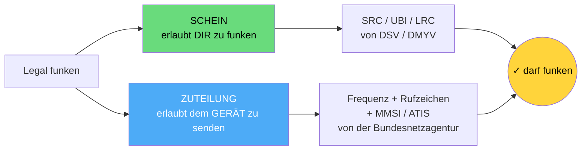
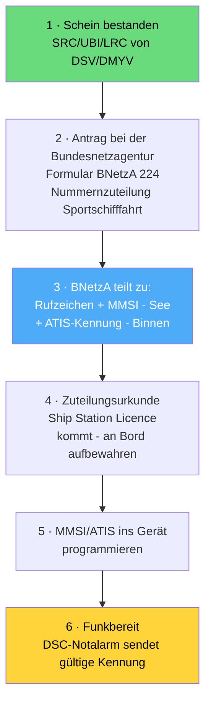

## Funkkurs — Rechtliche Grundlagen (Pflicht, Behörden, Zuständigkeiten)

Modul des [[Funkzeugnis-Kurs SRC und UBI|Funkzeugnis-Kurs SRC & UBI]]. **Wann brauche ich was, und welche Behörde macht was?**

---

### Die Grundregel: Gerät an Bord → Zeugnis Pflicht
- **Wer eine Seefunk-/Binnenfunkanlage betreibt, braucht ein gültiges Sprechfunkzeugnis.** Maßgeblich ist nicht „Bootsgröße", sondern: **Ist eine Funkanlage an Bord und wird sie betrieben?**
- Der **Schiffsführer** muss Inhaber eines **ausreichenden** Zeugnisses sein — egal, wer sonst noch an Bord einen Schein hat.
- Eine Funkstelle darf grundsätzlich **nur** bedienen, wer das passende Zeugnis hat. Fehlt es, ist das eine **Ordnungswidrigkeit** (Bußgeld).
- **Wichtig:** Schon das **Betriebsbereithalten** eines Geräts zählt — auch reines „Zuhören/Empfangen" rechtfertigt den Betrieb nur mit Zeugnis + Frequenzzuteilung.

> [!note] Merksatz
> **„Kein Funk ohne Schein, kein Gerät ohne Zuteilung."**

---

### Welches Zeugnis wofür? (rechtlich)
| Zeugnis | Voller Name | Wofür vorgeschrieben |
|---|---|---|
| **SRC** | Beschränkt Gültiges Funkbetriebszeugnis (Short Range Certificate) | **UKW-Seefunk mit DSC** auf Sportbooten (Seegebiet A1) |
| **LRC** | Allgemeines Funkbetriebszeugnis (Long Range Certificate) | **GMDSS weltweit** — zusätzlich Grenzwelle/Kurzwelle/Satellit (MF/HF/Inmarsat) |
| **UBI** | UKW-Sprechfunkzeugnis für den Binnenschifffahrtsfunk | **UKW-Binnenfunk** auf Binnenwasserstraßen (mit ATIS) |

Faustregel: **nur UKW-See → SRC** · **See + Langstrecke → LRC** · **Binnen → UBI**. Wer Küste *und* Fluss fährt, braucht **SRC + UBI**.

---

### Wer macht was? — Die Behörden & Verbände
| Stelle | Zuständig für |
|---|---|
| **Bundesnetzagentur (BNetzA)**, Außenstelle Hamburg | **Frequenzzuteilung** + Vergabe von **Rufzeichen, MMSI und ATIS-Kennung**. Ohne ihre Zuteilung darf das Gerät nicht betrieben werden. Kontakt: seefunk@bnetza.de |
| **DSV** (Deutscher Segler-Verband) & **DMYV** (Deutscher Motoryachtverband) | Führen im **amtlichen Auftrag** die **Prüfungen** durch und **stellen die Zeugnisse** SRC, LRC und UBI aus. |
| **WSV / Wasserstraßen- und Schifffahrtsverwaltung** (Binnenbereich, ABVT Koblenz) | Zuständige Verwaltung für den **Binnenschifffahrtsfunk** (Rahmen, Aufsicht). |
| **BSH** (Bundesamt für Seeschifffahrt und Hydrographie) | Fachaufsicht/Seenotfunk-Hintergrund, Veröffentlichungen (z. B. *Wetter- und Warnfunk*). |

> [!important] Die zwei wichtigsten Stellen für die Teilnehmer
> 1. **Befähigung (Schein) → DSV/DMYV** (Prüfung + Zeugnis).
> 2. **Erlaubnis fürs Gerät (Frequenz + MMSI/Rufzeichen) → Bundesnetzagentur.**
>
> Das sind **zwei getrennte Dinge**: Der Schein erlaubt *dir* zu funken; die Zuteilung erlaubt *dem Gerät*, auf den Frequenzen zu senden.

---

### Rechtsgrundlagen (zum Nennen, nicht Auswendiglernen)
- **SRC / LRC (See):** beruhen auf der **Schiffssicherheitsverordnung** (SchSV); Durchführung über die *Durchführungsrichtlinien Funkbetriebszeugnisse*.
- **UBI (Binnen):** **Binnenschifffahrt-Sprechfunkverordnung (BinSchSprFunkV)**; Rahmen zusätzlich **RAINWAT** (Regionales Abkommen über den Binnenschifffahrtsfunk) — schreibt u. a. **ATIS** vor.
- **Frequenznutzung:** **Telekommunikationsgesetz (TKG)** → Zuteilung durch die BNetzA.

---

### Rufzeichen (Call Sign) — wichtig zu wissen
- Das **Rufzeichen** identifiziert die **Funkstelle** eindeutig im Sprechfunk. Deutsche Seefunkstellen nennen sich mit **Schiffsname + Rufzeichen**.
- **Zwei Fälle je nach Registereintrag:**
  - **Kleinfahrzeug / Sportboot** (ohne Seeschiffsregister): **2 Buchstaben + 4 Ziffern** (sechsstellig). 1. Buchstabe immer **D**, 2. Buchstabe **A–R**; 1. Ziffer **2–9**, restliche **0–9**. *Beispiel:* **DA4711** → „Delta Alfa – Four Seven One One". Vergabe: **Bundesnetzagentur**.
  - **In das Seeschiffsregister eingetragenes Schiff:** **4-Buchstaben-Rufzeichen** (Unterscheidungssignal), z. B. **DDTW**. Zuteilung über das **Seeschiffsregister des Amtsgerichts**.
- Zuteilung durch die **Bundesnetzagentur** — zusammen mit Frequenzzuteilung und **MMSI** (See) bzw. **ATIS-Kennung** (Binnen).
- **Zusammenhang merken:** Aus dem Rufzeichen leiten sich die anderen Kennungen ab — z. B. steckt das Rufzeichen in der **ATIS-Kennung** (9 + MID + 2 Ziffern + 4 Ziffern aus dem Rufzeichen, siehe [[Funkkurs — UBI Binnenfunk]]).
- **MMSI ≠ Rufzeichen:** Rufzeichen = Sprechfunk-Kennung (Buchstaben+Ziffern); MMSI = 9-stellige **digitale** Kennung für DSC/AIS. Beide gehören zur selben Funkstelle.

### Nach dem Schein: Was muss konkret passieren?
Der **Schein allein reicht nicht** — er erlaubt *dir* zu funken, aber das **Gerät** braucht noch seine eigene „Zulassung". So läuft's Schritt für Schritt:

1. **Persönliches Zeugnis** (SRC/UBI/LRC) — von **DSV/DMYV**. ✅ (hast du nach dem Kurs)
2. **Antrag stellen** bei der **Bundesnetzagentur**, Außenstelle Hamburg — Formular **„BNetzA 224 – Nummernzuteilung Sportschifffahrt"** (seefunk@bnetza.de). Gilt für **Erstzuteilung** und Änderungen.
3. Die BNetzA **teilt zu**: **Rufzeichen** (immer), **MMSI** (für See/DSC/AIS) und/oder **ATIS-Kennung** (für Binnen) — nur die tatsächlich benötigten Nummern.
4. Du erhältst die **Zuteilungsurkunde (Ship Station Licence)** — sie enthält deine MMSI/Rufzeichen und muss **an Bord** sein.
5. **MMSI bzw. ATIS ins Funkgerät programmieren** (teils einmalig, je nach Gerät nur durch den Fachhändler).
6. Erst jetzt ist die Funkstelle **vollständig betriebsbereit**.

> [!info] Kosten & Gut zu wissen
> Für die **Nummernzuteilung** fallen **Gebühren**, für die **Frequenzzuteilung Beiträge** an. Die Zuteilung gehört zur **Funkstelle des Schiffes**, nicht zum einzelnen Gerät. Über **Bremen Rescue / DGzRS** werden Schiffsname + Kennungen zusätzlich für die Sicherheit registriert.

> [!warning] Häufigster Praxisfehler
> Schein gemacht, aber **MMSI nie beantragt / nie ins Gerät programmiert** → der DSC-Notalarm sendet dann **keine gültige Kennung**. Unbedingt im Kurs betonen!

---

> [!warning] Aktualität prüfen
> Behörden-Zuständigkeiten und Verordnungen können sich ändern — vor dem Kurs kurz gegen **bundesnetzagentur.de/seefunk**, **elwis.de** (Sprechfunkzeugnisse) und **dmyv.de / dsv.org** gegenchecken.

---
Tags: #marine
*Superlink:* [[Funkzeugnis-Kurs SRC und UBI]]
Created: 04/06/26
