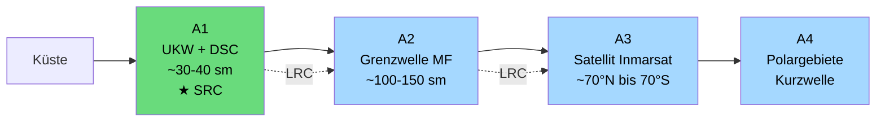
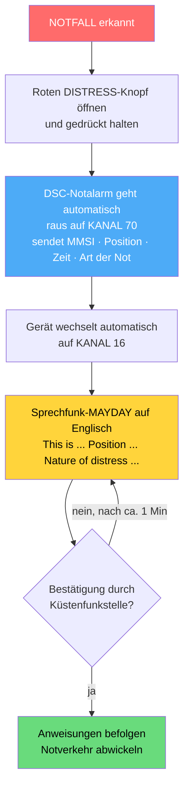

## Funkkurs — SRC: UKW-Seefunk (GMDSS)

Modul des [[Funkzeugnis-Kurs SRC und UBI|Funkzeugnis-Kurs SRC & UBI]]. Alles zum **Seefunk**: System, DSC, Kanäle, Notverkehr, Prüfung.

### Was darf man mit dem SRC?
Bedienung von UKW-Seefunkanlagen **mit DSC** auf Sportbooten. Pflicht, sobald eine Seefunkanlage an Bord betrieben wird (auch wenn man "nur zuhört" — der Betrieb ist zeugnispflichtig).

### GMDSS — Global Maritime Distress and Safety System
Weltweites Seenot- und Sicherheitsfunksystem. Kerngedanke: **automatischer Notalarm per Knopfdruck (DSC)**, dann Sprechfunk.

**Die GMDSS-Seegebiete (A1–A4)**
Die Seegebiete sagen, **welche Funktechnik** in welcher Entfernung von der Küste **gebraucht** wird — je weiter raus, desto aufwendiger. Wichtig: Die Gebiete sind **ineinander gestaffelt** — ein Schiff in A3 durchfährt auf dem Weg auch A1 und A2.

| Gebiet | Abdeckung durch                               | grobe Reichweite                     | Technik                    | Schein    |
| ------ | --------------------------------------------- | ------------------------------------ | -------------------------- | --------- |
| **A1** | UKW-Küstenfunkstelle mit **DSC**              | **~30–40 sm**                        | **UKW + DSC**              | **SRC** ✅ |
| **A2** | **Grenzwellen**-Küstenfunkstelle (MF) mit DSC | **~100–150 sm**                      | + **Grenzwelle (MF)**      | LRC       |
| **A3** | **Inmarsat-Satellit**                         | **~70° N bis 70° S** (fast weltweit) | + **Satellit / Kurzwelle** | LRC       |
| **A4** | jenseits der Satelliten = **Polargebiete**    | Pole                                 | + **Kurzwelle (HF)**       | LRC       |


<sub>Je weiter raus, desto mehr Technik: **SRC deckt A1**; ab A2 aufwärts braucht es das **LRC**. Für den Wochenend-Kurs reicht: A1 = Küstenbereich, das ist unser Revier.</sub>

> [!info] Was ist die Grenzwelle?
> **Grenzwelle = Mittelfrequenz (MF)**, der Funkbereich rund um **1,6–4 MHz** — er liegt „an der **Grenze**" zwischen Mittel- und Kurzwelle. Maritime Not-Frequenzen: **2182 kHz** (Sprechfunk) und **2187,5 kHz** (DSC).
> - Sie breitet sich vor allem als **Bodenwelle** aus und reicht damit **über den Horizont hinaus** — typisch **~100–150 sm**, also viel weiter als UKW.
> - Genutzt im **Seegebiet A2** und nur mit dem **LRC** (nicht SRC). **Bremen Rescue** ist auch auf **2187,5 kHz (DSC)** erreichbar.
> - **Kurz:** UKW = Sichtweite (A1), **Grenzwelle = küstenferner Mittelstreckenfunk** (A2), Satellit/Kurzwelle = weltweit (A3/A4).

> [!info] Kurzwelle (HF) — A3/A4
> **Kurzwelle = High Frequency (HF)**, ca. **3–30 MHz**. Sie wird an der **Ionosphäre reflektiert** („Raumwelle") und springt so um die halbe Welt — **Reichweite weltweit**, aber **stark schwankend** (Tageszeit, Sonne, Frequenzwahl). Trägt Sprechfunk, DSC und Funkfernschreiben über große Distanzen. In den **Polargebieten (A4)**, wo der Satellit nicht hinreicht, ist Kurzwelle das Rückgrat. Braucht das **LRC**.

> [!info] Inmarsat / Satellit — A3
> **Inmarsat** ist ein System **geostationärer Satelliten** über dem Äquator. Abdeckung **~70° N bis 70° S** — also fast die ganze Erde **außer den Polkappen** (deshalb gibt es A4 mit Kurzwelle). Liefert **Sprache, Daten und Seenotalarm** (z. B. Inmarsat-C im GMDSS). Damit ist man im **Seegebiet A3** quasi weltweit erreichbar — unabhängig von Küstenfunkstellen. Braucht das **LRC**.
>
> *Ergänzend, system­übergreifend:* die **EPIRB** (Seenotfunkbake, 406 MHz, **Cospas-Sarsat**-Satelliten) sendet bei Seenot automatisch Position + Kennung — funktioniert **überall**, auch an den Polen, und ist unabhängig von A1–A4.

### DSC — Digital Selective Calling (Digitaler Selektivruf)
- Digitaler Anruf per Knopfdruck — Gerät sendet automatisch die eigene **MMSI**.
- Läuft **ausschließlich auf Kanal 70** — dort **kein Sprechfunk!** Häufige Prüfungsfalle.
- Notalarm, Routineanruf an einzelne Station, Gruppenruf, Anruf an alle Schiffe (All Ships).

### MMSI — Maritime Mobile Service Identity
- **9-stellige** Kennung der Seefunkstelle.
- Schiff-MMSI beginnt mit der **MID** (Maritime Identification Digits, Länderkennung); Deutschland = **211 / 218**.
- Wird in Deutschland von der **Bundesnetzagentur** zugeteilt.

### Wichtige UKW-Seefunkkanäle (auswendig! — nach offiziellem Lehrbuch)
| Kanal | Funktion |
|---|---|
| **16** | 156,800 MHz — Allgemeiner **Not- und Anrufkanal**, Dauer-**Hörwache** (calling) |
| **06** | **On-Scene-Kommunikation** im Seenotfall vor Ort (**SAR** – Search and Rescue); Schiff-Schiff |
| **08, 13** | **Ausweichkanal**, falls 16 und 06 belegt sind (13 auch Brücke-Brücke, Navigationssicherheit) |
| **15, 17** | **Interner Bordfunk** (nur 1 W) |
| **70** | 156,525 MHz — Kanal für den **DSC-Controller**; **darf nicht für Sprechfunk** benutzt werden! |
| **72, 77** | **Soziale Nachrichten** („privater Plausch") Schiff-Schiff (**Kanal 69** auch — aber **nur in Deutschland**, nicht im Ausland) |
| **75, 76** | Funkverkehr zu **navigatorischen Zwecken** zwischen Schiffsfunkstellen |
| **87, 88** | **AIS-Kanäle** — **dürfen nicht für Sprechfunk** benutzt werden! |

**Verfügbare UKW-Seefunkkanäle:** **1–28** und **60–88** (dazwischen liegt kein nutzbarer Kanalbereich). Kanal 16 und 70 liegen darin als die festen Not-/DSC-Kanäle.

**Sendeleistung (nach Lehrbuch):**
- Gerät hat **zwei Stufen: 1 W oder 25 W**. Die Einstellung bedeutet **„maximal"** 1 W bzw. 25 W — die *tatsächliche* Leistung hängt u. a. von **Antenne** und Bedingungen ab.
- **Immer 25 W** (volle Leistung): bei **Not-, Dringlichkeits- und Sicherheitsverkehr** sowie **grundsätzlich beim Verkehr mit Küstenfunkstellen** — unabhängig vom Inhalt.
- **Auf 1 W reduzieren:** bei bestimmten Meldungen im **Nahbereich** (Hafen/Marina, Bordfunk 15/17), weil man sich die Kanäle teilt und jeder senden können soll. *Warum genau → [[Funkkurs — Quiz SRC (Seefunk)]] (Abschnitt Sendeleistung).*

> [!info] Revierkanäle separat
> Gängige Arbeits-, Hafen- und Marina-Kanäle für Ostsee & Mittelmeer → eigenes Modul: [[Funkkurs — Revierkanäle Ostsee & Mittelmeer]].

### Warum 1 W im Hafen?
Mehr Leistung bringt im Hafen nichts (UKW = Sichtweite-Funk; 1 W reicht für den Nahbereich), **blockiert aber den Kanal großräumig und stört alle anderen**. Merksatz: **Sendeleistung = Lautstärke, nicht Qualität** — im Hafen flüstern (1 W), auf See rufen (25 W). Deshalb High/Low-Taste; Bordverkehr (15/17) ohnehin fest 1 W. *Ausführlich + Analogie → [[Funkkurs — Quiz SRC (Seefunk)]] (Frage zur Sendeleistung).*

### Not-, Dringlichkeits- und Sicherheitsverkehr (die 3 Stufen)
| Stufe | Kennwort | Bedeutung |
|---|---|---|
| **Not / Distress** | **MAYDAY** | Unmittelbare Gefahr für Schiff oder Person, sofortige Hilfe nötig |
| **Dringlichkeit / Urgency** | **PAN PAN** | Dringende Meldung, aber (noch) keine unmittelbare Gefahr (z. B. Mensch krank, Manövrierunfähig ohne akute Gefahr) |
| **Sicherheit / Safety** | **SÉCURITÉ** | Sicherheitsmeldung, z. B. Navigationswarnung, Wetterwarnung |

### MAYDAY-Spruch — Aufbau (auf ENGLISCH, Teilnehmer üben lassen!)
Erst **DSC-Notalarm Kanal 70**, dann Sprechfunk auf **Kanal 16** — im Seefunk auf Englisch:

```
MAYDAY – MAYDAY – MAYDAY
THIS IS   [Schiffsname 3×]   Call Sign   MMSI
MAYDAY    [Schiffsname 1×]   Call Sign   MMSI
POSITION: ...        (Lat/Lon oder Peilung + Distanz zu markantem Punkt)
NATURE OF DISTRESS: ...        (Art der Not — z. B. sinking, fire, man overboard)
ASSISTANCE REQUIRED: ...       (benötigte Hilfe)
PERSONS ON BOARD: ...          (Anzahl Personen an Bord)
OTHER INFORMATION: ...         (z. B. Schiffstyp, Farbe, verlassen Schiff)
OVER
```

**MAYDAY RELAY** = Weitergabe eines fremden Notrufs, wenn man selbst Zeuge wird und die Station es nicht selbst kann.

### Das Funkschema im Notfall (DSC → Sprechfunk)



### Wie DSC auf Kanal 70 wirklich funktioniert (häufiges Missverständnis!)

**Man wechselt NICHT manuell auf Kanal 70. DSC läuft automatisch.** Kanal 70 ist kein Kanal, den man anwählt und auf dem man spricht — er ist ein reiner **Datenkanal**, den das Gerät permanent im Hintergrund bedient.

1. **Dauerüberwachung:** Jedes DSC-fähige Gerät hat einen eigenen **DSC-Wachempfänger**, der **ständig auf Kanal 70 mithört** — egal, auf welchem Sprechkanal du gerade stehst (z. B. 72 oder 16). Das läuft automatisch, da stellt man nichts ein.
2. **DSC-Call absetzen = Menü, nicht Kanalwahl:** Du wählst die **Funktion im DSC-Menü** (rote Taste = Distress, oder „Individual Call" mit Ziel-MMSI). Du drehst **nicht** vorher auf Kanal 70.
3. **Das Gerät macht den Rest selbst:** Beim Senden schaltet es **selbsttätig kurz auf Kanal 70**, feuert das **digitale DSC-Telegramm** raus (MMSI, Position, Zeit, ggf. Art der Not) und **springt sofort zurück** — beim Notalarm automatisch auf **Kanal 16** für den Sprech-MAYDAY. Dauert nur den Bruchteil einer Sekunde.

> [!warning] Der typische Denkfehler
> Viele denken wie beim Sprechfunk („erst Kanal einstellen, dann reden"). Bei DSC ist es umgekehrt: **Du wählst eine *Funktion* (was du willst), nicht einen *Kanal* (wo).** Das Gerät erledigt das *Wo* (= Kanal 70) automatisch. Deshalb gilt: **Auf Kanal 70 wird nie gesprochen** — dort läuft nur Maschine-zu-Maschine-Datenfunk.

**Analogie für die Teilnehmer:** Kanal 70 ist wie das **Klingel-/SMS-Signal** beim Telefon — läuft automatisch im Hintergrund und stellt die Verbindung her. Gesprochen wird danach im „Gespräch" auf dem Sprechkanal. Niemand „wählt das Klingelsignal an".

*Sonderfall Routine-Call:* Das DSC-Telegramm teilt der Gegenstelle gleich den gewünschten **Arbeitskanal** mit — moderne Geräte stellen ihn nach der Quittung sogar **automatisch** ein.

### SRC-Prüfung (Aufbau exakt)
**Theorie:** **24 Multiple-Choice-Fragen** aus dem amtlichen Katalog, **19 müssen richtig** sein (Funkrecht, Technik, Verfahren).

**Praxis (auf Englisch!):**
- **Diktat:** einer von **27 englischen Seefunktexten** wird vorgelesen → korrekt mitschreiben → sinngemäß ins **Deutsche** übersetzen.
- **Übersetzung:** einer von **27 deutschen** Texten → schriftlich sinngemäß ins **Englische**.
- **Bedienung am Gerät/Simulator:** **4 Aufgaben** aus einem Pool, u. a.:
  - DSC-Controller bedienen + **Notalarm absetzen**
  - Speicherabfrage + Empfangsbestätigung eines DSC-Notalarms
  - Notmeldung per Sprechfunk weiterleiten (**Distress Relay**)
  - Routine-/Dringlichkeits-/Sicherheitsmeldung

> [!important] Englisch in der Prüfung
> Not-, Dringlichkeits- und Sicherheitsverkehr werden **in Englisch** mit dem internationalen Buchstabieralphabet aufgenommen und dann ins Deutsche übersetzt. → Buchstabieralphabet muss **sitzen** ([[Funkkurs — Funkverfahren & Buchstabieralphabet]]).

---
Tags: #marine
*Superlink:* [[Funkzeugnis-Kurs SRC und UBI]]
Created: 04/06/26
