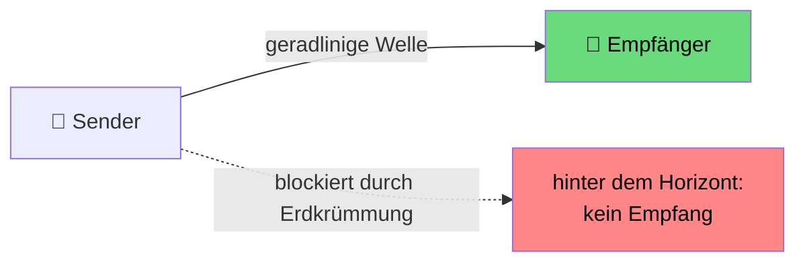
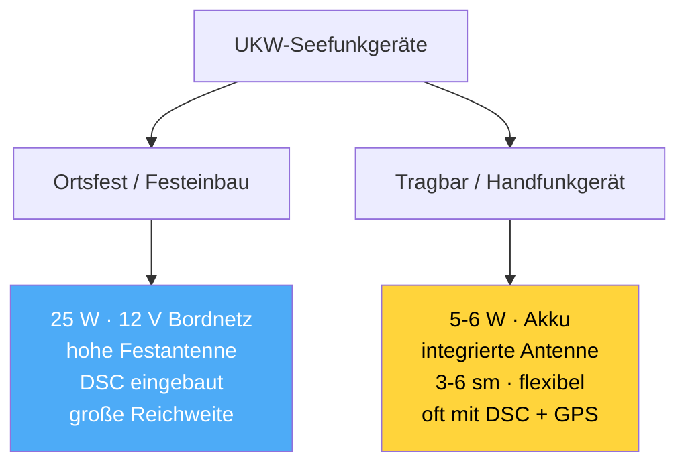
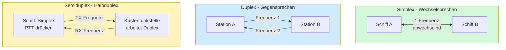

## Funkkurs — Technik: Wellen, Frequenzen, Reichweite, Geräte, Praxis

Modul des [[Funkzeugnis-Kurs SRC und UBI|Funkzeugnis-Kurs SRC & UBI]]. Die technischen Grundlagen — Funkwellen, Frequenzen, Reichweite, Antenne, Spannung/Leistung, Gerätearten, Simplex/Duplex/Semiduplex, DSC-Controller und die **Praxis** des Funkens.

---

### 1. Funkwellen — UKW (Ultrakurzwelle / VHF)
- Seefunk nutzt **Ultrakurzwelle (UKW / VHF)**. Ausbreitung **quasi-optisch** = nahezu geradlinig, **„Sichtweite-Funk" (line of sight)**.
- UKW folgt **nicht** der Erdkrümmung und wird kaum gebeugt → **hinter dem Horizont ist Schluss**.
- **Wellenlänge** λ = c / f ≈ 300 / 156 ≈ **~1,9 m** (deshalb sind UKW-Antennen kurz). Polarisation **vertikal**.



### 2. Frequenzen
- Der mobile Seefunkdienst belegt auf UKW den Bereich **156–162 MHz**.
- Ein **Kanal** ist eine feste Frequenz (Simplex) **oder** ein Frequenzpaar (Duplex: getrennte Sende-/Empfangsfrequenz).
- **Wichtige feste Frequenzen (auswendig):**

| Kanal/Dienst | Frequenz | Art | Funktion |
|---|---|---|---|
| **Kanal 16** | **156,800 MHz** | **Simplex** | Anruf · Not · Dringlichkeit · Sicherheit |
| **Kanal 70** | **156,525 MHz** | (DSC) | digitaler Selektivruf — **nur DSC**, kein Sprechfunk |
| Grenzwelle (Not) | **2187,5 kHz** | — | DSC-Not auf Mittelwelle (z. B. Bremen Rescue) |
| NAVTEX international | **518 kHz** | Text | Sicherheitsmeldungen in Englisch |
| AIS 1 / AIS 2 | 161,975 / 162,025 MHz | — | AIS-Datenfunk (Kanal 87/88) — kein Sprechfunk |

> [!tip] Warum Kanal 16 Simplex ist
> **Kanal 16 ist ein Simplex-Kanal** — genau deshalb können ihn **alle** Seefunkstellen mithören; das ist für einen Not-/Anrufkanal gewollt.

### 3. Reichweite & Funkhorizont
Weil UKW nur bis zum **Funkhorizont** reicht, hängt die Reichweite **vor allem von der Antennenhöhe** ab (beider Stationen) — **nicht** in erster Linie von der Sendeleistung.

**Faustformel (Reichweite über den Funkhorizont):**
> [!formula] Faustformel Funkhorizont
> **Reichweite [km] ≈ 3,84 × (√h₁ + √h₂)** — mit h₁, h₂ = Antennenhöhen in **Metern**.

*Beispiel:* Masttop-Antenne 16 m (√16 = 4) ↔ Küstenfunkstelle 100 m (√100 = 10) → 3,84 × (4 + 10) ≈ **54 km ≈ 29 sm**.

**Typische Reichweiten:**

| Verbindung | grobe Reichweite |
|---|---|
| Handfunke ↔ Handfunke (niedrig) | **~3–6 sm** |
| Yacht-Masttop ↔ Yacht-Masttop | **~20–30 sm** |
| Yacht ↔ hohe Küstenfunkstelle | **deutlich mehr** (Küstenantenne sehr hoch) |

![[funkkurs-reichweite.png]]
<sub>Merke: **Reichweite kommt von der Antennenhöhe, nicht von Watt.** Mehr Leistung „drückt" nicht hinter den Horizont. UKW breitet sich aus wie Licht — die Rechnung ähnelt der „Feuersichtweite in der Kimm". <i>(Plot generiert mit [[Funkkurs — Grafik-Generator (Python)]].)</i></sub>

### 4. Antenne
- Antenne **so hoch wie möglich** montieren (Segelyacht: **Masttop**) — Höhe = Reichweite.
- **Vertikale Polarisation**; Stabantenne (λ/2 ≈ 1 m, λ/4 ≈ 0,5 m bei ~156 MHz).
- Saubere Installation/Kabel wichtig (Stehwellenverhältnis); defekte Antenne kostet Reichweite — die eingestellten 25 W bringen nur etwas mit **funktionierender** Antenne.

### 5. Spannung, Strom (Ampere) & Batterie
**Spannung:** Festeinbau am **12-V-Bordnetz** (Gleichspannung); Handfunke am **Akku**.

**Stromaufnahme Festgerät (12 V) — typische Werte:**
| Zustand | Stromaufnahme | Leistungsaufnahme |
|---|---|---|
| **Standby / Empfang** | **~0,3–1 A** | wenige Watt |
| **Senden mit 1 W** | **~1 A** | ~12 W |
| **Senden mit 25 W** | **~5 A** (bis ~6 A) | ~60 W (Wirkungsgrad ~40 %) |

![[funkkurs-stromaufnahme.png]]

> [!tip] Merke: Senden ist der Stromfresser
> **25 W ≈ 5 A** — Zuhören kostet fast nichts. Da Funk meist *gehört* und selten *gesendet* wird, ist der Durchschnittsverbrauch niedrig.

**Batterieverbrauch — Rechenbeispiel (Festgerät):**
- Liegt fast immer auf **Empfang/Standby** (~0,5 A). An einer **100-Ah-Bordbatterie** läuft es so theoretisch **~200 h** (Praxis: weniger, weil andere Verbraucher + man die Batterie nicht leer fährt).
- Jede Sendung mit 25 W zieht kurz ~5 A — die einzelnen Sprechsekunden fallen kaum ins Gewicht.

![[funkkurs-batterie-laufzeit.png]]

> [!danger] Eine Batterie nie komplett entladen!
> **Tiefentladung schädigt die Batterie dauerhaft** (Kapazitätsverlust, bei Blei-/AGM-Batterien irreversibel) — und eine leergefahrene Bordbatterie heißt: **kein Funk, kein Notruf**.
> - Faustregel: Blei/AGM **max. ~50 %** entnehmen, **rechtzeitig nachladen**.
> - Das **Funkgerät als sicherheitskritischen Verbraucher** nie an einer fast leeren Batterie betreiben.
> - Eine geladene **Reserve-/Starterbatterie** und die akkubetriebene **Handfunke** sind die Rückversicherung.

**Handfunkgerät — Akku:**
- Eingebauter **Li-Ion-Akku**, typisch **~2000–2200 mAh**.
- Laufzeit grob **~10–12 h** / Standby **~100–120 h** — gerechnet nach dem üblichen **5/5/90-Zyklus** (5 % senden, 5 % empfangen, 90 % standby).
- **Wer viel mit voller Leistung sendet, leert den Akku deutlich schneller.** → für lange Törns Ersatzakku / Lademöglichkeit.

> [!tip] Notreserve Handfunke
> Das Festgerät ist tot, wenn das **Bordnetz** ausfällt → ein **akkubetriebenes Handfunkgerät** ist die wichtige **Notreserve** (eigene Stromquelle!).

### 6. Gerätearten
![[funkkurs-ukw-geraet.jpg|340]]
> [!quote] Oldtimer-Alarm 😄
> Dieses fest eingebaute UKW-Gerät (Sailor RT144) ist ein echtes **Museumsstück** — Jahrzehnte alt, noch **ohne DSC** und mit reiner Drehknopf-/Tasten-Bedienung. Moderne Festgeräte sehen schicker aus und haben **DSC-Controller, Display und GPS-Anschluss** eingebaut — die **Funktion** (25 W/1 W, Kanäle, Hörer mit Sprechtaste) ist aber bis heute dieselbe.


- **Ortsfeste Seefunkstelle (Festeinbau):** das „Hauptgerät" — 25 W, DSC, hohe Antenne, am Bordnetz.
- **Tragbares Handfunkgerät:** akkubetrieben, ideal bei **Stromausfall** oder im **Beiboot**; geringere Reichweite. Moderne Modelle haben **DSC-Controller + GPS** eingebaut.

![[funkkurs-handfunke.jpg|240]]
<sub>Tragbares UKW-Handfunkgerät (Marine). Bild: Wikimedia Commons, CC BY-SA.</sub>
- **Kombianlage** (See **und** Binnen, umschaltbar DSC/ATIS) → [[Funkkurs — UBI Binnenfunk#Kombianlagen — und warum ein Seefunkgerät im Binnenfunk nicht zulässig ist|Kombianlagen]].

### 7. Sprechverfahren: Simplex · Duplex · Semiduplex
**Der Kanal bestimmt, wie gesprochen wird.** Ein Kanal liegt auf *einer* Frequenz (Simplex) oder auf *zwei* Frequenzen (Duplex).

| Verfahren | Frequenzen | Sprechen | Typisch für |
|---|---|---|---|
| **Simplex** (Wechselsprechen) | **1** Frequenz | **abwechselnd** (nur einer zugleich → „OVER") | **Schiff–Schiff** |
| **Duplex** (Gegensprechen) | **2** Frequenzen pro Kanal | **gleichzeitig** (wie Telefon) | Küstenfunk-Verbindungen |
| **Semiduplex** (Halbduplex) | **2** Frequenzen (Küste duplex, Schiff simplex) | Schiff per **Sprechtaste**, Küste duplex | **Schiff ↔ Küstenfunkstelle** |



**Semiduplex erklärt:** Die **Küstenfunkstelle** sendet und empfängt **gleichzeitig** (zwei Frequenzen = Duplex). Das **Schiff** arbeitet **Simplex**: Es liegt normal auf der **Empfangsfrequenz (RX)** der Küstenfunkstelle und schaltet **nur beim Drücken der Sprechtaste** auf seine **Sendefrequenz (TX)**.

**Kurz zu Duplex-Kanälen:**
- Ein **Duplexkanal** hat **zwei verschiedene Frequenzen** (eine zum Senden, eine zum Empfangen) — er ist für den Verkehr **Schiff ↔ Küstenfunkstelle** gedacht (z. B. Anruf bei DP07, früher öffentliche Telefonvermittlung).
- Viele Kanäle im **oberen Bereich (ca. 60–88)** und Teile von **18–28** sind **Duplexkanäle**.
- **Schiff–Schiff-Kanäle** (06, 08, 72, 77 …) und vor allem **Kanal 16** sind dagegen **Simplex** — eine Frequenz, von **allen** mithörbar (genau deshalb ist der Notkanal simplex).
- Wichtig: Auf einem Duplexkanal kannst du **ein anderes Schiff nicht direkt hören** (es sendet auf der anderen Frequenz) — Duplexkanäle laufen praktisch **immer über die Küstenfunkstelle**.

### 8. Wichtige Bedienelemente: Squelch · Dual Watch · Scan

> [!info] Squelch (Rauschsperre)
> Unterdrückt das **Hintergrundrauschen**, wenn kein Signal anliegt. **Einstellen:** langsam aufdrehen, bis das Rauschen **gerade verstummt** — dort stehen lassen. **Zu hoch** = schwache/ferne Signale werden mit weggesperrt; **zu niedrig** = es rauscht dauernd. Merke: *so weit zu wie nötig, so weit offen wie möglich.*

> [!important] Prüfungsrelevant: Squelch VOR jedem Senden öffnen!
> **Vor jeder Aussendung** kurz den **Squelch öffnen** (Monitor-/Squelch-Taste) und **hören, ob der Kanal wirklich frei ist** — ein zu hoch eingestellter Squelch könnte einen **schwachen, aber laufenden** Funkverkehr unterdrücken. Erst wenn der Kanal frei ist, sendest du. Das ist die technische Umsetzung von **„erst hören, dann senden"** — und eine **typische Prüfungsfrage**.
>
> **Ausnahme:** **im laufenden Gespräch** nicht jedes Mal — da bist du bereits Teil des Funkverkehrs auf dem Arbeitskanal. Das Squelch-Öffnen gilt für den **Erstanruf / Beginn** einer Aussendung.

> [!info] Dual Watch (Zweikanalwache)
> Überwacht **zwei Kanäle gleichzeitig**: deinen **Arbeitskanal + Kanal 16**. Das Gerät springt im **Sekundentakt** hin und her und bleibt stehen, sobald Verkehr läuft. So hältst du **Hörwache auf 16**, obwohl du auf einem Arbeitskanal stehst. (**Tri-Watch** = drei Kanäle.)

> [!info] Scan (Suchlauf)
> Das Gerät **durchsucht automatisch** alle bzw. gespeicherte Kanäle der Reihe nach und **stoppt**, wenn auf einem Kanal gesendet wird. Praktisch, um mitzubekommen, **wo gerade Verkehr** läuft.

> [!tip] Fürs Üben
> Dual Watch ist der Praxis-Standard: **Arbeitskanal vorwählen → Dual Watch ein → Kanal 16 bleibt mitgehört.** Squelch vor jedem Törn neu justieren (Bedingungen ändern sich).

### 9. DSC-Controller
- Erzeugt die **digitalen Selektivrufe** und sendet sie auf **Kanal 70** (Notalarm, Routine-/Gruppenruf).
- **Eingebaut** (moderne Festgeräte, manche Handfunken) oder als **separates** Zusatzgerät.
- Braucht zwingend die programmierte **MMSI** und — für sinnvolle Notalarme — eine **Positionsquelle (GPS)**.
- *Funktionsweise Kanal 70* → [[Funkkurs — SRC Seefunk (GMDSS)#Wie DSC auf Kanal 70 wirklich funktioniert (häufiges Missverständnis!)|hier]].

### 10. Praxis — richtig funken
**Die wichtigsten Praxisregeln (für den Kurs durchexerzieren):**
1. **ERST HÖREN, DANN SENDEN.** Vor dem Anruf prüfen, ob der Kanal frei ist — niemals reinquatschen.
2. **Deutlich und nicht zu schnell** sprechen; Zahlen/Namen ggf. buchstabieren ([[Funkkurs — Funkverfahren & Buchstabieralphabet]]).
3. **So kurz wie möglich, so umfassend wie nötig.** Kanal 16 ist Anrufkanal → nach Kontakt sofort auf Arbeitskanal wechseln.
4. **Hörwache halten:** Kanal 16 möglichst immer mithören. Mit der **Dual-Watch-Taste** überwacht das Gerät gleichzeitig den Arbeitskanal **und** Kanal 16 (springt im Sekundentakt hin und her).
5. **Gesprächsaufbau:** beim **ersten** Kontakt Name von Gegenstation **und** sich selbst **3×** (mit Rufzeichen/MMSI); danach nur noch **1×**, ohne Rufzeichen.
6. **Leistung anpassen:** im Nahbereich/Hafen **1 W**, sonst/Küstenfunkstelle **25 W**.

**Muster Routine-Anruf → Kanalwechsel:**
```
"Marina Nord, Marina Nord, Marina Nord — hier ist Albatros, Albatros, Albatros, OVER"
"Albatros — hier ist Marina Nord, wechseln auf Kanal 71, OVER"
→ beide auf 71: Anliegen … OVER … Abschluss mit OUT
```

> [!success] Goldene Regeln
> *Erst hören – dann senden* · *Kanal 16 freihalten* · *kurz & klar* · *niemals „Over and Out"*.

---

## Quellen (recherchiert 06/2026)
- Wikipedia — *Mobiler Seefunkdienst (Ultrakurzwelle)* — https://de.wikipedia.org/wiki/Mobiler_Seefunkdienst_(Ultrakurzwelle)
- Bootspruefung.de — *Technische Grundlagen UKW-Seefunk* — https://www.bootspruefung.de/theorie/src/technik
- DL4CS — *Berechnung von Funk-Reichweiten im UKW-Bereich* — https://dl4cs.de/funktechnik/various/distances/index.htm
- 50ohm.de — *Funkhorizont* — https://50ohm.de/N_funkhorizont.html
- src-lrc-ubi.de — *UKW-Funkgerät Boot: Kanäle, DSC, Reichweite & Praxis* — https://src-lrc-ubi.de/glossar-ukw-funkgeraet-boot/
- HanseNautic / SVB — Geräte-Ratgeber (Festeinbau vs. Handfunke, 12 V, Leistung) — https://www.svb.de/de/ratgeber/ratgeber-handfunkgeraete.html
- Scansail — *Seefunk in der Charterpraxis* (Hörwache, Dual-Watch, Gesprächsaufbau) — https://blog.scansail.com/de/seefunk-in-der-charterpraxis/
- YACHT — *Bloß nicht „Over and Out"* — https://www.yacht.de/

---
Tags: #marine
*Superlink:* [[Funkzeugnis-Kurs SRC und UBI]]
Created: 04/06/26
