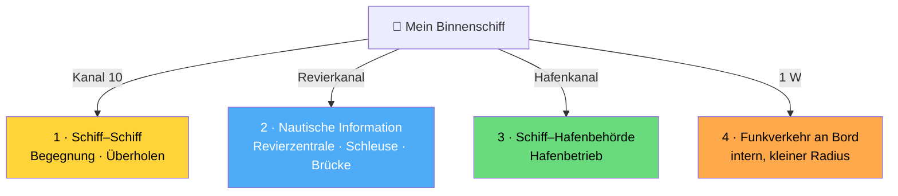

## Funkkurs — UBI: UKW-Binnenschifffahrtsfunk

Modul des [[Funkzeugnis-Kurs SRC und UBI|Funkzeugnis-Kurs SRC & UBI]]. Alles zum **Binnenfunk**: ATIS, Verkehrskreise, Kanäle, Notverkehr, Prüfung.

### Was darf man mit dem UBI?
Bedienung von UKW-Sprechfunkanlagen im **Binnenschifffahrtsfunk**. Pflicht beim Betrieb einer Funkanlage auf Binnenwasserstraßen.

### Rechtsrahmen
- **RAINWAT** — Regionales Abkommen über den Binnenschifffahrtsfunk (regelt einheitliche Nutzung in den Vertragsstaaten).
- **Handbuch Binnenschifffahrtsfunk** — das maßgebliche Nachschlagewerk.
- Mehr zu Zuständigkeiten/Pflicht → [[Funkkurs — Rechtliche Grundlagen]].

### ATIS — genau erklärt (der zentrale Binnenfunk-Unterschied)
**ATIS = Automatic Transmitter Identification System** (automatisches Sender-Identifizierungs-System).

**Was macht ATIS?**
Es hängt an **jede** Aussendung automatisch eine **digitale Kennung** an, die das **sendende Gerät eindeutig identifiziert**. So lässt sich immer nachvollziehen, **wer gefunkt hat** — besonders wichtig, um **Störer** auf den dicht genutzten Binnenkanälen zu finden.

**Wann genau wird es gesendet?**
- **Automatisch beim Loslassen der Sprechtaste** (PTT) — also **am Ende jeder Sendung**.
- Es ist ein **kurzer digitaler Datenburst** (Bruchteil einer Sekunde), **keine hörbare Sprache** — der Funker tut nichts dafür, das Gerät macht es selbst.
- Man stellt ATIS **einmal ein/programmiert** es (richtige Kennung), danach läuft es bei jedem Drücken/Loslassen mit.

**Warum gibt es ATIS?**
Vorgeschrieben durch das Abkommen **RAINWAT** für den Binnenschifffahrtsfunk. Es ersetzt im Binnenbereich die Identifikations-/Anruffunktion, die im Seefunk das **DSC** übernimmt.

**Aufbau der ATIS-Kennung (10 Ziffern):**
```
9   211        01            2345
│   │          │             │
│   │          │             └─ 4 Ziffern aus dem Rufzeichen
│   │          └─ 2 Ziffern für den 2. Buchstaben des Rufzeichens
│   └─ MID (Länderkennung, Deutschland 211)
└─ feste führende 9 (= ATIS-Kennung)
```
*Beispiel:* Rufzeichen **DA2345** → ATIS **9 211 01 2345**. Jede ATIS-Kennung beginnt mit **9**, gefolgt von der **MID** (DE = 211).

**Wichtige Abgrenzungen:**
- **Zuteilung** der ATIS-Kennung durch die **Bundesnetzagentur** (wie MMSI/Rufzeichen) → [[Funkkurs — Rechtliche Grundlagen]].
- **ATIS ≠ DSC:** ATIS ist **nur eine automatische Senderkennung**, **kein** Notalarm und **kein** Selektivruf. Es kann niemanden gezielt anrufen.
- **Im Seefunk ist ATIS sogar verboten**, im Binnenfunk Pflicht → deshalb **Kombigeräte umschalten** ([[Funkkurs — UBI Binnenfunk#Kombianlagen — und warum ein Seefunkgerät im Binnenfunk nicht zulässig ist|siehe oben]]).
- **Im Binnenfunk gibt es kein DSC und keinen Kanal 70.**

> [!tip] Merksatz
> *DSC ruft (Seefunk, K70). ATIS verrät nur, wer gesendet hat (Binnenfunk, automatisch beim Loslassen der Taste).*

### Kombianlagen — und warum ein Seefunkgerät im Binnenfunk nicht zulässig ist
**Kombianlage / Kombigerät** = ein UKW-Gerät, das **beide Welten** kann: **Seefunk** (mit DSC) **und** Binnenfunk (mit ATIS). Man **schaltet zwischen zwei Betriebsarten um**: **See-Modus** (DSC an, ATIS aus) ↔ **Binnen-Modus** (ATIS an, DSC aus).

**Warum geht ein reines Seefunkgerät NICHT für den Binnenfunk?**
| | Seefunk | Binnenfunk |
|---|---|---|
| **ATIS** | **nicht gestattet** | **vorgeschrieben** (Pflicht!) |
| **DSC** | genutzt (K70) | **nicht erlaubt** (gehört zum Seefunk) |
| Kennung | MMSI | ATIS-Kennung |

- Der Binnenfunk **verlangt ATIS** (automatische Senderkennung bei jedem Loslassen der Sprechtaste). Ein **reines Seefunkgerät sendet kein ATIS** — und im Seefunk ist ATIS sogar **verboten**. → Damit erfüllt es die Binnen-Pflicht nicht.
- Umgekehrt **darf im Binnenfunk nicht mit dem DSC-Controller** gearbeitet werden (DSC gehört zum Seefunk).
- Das Gerät muss zudem **für den Binnenschifffahrtsfunk zugelassen** sein.

> 💡 **Merksatz:** *See = DSC, kein ATIS. Binnen = ATIS, kein DSC.* Ein **Kombigerät** kann beides — aber nur, wenn man es **korrekt umschaltet**. Ein reines Seefunkgerät darf am Binnenfunk **nur im Notfall** teilnehmen.

### Die 4 Verkehrskreise (auswendig — Prüfungsklassiker!)
Der Binnenfunk kennt **genau vier** Verkehrskreise:
1. **Schiff–Schiff** — Verkehr zwischen Fahrzeugen (Nautik, Begegnung, Überholen).
2. **Nautische Information** — Schiff ↔ Land, **Revierzentralen / Verkehrsposten** (Schleusen, Brücken, Verkehrslenkung).
3. **Schiff–Hafenbehörde** — Hafenbetrieb.
4. **Funkverkehr an Bord (Bordfunk)** — interne Kommunikation an Bord (niedrige Leistung).

**Merkhilfe:** „Schiff–Schiff, Nautische Info, Hafen, Bord." (vier, nicht fünf!)



### Kanal 10 — der wichtigste Binnen-Kanal
**Kanal 10** ist der **Anruf- und Sicherheitskanal Schiff–Schiff**. Auf ihm muss während der Fahrt **Dauerhörwache** gehalten werden — unabhängig von der befahrenen Strecke.

### Sendeleistung Binnen
- Regulär bis **max. 25 W**, der Lage angepasst herunterregeln.
- Örtlich kann **reduzierte Leistung von 0,5–1 W** verlangt werden (z. B. im **Schleusenbereich**).
- **Bordfunk: nur 1 W** (kleiner Radius gewollt). *Warum 1 W? →* [[Funkkurs — SRC Seefunk (GMDSS)#Warum 1 W im Hafen?|gleiche Logik wie im Seehafen]].

### Notverkehr Binnen
- Auch hier **MAYDAY / PAN PAN / SÉCURITÉ**, aber **per Sprechfunk** (kein DSC).
- Notruf geht an die **Revierzentrale** (Verkehrsposten) bzw. über **Schiff–Schiff (Kanal 10)**.
- Aufbau des MAYDAY-Spruchs analog zum Seefunk, nur mit ATIS-Identifikation statt MMSI.

### UBI-Prüfung
- **Theorie (Vollprüfung):** **22 Multiple-Choice-Fragen**, **17 müssen richtig** sein (max. 5 Fehler) — aus einem Katalog von 130 Fragen.
- **Ergänzungsprüfung für SRC-Inhaber:** nur noch **10 Fragen**, **8 richtig** zum Bestehen (30 Min). → Wer am Wochenende **erst SRC, dann UBI** macht, schreibt nur die kurze Ergänzung!
- **Praxis:** Sprechfunk-Meldungen am Gerät/Simulator (**kein DSC-Teil**).
- **Kein Englisch-Pflichtteil** wie beim SRC — Binnenfunk läuft in der **Landessprache (Deutsch)** nach RAINWAT-Regeln.
- **Mindestalter: 15 Jahre.**

---
Tags: #marine
*Superlink:* [[Funkzeugnis-Kurs SRC und UBI]]
Created: 04/06/26
