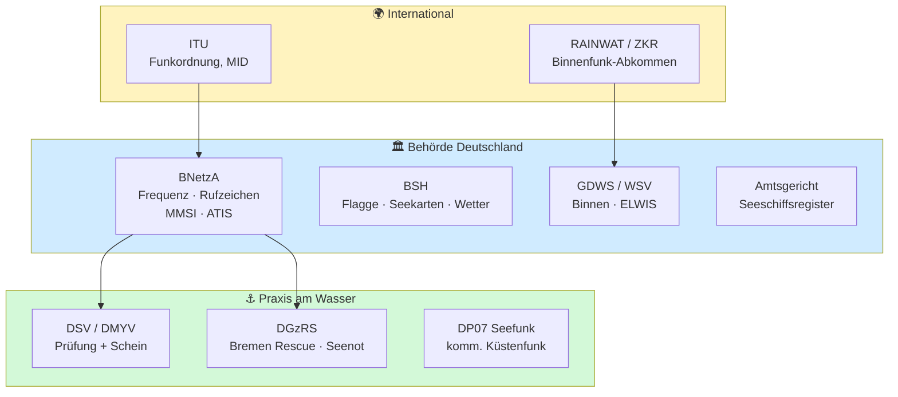

## Funkkurs — Wichtige Stellen & Behörden

Modul des [[Funkzeugnis-Kurs SRC und UBI|Funkzeugnis-Kurs SRC & UBI]]. **Wer ist im Funk-/Schifffahrtswesen für was zuständig?** Übersicht aller relevanten Stellen — fürs Verständnis und für Teilnehmerfragen.

---

### Schnell-Übersicht: Wer macht was?
| Stelle                                        | Kürzel         | Zuständig für (Funk-relevant)                                             |
| --------------------------------------------- | -------------- | ------------------------------------------------------------------------- |
| Bundesnetzagentur, Außenstelle Hamburg        | **BNetzA**     | **Frequenzzuteilung**, **Rufzeichen**, **MMSI**, **ATIS-Kennung**         |
| Deutscher Segler-Verband / Motoryachtverband  | **DSV / DMYV** | **Prüfung & Ausstellung** der Funkzeugnisse (SRC, LRC, UBI)               |
| Bundesamt für Seeschifffahrt und Hydrographie | **BSH**        | **Flaggenzertifikat**, GMDSS-Hintergrund, Seekarten, **Wetter-/Warnfunk** |
| Seeschiffsregister (Amtsgericht)              | —              | **Registrierung** von Seeschiffen (Eigentum, Heimathafen)                 |
| DGzRS / Seenotleitung Bremen                  | **MRCC**       | **Seenotrettung** (SAR), „**Bremen Rescue**"                              |
| Generaldirektion Wasserstraßen u. Schifffahrt | **GDWS / WSV** | **Binnenwasserstraßen**, Verkehr, Aufsicht; betreibt ELWIS                |
| Internationale Fernmeldeunion                 | **ITU**        | Weltweite **Frequenz-/Funkordnung**, vergibt **MID**-Länderblöcke         |
| RAINWAT-Komitee / ZKR (CCNR)                  | —              | **Binnenschifffahrtsfunk-Abkommen**, Handbuch Binnenfunk                  |
| DP07 Seefunk                                  | —              | Privater **kommerzieller UKW-Küstenfunk** (Ostsee/Nordsee)                |

---

### Die Stellen im Detail

#### 🟦 Bundesnetzagentur (BNetzA) — die Funk-Behörde
- Zentrale Stelle für **alles, was das Gerät senden darf**: **Frequenzzuteilung**, Vergabe von **Rufzeichen, MMSI und ATIS-Kennung**.
- Zuständige **Außenstelle Hamburg** (seefunk@bnetza.de).
- Führt die **Datenbank** der Schiffsnamen, Rufzeichen und Kennungen.
- **Merke:** Der Schein erlaubt *dir* zu funken — die BNetzA-Zuteilung erlaubt *dem Gerät*, auf den Frequenzen zu senden.

#### 🟩 DSV / DMYV — Prüfung & Zeugnisse
- **Deutscher Segler-Verband (DSV)** und **Deutscher Motoryachtverband (DMYV)** nehmen im **amtlichen Auftrag** die Funkprüfungen ab und **stellen die Zeugnisse** aus (SRC, LRC, UBI).
- Rechtsbasis See: Schiffssicherheitsverordnung; Binnen: BinSchSprFunkV. → Details: [[Funkkurs — Rechtliche Grundlagen]].

#### 🟧 BSH — Bundesamt für Seeschifffahrt und Hydrographie
- Stellt das **Flaggenzertifikat** für Sportboote aus (Nachweis der deutschen Flagge; gilt 8 Jahre).
- **Fachstelle** für GMDSS-Hintergrund/Seefunk-Anfragen von Berufs- und Sportschifffahrt.
- Gibt **Seekarten** und Sicherheitspublikationen heraus — u. a. **„Wetter- und Warnfunk"** (Sendezeiten/Kanäle der Seewetterberichte) und das **Handbuch Nautischer Funkdienst** (siehe unten).

> [!info] Handbuch Nautischer Funkdienst (BSH 5000)
> Das **amtliche Nachschlagewerk für den Seefunk**, herausgegeben vom **BSH**. Enthält u. a.:
> - **Frequenzen & Sendezeiten** aller **Küstenfunkstellen**, NAVTEX und Wetterfunk
> - **Seenot-/SAR-Dienst**, **funkärztliche Beratung (MEDICO)**, MARPOL-Meldungen
> - **Frequenztabellen** und Kommunikationswege
>
> Für Sportboote gibt es die schlanke Ausgabe **„Funkdienst für die Klein- und Sportschifffahrt"** (früher *Yacht-Funkdienst*) — genau das Richtige für Skipper. → Hier stehen die konkreten Kanäle/Zeiten, die im [[Funkkurs — Revierkanäle Ostsee & Mittelmeer|Revierkanäle-Modul]] nur beispielhaft genannt sind.

#### 🟫 Seeschiffsregister (beim Amtsgericht)
- **Kein bundeseinheitliches** Register — geführt bei den **Amtsgerichten** (z. B. Hamburg, Bremen) am **Heimathafen**.
- **Eintragungspflicht** für Seeschiffe ab **15 m Rumpflänge**; darunter freiwillig.
- Kleinere Boote nutzen oft das **Flaggenzertifikat (BSH)** statt Registereintrag.
- Bezug zum Funk: Schiffsname/Heimathafen → Grundlage für Rufzeichen-/MMSI-Zuteilung.

#### 🟥 DGzRS / MRCC Bremen — „Bremen Rescue"
- **Deutsche Gesellschaft zur Rettung Schiffbrüchiger** betreibt die **Seenotleitung Bremen** als **MRCC** (Maritime Rescue Coordination Centre).
- Küstenfunkstelle **„Bremen Rescue"** hört 24/7 auf **UKW Kanal 16** + **DSC Kanal 70** + **Grenzwelle 2187,5 kHz**.
- **MMSI 00 211 1240** · Telefon **+49-421-53687-0** · Seenot-Mobilfunk **124 124** · mrcc@seenotretter.de
- Koordiniert alle **SAR-Einsätze** im deutschen Teil von Nord- und Ostsee. → [[Funkkurs — Revierkanäle Ostsee & Mittelmeer]].

#### 🟪 GDWS / WSV — Binnen & Wasserstraßen
- **Wasserstraßen- und Schifffahrtsverwaltung des Bundes** (Generaldirektion GDWS): hoheitliche Aufgaben auf Bundeswasserstraßen — Verkehr, Genehmigungen, Schifffahrtspolizei, Unterhaltung.
- Relevanz Funk: Rahmen/Aufsicht **Binnenschifffahrtsfunk** (Revierzentralen, Schleusenfunk); **ABVT Koblenz** für Binnen-Funkfragen.
- Betreibt **ELWIS** (Elektronisches Wasserstraßen-Informationssystem) — Nachschlagewerk für Sprechfunkzeugnisse & Schifffahrtsrecht.

#### 🟨 ITU — International Telecommunication Union
- UN-Sonderorganisation; legt die **weltweite Funkordnung (Radio Regulations)** fest.
- Vergibt die **MID-Länderblöcke** (Deutschland 211/218), aus denen MMSI/ATIS gebildet werden.
- Sorgt dafür, dass Seefunk **weltweit kompatibel** ist (Kanäle, Verfahren, GMDSS).

#### 🟩 RAINWAT-Komitee / ZKR (CCNR)
- **RAINWAT** = Regionales Abkommen über den Binnenschifffahrtsfunk — harmonisiert den Binnenfunk in den Vertragsstaaten, schreibt **ATIS** vor.
- **Zentralkommission für die Rheinschifffahrt (ZKR / CCNR)** gibt das **Handbuch Binnenschifffahrtsfunk** heraus.

#### ⚪ DP07 Seefunk
- **Privater** Betreiber des kommerziellen UKW-Küstenfunks (Nachfolge des früheren staatlichen Seefunks).
- Stationen u. a. Kiel/Lübeck/Rostock/Arkona; Wetterberichte & Gesprächsvermittlung. → [[Funkkurs — Revierkanäle Ostsee & Mittelmeer]].

---

### Die Stellen in 3 Ebenen (Diagramm)

> [!tip] Fürs Verständnis — 3 Ebenen
> 1. **International** → ITU (Regeln, MID) · RAINWAT/ZKR (Binnen).
> 2. **Behörde DE** → BNetzA (Frequenz/Kennungen) · BSH (Flagge/Karten/Wetter) · GDWS-WSV (Binnen) · Amtsgericht (Register).
> 3. **Praxis am Wasser** → DSV/DMYV (Schein) · DGzRS „Bremen Rescue" (Seenot) · DP07 (kommerzieller Küstenfunk).

---
Tags: #marine
*Superlink:* [[Funkzeugnis-Kurs SRC und UBI]]
Created: 04/06/26
