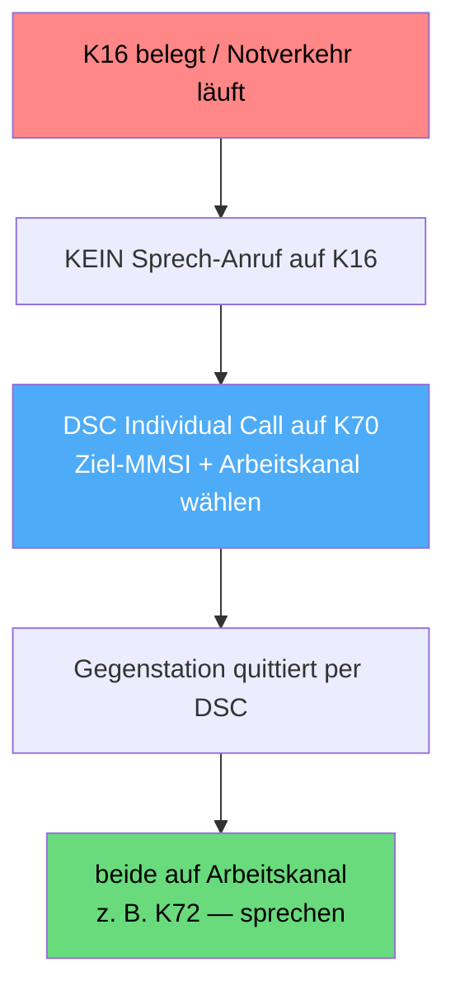
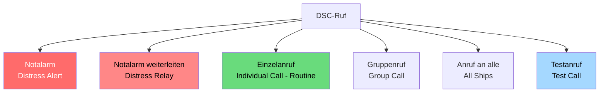

## Funkkurs — DSC: Digital Selective Calling (Digitaler Selektivruf)

Modul des [[Funkzeugnis-Kurs SRC und UBI|Funkzeugnis-Kurs SRC & UBI]]. Das **Herzstück des SRC**: was DSC ist, welche Rufarten es gibt und wie der Notalarm funktioniert.

> [!abstract] In einem Satz
> **DSC = digitaler Anruf per Knopfdruck.** Das Gerät sendet auf **Kanal 70** automatisch ein Datentelegramm mit deiner **MMSI**, Position und Zeit — danach wird gesprochen (meist auf Kanal 16).

---

### 1. Was ist DSC?
- **DSC = Digital Selective Calling** (digitaler Selektivruf), Teil des **GMDSS**.
- Statt zu rufen und zu hoffen, dass jemand mithört, schickt DSC ein **kurzes digitales Telegramm** — schnell, eindeutig, weltweit standardisiert.
- Läuft **ausschließlich auf Kanal 70** (156,525 MHz) — dort wird **nie gesprochen**.
- Erfordert eine programmierte **MMSI** und idealerweise eine angeschlossene **GPS-Position**.

> [!info] DSC ≠ Sprechfunk
> DSC stellt nur die **Verbindung her** (wie Klingeln/SMS). Geredet wird **danach** auf dem Sprechkanal. → Funktionsweise im Detail: [[Funkkurs — SRC Seefunk (GMDSS)#Wie DSC auf Kanal 70 wirklich funktioniert (häufiges Missverständnis!)|Kanal 70 erklärt]].

### DSC-Controller — Kann oder Muss?
> [!question] Ist ein DSC-Controller Pflicht?
> **Jein — es kommt auf die Ebene an:**
> - **Eine Funkanlage überhaupt mitzuführen ist für Sportboote ein „Kann"** (freiwillig) — keine generelle Ausrüstungspflicht (anders als bei Berufsschiffen unter SOLAS).
> - **Wenn** du aber ein **modernes Seefunkgerät** betreibst, ist der **DSC-Controller faktisch ein „Muss"**: Neue UKW-Seefunkanlagen sind DSC-fähig, und das **GMDSS baut auf DSC** auf. Zum Bedienen brauchst du das **SRC**.
> - **Merke:** Funk an Bord = Kann. Aber **moderner Seefunk = mit DSC** (und SRC). Reine „UKW-ohne-DSC"-Altgeräte sind die Ausnahme.

### DSC, wenn Kanal 16 blockiert ist
> [!info] Warum DSC den Kanal 16 entlastet
> DSC ist nicht nur für den Notfall — es ist auch der **saubere Weg, jemanden zu erreichen, ohne Kanal 16 zu benutzen**. Das ist besonders wichtig, wenn **K16 belegt ist** (z. B. durch laufenden **Notverkehr / Silence** — dann **darfst du auf K16 gar nicht senden**).

**So läuft ein DSC-Anruf bei blockiertem Kanal 16:**
1. Du machst **keinen** Sprech-Anruf auf K16. Stattdessen im DSC-Menü einen **Individual Call** an die **MMSI** der Gegenstation.
2. Du **wählst dabei gleich den gewünschten Arbeitskanal** mit aus (z. B. 72).
3. Der Anruf geht digital auf **Kanal 70** raus — **völlig unabhängig von Kanal 16**.
4. Die Gegenstation **quittiert per DSC**; moderne Geräte stellen den vereinbarten **Arbeitskanal automatisch** ein.
5. Ihr sprecht direkt auf dem **Arbeitskanal** — Kanal 16 bleibt für den Notverkehr frei.



> [!tip] Kernvorteil
> Mit DSC rufst du **gezielt eine Station** und **verabredest direkt den Arbeitskanal** — du musst Kanal 16 **nicht** belegen. Genau deshalb hält DSC den Not-/Anrufkanal frei.

### 2. Die DSC-Rufarten


| Rufart | Zweck |
|---|---|
| **Distress Alert** (Notalarm) | roter Knopf → Notruf an alle + Küstenfunkstellen/MRCC |
| **Distress Relay** | fremden Notalarm weiterleiten |
| **Individual Call** (Routine) | gezielter Anruf an **eine** Station (MMSI) |
| **Group Call** | Anruf an eine **Gruppe** (z. B. Flottille) |
| **All Ships Call** | Anruf an **alle** Schiffe (z. B. Sicherheit/Dringlichkeit) |
| **Test Call** | Funktionstest an eine Küstenfunkstelle (auto-Bestätigung) |

### 3. Der DSC-Notalarm im Detail
![[funkkurs-vhf-distress.jpg|420]]
<sub>UKW-Seefunkgerät mit dem roten **DISTRESS-Knopf** (hier unter der Klappe). Bild: Wikimedia Commons, CC BY-SA.</sub>

> [!danger] Roter DISTRESS-Knopf
> Deckel öffnen, **Knopf ~5 Sekunden gedrückt halten** → der Notalarm geht automatisch auf **Kanal 70** raus und enthält: **MMSI · Position · Zeit · (Art der Not)**. Danach schaltet das Gerät selbsttätig auf **Kanal 16** für den Sprech-MAYDAY.

**Designated vs. undesignated:**
- **Designated** (qualifiziert): Du **wählst die Art der Not** (siehe Liste) vor dem Senden.
- **Undesignated** (unqualifiziert): einfach roter Knopf ohne Auswahl → „undefinierte Not". Im Zweifel/bei Zeitnot **völlig in Ordnung** — Hauptsache, der Alarm geht raus.

**Auswahl „Nature of Distress" (Art der Not) im DSC-Menü:**
| Englisch (Display) | Deutsch |
|---|---|
| **Fire, explosion** | Feuer, Explosion |
| **Flooding** | Wassereinbruch |
| **Collision** | Kollision |
| **Grounding** | Auf Grund gelaufen |
| **Listing, capsizing** | Schlagseite / kentert |
| **Sinking** | Sinkend |
| **Disabled and adrift** | Manövrierunfähig, treibend |
| **Abandoning ship** | Schiff wird verlassen |
| **Piracy / armed attack** | Piraterie / bewaffneter Überfall |
| **Man overboard** | Mensch über Bord |
| **Undesignated distress** | Unbestimmte Not (Standard) |

> [!tip] Im Ernstfall
> Lieber **schnell „undesignated"** absetzen als lange im Menü suchen — der Alarm mit Position ist das Wichtigste. Die genaue Art der Not sagst du ohnehin gleich danach im Sprech-MAYDAY.

**Position & Zeit:**
- Bei angeschlossenem **GPS** automatisch aktuell. Ohne GPS **manuell eingeben** (sonst sendet das Gerät keine/veraltete Position).

> [!important] Position nur beim NOTALARM!
> Die **Position (und Zeit) wird ausschließlich beim Notalarm (Distress)** automatisch im DSC-Telegramm mitgesendet. Bei **Dringlichkeit (PAN PAN)** und **Sicherheit (SÉCURITÉ)** überträgt der DSC-Ankündigungsruf **keine Position** — die nennt man dann **im Sprechfunk**. (Der DSC-Ruf enthält dort nur die Kategorie + MMSI.)

> [!tip] Empfangsbestätigung
> Nach dem Alarm **auf Antwort warten**. Eine **Küstenfunkstelle/MRCC** bestätigt per DSC und übernimmt den Notverkehr. Erst wenn niemand quittiert, wiederholt sich der Alarm automatisch.

### 4. MMSI — die Adresse im DSC
- **9-stellige** Nummer, die deine Funkstelle eindeutig identifiziert (erste drei Ziffern = **MID**, DE 211/218).
- **Muss programmiert sein** — sonst ist der Notalarm wertlos.
- Vergabe durch die **Bundesnetzagentur** → [[Funkkurs — Rechtliche Grundlagen]].

> [!warning] Häufiger Praxisfehler
> Schein vorhanden, aber **MMSI nie beantragt / nie ins Gerät programmiert** → der DSC-Notalarm sendet keine gültige Kennung. Unbedingt prüfen!

### 5. Fehlalarm — was tun?
> [!danger] Versehentlichen DSC-Notalarm NICHT einfach ausschalten!
> Sofort per Sprechfunk auf **Kanal 16** widerrufen:
> ```
> ALL STATIONS – ALL STATIONS – ALL STATIONS
> THIS IS  <Schiffsname 3×>  Call Sign  MMSI
> PLEASE CANCEL MY DISTRESS ALERT OF <Uhrzeit UTC>
> OUT
> ```
> Mehr: [[Funkkurs — Notverfahren & Funkschema (alle Fälle)]].

### 6. DSC im Binnenfunk?
> [!info] Nein!
> Im **Binnenfunk gibt es kein DSC** (und keinen Kanal 70). Dort identifiziert **ATIS** den Sender, der Notruf läuft per Sprechfunk an die Revierzentrale. → [[Funkkurs — UBI Binnenfunk]].

---
*Superlink:* [[Funkzeugnis-Kurs SRC und UBI]]
Created: 04/06/26
