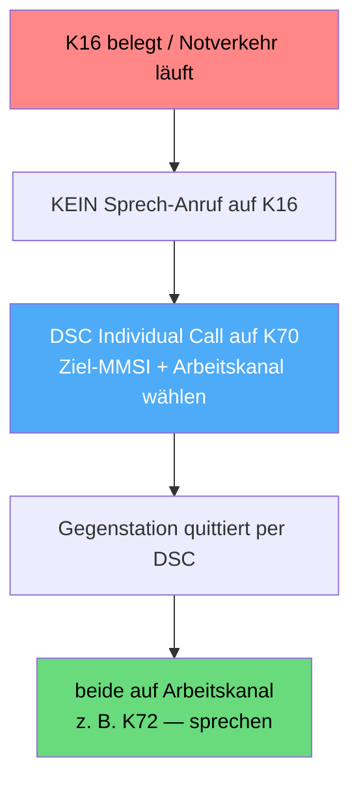
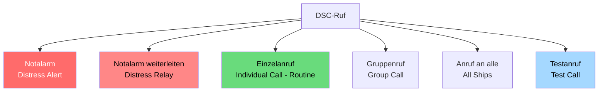

## Funkkurs - DSC: Digital Selective Calling (Digitaler Selektivruf)

Modul des [[Funkzeugnis-Kurs SRC und UBI|Funkzeugnis-Kurs SRC & UBI]]. Das Herzstück des SRC: was DSC ist, welche Rufarten es gibt und wie der Notalarm funktioniert.

In einem Satz: **DSC** ist der digitale Anruf per Knopfdruck. Das Gerät sendet auf Kanal 70 automatisch ein Datentelegramm mit deiner MMSI, Position und Zeit - danach wird gesprochen, meist auf Kanal 16.

---

### 1. Was ist DSC?
- DSC steht für Digital Selective Calling (digitaler Selektivruf) und ist Teil des GMDSS.
- Statt zu rufen und zu hoffen, dass jemand mithört, schickt DSC ein kurzes digitales Telegramm - schnell, eindeutig, weltweit standardisiert.
- Läuft ausschließlich auf **Kanal 70** (156,525 MHz); dort wird nie gesprochen.
- Erfordert eine programmierte MMSI und idealerweise eine angeschlossene GPS-Position.

DSC ist dabei nicht selbst Sprechfunk - es stellt nur die Verbindung her, ähnlich wie Klingeln oder SMS. Geredet wird danach auf dem Sprechkanal. Die Funktionsweise im Detail steht in [[Funkkurs — SRC Seefunk (GMDSS)#Wie DSC auf Kanal 70 wirklich funktioniert (häufiges Missverständnis!)|Kanal 70 erklärt]].

### DSC-Controller - Kann oder Muss?
Ob ein DSC-Controller Pflicht ist, hängt von der Ebene ab. Eine Funkanlage überhaupt mitzuführen ist für Sportboote ein „Kann", also freiwillig - es gibt keine generelle Ausrüstungspflicht (anders als bei Berufsschiffen unter SOLAS). Wenn du aber ein modernes Seefunkgerät betreibst, ist der DSC-Controller faktisch ein Muss: Neue UKW-Seefunkanlagen sind DSC-fähig, und das GMDSS baut auf DSC auf; zum Bedienen brauchst du das SRC. Funk an Bord ist also Kann, moderner Seefunk dagegen heißt mit DSC (und SRC). Reine „UKW-ohne-DSC"-Altgeräte sind die Ausnahme.

### DSC, wenn Kanal 16 blockiert ist
DSC ist nicht nur für den Notfall da - es ist auch der saubere Weg, jemanden zu erreichen, ohne Kanal 16 zu benutzen. Das ist besonders wichtig, wenn K16 belegt ist, etwa durch laufenden Notverkehr oder Silence, denn dann darfst du auf K16 gar nicht senden.

So läuft ein DSC-Anruf bei blockiertem Kanal 16:
1. Du machst keinen Sprech-Anruf auf K16. Stattdessen im DSC-Menü einen **Individual Call** an die MMSI der Gegenstation.
2. Du wählst dabei gleich den gewünschten Arbeitskanal mit aus (z. B. 72).
3. Der Anruf geht digital auf Kanal 70 raus - völlig unabhängig von Kanal 16.
4. Die Gegenstation quittiert per DSC; moderne Geräte stellen den vereinbarten Arbeitskanal automatisch ein.
5. Ihr sprecht direkt auf dem Arbeitskanal - Kanal 16 bleibt für den Notverkehr frei.



Der Kernvorteil: Mit DSC rufst du gezielt eine Station und verabredest direkt den Arbeitskanal - du musst Kanal 16 nicht belegen. Genau deshalb hält DSC den Not- und Anrufkanal frei.

### 2. Die DSC-Rufarten


| Rufart | Zweck |
|---|---|
| Distress Alert (Notalarm) | roter Knopf → Notruf an alle + Küstenfunkstellen/MRCC |
| Distress Relay | fremden Notalarm weiterleiten |
| Individual Call (Routine) | gezielter Anruf an eine Station (MMSI) |
| Group Call | Anruf an eine Gruppe (z. B. Flottille) |
| All Ships Call | Anruf an alle Schiffe (z. B. Sicherheit/Dringlichkeit) |
| Test Call | Funktionstest an eine Küstenfunkstelle (auto-Bestätigung) |

### 3. Der DSC-Notalarm im Detail
![[funkkurs-vhf-distress.jpg|420]]
<sub>UKW-Seefunkgerät mit dem roten DISTRESS-Knopf (hier unter der Klappe). Bild: Wikimedia Commons, CC BY-SA.</sub>

Roter **DISTRESS-Knopf**
Deckel öffnen, Knopf ~5 Sekunden gedrückt halten → der Notalarm geht automatisch auf Kanal 70 raus und enthält: MMSI · Position · Zeit · (Art der Not). Danach schaltet das Gerät selbsttätig auf Kanal 16 für den Sprech-MAYDAY.

Ich stelle mir den roten Knopf gern wie den Feueralarm im Treppenhaus vor: einmal gedrückt, läuft alles automatisch - und genau deshalb tippt man ihn nie „zum Ausprobieren" an.

Beim Auslösen unterscheidet man designated und undesignated. Designated (qualifiziert) heißt, du wählst die Art der Not vor dem Senden aus (siehe Liste). Undesignated (unqualifiziert) ist einfach der rote Knopf ohne Auswahl, also eine „undefinierte Not". Bei Zweifel oder Zeitnot ist das völlig in Ordnung - Hauptsache, der Alarm geht raus.

Auswahl „Nature of Distress" (Art der Not) im DSC-Menü:
| Englisch (Display) | Deutsch |
|---|---|
| Fire, explosion | Feuer, Explosion |
| Flooding | Wassereinbruch |
| Collision | Kollision |
| Grounding | Auf Grund gelaufen |
| Listing, capsizing | Schlagseite / kentert |
| Sinking | Sinkend |
| Disabled and adrift | Manövrierunfähig, treibend |
| Abandoning ship | Schiff wird verlassen |
| Piracy / armed attack | Piraterie / bewaffneter Überfall |
| Man overboard | Mensch über Bord |
| Undesignated distress | Unbestimmte Not (Standard) |

Im Ernstfall setzt man lieber schnell „undesignated" ab, als lange im Menü zu suchen - der Alarm mit Position ist das Wichtigste. Die genaue Art der Not sagst du ohnehin gleich danach im Sprech-MAYDAY.

> [!important] Position nur beim NOTALARM
> Position und Zeit werden ausschließlich beim Notalarm (Distress) automatisch im DSC-Telegramm mitgesendet. Bei Dringlichkeit (PAN PAN) und Sicherheit (SÉCURITÉ) überträgt der DSC-Ankündigungsruf keine Position - die nennt man dann im Sprechfunk. (Der DSC-Ruf enthält dort nur die Kategorie + MMSI.) Bei angeschlossenem GPS ist die Position automatisch aktuell; ohne GPS musst du sie manuell eingeben, sonst sendet das Gerät keine oder eine veraltete Position.

Nach dem Alarm wartet man auf Antwort. Eine Küstenfunkstelle oder das MRCC bestätigt per DSC und übernimmt den Notverkehr. Erst wenn niemand quittiert, wiederholt sich der Alarm automatisch.

### 4. MMSI - die Adresse im DSC
- Eine 9-stellige Nummer, die deine Funkstelle eindeutig identifiziert (die ersten drei Ziffern sind die MID, für Deutschland 211/218).
- Muss programmiert sein - sonst ist der Notalarm wertlos.
- Vergeben wird sie durch die Bundesnetzagentur → [[Funkkurs — Rechtliche Grundlagen]].

Ein häufiger Praxisfehler: Der Schein ist vorhanden, aber die **MMSI** wurde nie beantragt oder nie ins Gerät programmiert - dann sendet der DSC-Notalarm keine gültige Kennung. Das unbedingt prüfen.

### 5. Fehlalarm - was tun?
> [!danger] Versehentlichen DSC-Notalarm NICHT einfach ausschalten
> Sofort per Sprechfunk auf Kanal 16 widerrufen - sonst läuft eine echte SAR-Suche nach dir an.

```
ALL STATIONS - ALL STATIONS - ALL STATIONS
THIS IS <Schiffsname 3×> Call Sign MMSI
PLEASE CANCEL MY DISTRESS ALERT OF <Uhrzeit UTC>
OUT
```
Mehr: [[Funkkurs — Notverfahren & Funkschema (alle Fälle)]].

### 6. DSC im Binnenfunk?
Im Binnenfunk gibt es kein DSC und keinen Kanal 70. Dort identifiziert ATIS den Sender, und der Notruf läuft per Sprechfunk an die Revierzentrale → [[Funkkurs — UBI Binnenfunk]].

---
*Superlink:* [[Funkzeugnis-Kurs SRC und UBI]]
Created: 04/06/26
