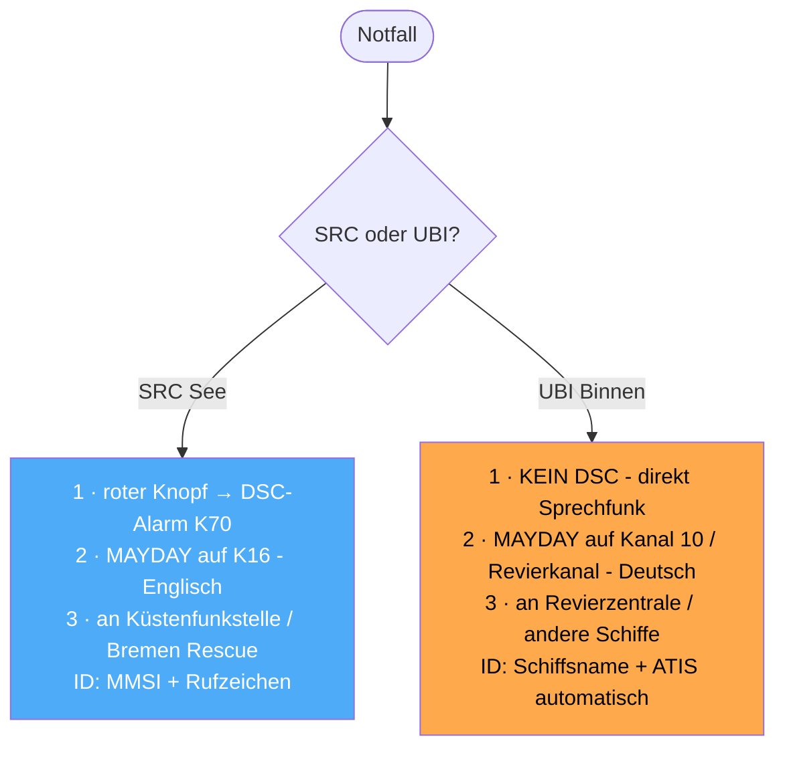
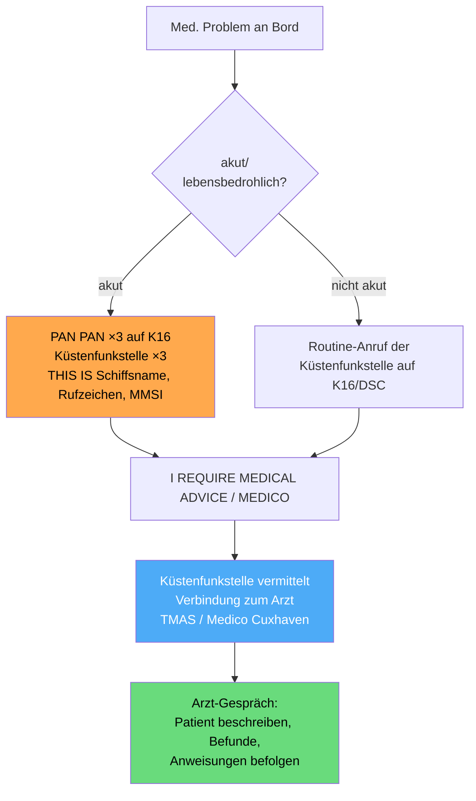
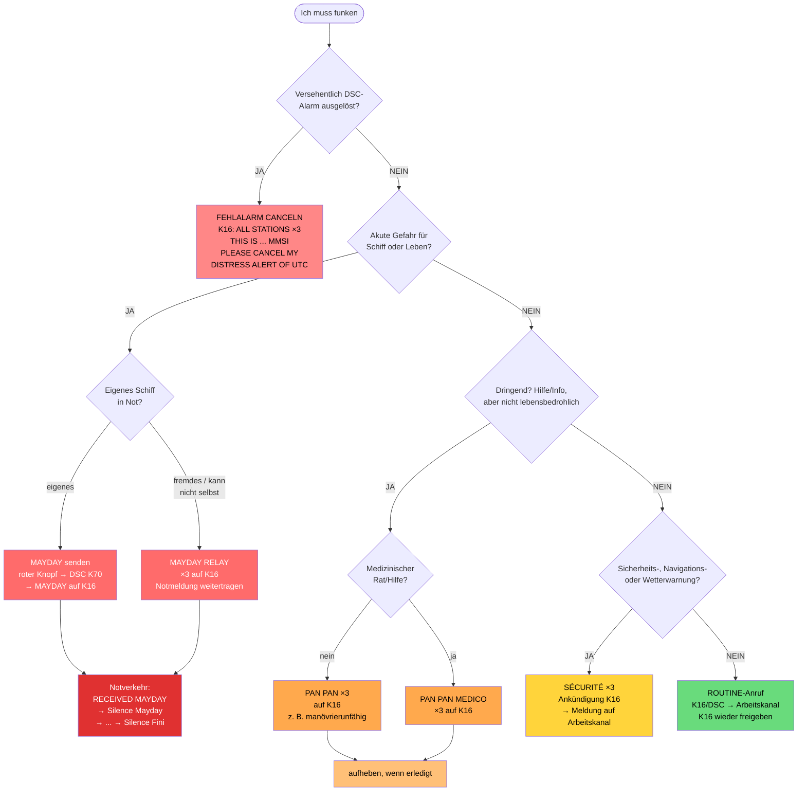
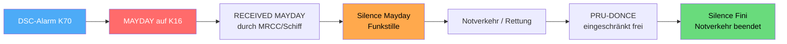

## Funkkurs — Notverfahren & Funkschema (alle Fälle)


Modul des [[Funkzeugnis-Kurs SRC und UBI|Funkzeugnis-Kurs SRC & UBI]]. **Komplettes Ablaufschema** für alle GMDSS-Fälle: Notmeldung, Weiterleiten, Bestätigen, Funkstille, Aufheben, Fehlalarm, Dringlichkeit, Sicherheit.

> [!quote] Mein wichtigster Tipp fürs Notverfahren
> Im Ernstfall vergisst du die Hälfte von dem hier — das ist normal, der Puls geht hoch. Deshalb übe ich mit der Crew genau **eine** Reflexkette ein: **roter Knopf → Kanal 16 → „MAYDAY, this is …, Position, was los ist, wie viele wir sind".** Den Rest macht das Gerät oder die Küstenfunkstelle. Lieber holprig den Notruf raushauen als perfekt zu schweigen.

**Funkschema-Matrix — alle Fälle auf einen Blick:**

![[Funkschema-GMDSS-Matrix-alle-Faelle.png]]

<sub>Matrix nach Spalten: Notmeldung (aussenden/weiterleiten/bestätigen) · Notverkehr (Funkstille/Beenden) · Fehlalarm canceln · Dringlichkeit (aussenden/aufheben) · Sicherheitsmeldung · Routineverkehr. Zeilen: DSC-Prio (CH 70) · Sprechfunk-Kanal · Ankündigung · Adressat · Absender · Meldung · OVER. Darunter alles zusätzlich als Schema + Wortlaut aufbereitet.</sub>

> [!warning] Dieses Schema gilt für SRC (Seefunk/GMDSS)
> Im **UBI (Binnenfunk)** läuft der Notfall **anders** — siehe Abschnitt direkt unten.

---

### ⚖️ SRC vs. UBI — der Unterschied im Notverfahren
| | **SRC (Seefunk/GMDSS)** | **UBI (Binnenfunk)** |
|---|---|---|
| **DSC / Kanal 70** | **Ja** — DSC-Notalarm auf K70 **zuerst** | **Nein** — kein DSC, kein K70 |
| **Sprechfunk-Kanal** | **K16** (Anruf/Not) | **Kanal 10** (Schiff–Schiff) / **Revierkanal** |
| **Empfänger** | Küstenfunkstelle / **MRCC „Bremen Rescue"** | **Revierzentrale** (Verkehrsposten) / andere Schiffe |
| **Identifikation** | **MMSI** + Rufzeichen + Schiffsname | **Schiffsname** (+ automatische **ATIS**-Kennung) |
| **Sprache** | **Englisch** | **Deutsch** |
| **Kennwörter** | MAYDAY · PAN PAN · SÉCURITÉ (+ Silence …) | gleiche Kennwörter, aber **nur Sprechfunk** |



> [!tip] Kernsatz SRC vs. UBI
> Die **Kennwörter** (MAYDAY/PAN PAN/SÉCURITÉ) sind gleich — aber **SRC** macht **DSC-Alarm (K70) → MAYDAY (K16) auf Englisch**, während **UBI direkt per Sprechfunk** auf **Kanal 10 / Revierkanal auf Deutsch** läuft (ohne DSC, mit ATIS statt MMSI).

---

> [!info] Hinweis
> Das ausführliche Schema unten (Matrix + Wortlaute) ist das **SRC/GMDSS-Verfahren**. Die UBI-Kurzform steht oben.

---

### Die 3 Dringlichkeitsstufen auf einen Blick

| Stufe | Kennwort (3×) | Wann | Sprich auf |
|---|---|---|---|
| **Not** | **MAYDAY** | unmittelbare Gefahr für Schiff/Person, sofortige Hilfe | DSC K70 → Sprechfunk **K16** |
| **Dringlichkeit** | **PAN PAN** | dringend, aber (noch) keine akute Gefahr | DSC K70 → **K16**, dann Arbeitskanal |
| **Sicherheit** | **SÉCURITÉ** | Sicherheits-/Navigations-/Wetterwarnung | Ankündigung **K16** → Arbeitskanal |

Aussprache: **PAN PAN** = „pann pann", **SÉCURITÉ** = „ßekürität".

> [!question] Warum heißt es SOS — und was ist SAR?
> **SOS** ist das **Morse-Seenotzeichen**: `· · ·  — — —  · · ·` (drei kurz, drei lang, drei kurz), **ohne Pausen** als *ein* durchgehendes Zeichen gesendet.
> - Es ist **keine Abkürzung!** 1906 gewählt, weil diese Morsefolge **einfach, eindeutig und unverwechselbar** ist — auch bei schlechtem Empfang sofort erkennbar.
> - „Save Our Souls" / „Save Our Ship" sind **nachträgliche Eselsbrücken** (Backronyme), nicht der Ursprung.
> - Im **Sprechfunk** entspricht SOS dem **MAYDAY** (von frz. *m'aider* = „helft mir"). Also: **SOS = Morse/Telegrafie, MAYDAY = gesprochen.**
>
> **SAR = Search and Rescue** = der **Such- und Rettungsdienst** auf See. Der Funkverkehr **vor Ort** läuft auf **Kanal 06** (On-Scene); ein **OSC** (On-Scene Coordinator) leitet die Einsatzkräfte.

> [!info] RCC, MRCC & Co. — wer koordiniert die Rettung?
> - **RCC = Rescue Co-ordination Centre** = allgemeine **Rettungsleitstelle**, die einen SAR-Einsatz **leitet und koordiniert**.
> - **MRCC = Maritime Rescue Co-ordination Centre** = das RCC **für die Seefahrt**. In Deutschland ist das die **Seenotleitung Bremen** (Funkrufname **„Bremen Rescue"**, betrieben von der DGzRS) → [[Funkkurs — Wichtige Stellen & Behörden]].
> - **OSC = On-Scene Coordinator** (Einsatzleiter vor Ort) = das Schiff/Boot/Luftfahrzeug, das die Rettung **direkt am Unglücksort** koordiniert. Wird vom **MRCC** bestimmt (oft das erste geeignete Schiff vor Ort oder ein Rettungskreuzer). Aufgaben:
>   - **Suchmuster** organisieren und die eintreffenden Helfer einteilen,
>   - **Funk-Bindeglied** zwischen den Einheiten vor Ort und dem MRCC,
>   - On-Scene-Funkverkehr meist auf **Kanal 06** (oder 16) bündeln, Doppelarbeit vermeiden.
>   - Darf auch **Silence** anordnen, wenn er den Notverkehr leitet.
>
> **Merke:** Dein DSC-Notalarm/MAYDAY landet beim **MRCC** (Bremen Rescue). Das **MRCC plant** den Gesamteinsatz und bestimmt einen **OSC**, der die Helfer **vor Ort** dirigiert.

---

### Die vier Verkehrsarten — Beschreibung & Beispiele
Der Seefunk kennt **vier Verkehrsarten**, streng nach Priorität geordnet (Not geht immer vor):

#### 🔴 1. Notverkehr (Distress) — Kennwort **MAYDAY**
**Wann:** Ein Schiff oder eine Person ist in **unmittelbarer Gefahr** und braucht **sofortige Hilfe**. Hat **höchste Priorität** — alles andere schweigt.
**Beispiele:**
- Schiff **sinkt** / macht schwer Wasser
- **Feuer** an Bord
- **Mensch über Bord**, den man nicht selbst bergen kann
- Schiff **aufgelaufen** und in Brandung in Gefahr
- schwerer **Wassereinbruch** nach Kollision

#### 🟠 2. Dringlichkeitsverkehr (Urgency) — Kennwort **PAN PAN**
**Wann:** Eine **dringende Meldung** zur Sicherheit eines Schiffes/einer Person — aber **(noch) keine unmittelbare Lebensgefahr**.
**Beispiele:**
- **Manövrierunfähig** (Motorschaden/Ruderbruch) ohne akute Gefahr
- **Treibstoff leer**, abgetrieben, aber stabil
- **medizinischer Notfall** an Bord → **MEDICO** (siehe unten)
- Person **vermisst**, Lage noch nicht lebensbedrohlich
- Mast gebrochen, Schiff aber schwimmfähig

#### 🟡 3. Sicherheitsverkehr (Safety) — Kennwort **SÉCURITÉ**
**Wann:** Eine **Sicherheitsmeldung** — Gefahren für die Schifffahrt oder Wetter/Navigation.
**Beispiele:**
- **Treibendes Hindernis** (Container, Baumstamm, verlorene Ladung)
- **Navigationswarnung** (ausgefallenes Seezeichen, Tonne vertrieben)
- **Sturm-/Wetterwarnung** der Küstenfunkstelle
- militärische Sperrgebiete, Schießübungen

#### 🟢 4. Routineverkehr (Routine) — kein Kennwort
**Wann:** **Normaler Funkverkehr** ohne Sicherheitsbezug.
**Beispiele:**
- **Marina/Hafen anrufen** (Liegeplatz reservieren)
- **Schleuse/Brücke** kontaktieren
- **Schiff-Schiff**-Absprache (Überholen, Treffpunkt)
- **Wetterbericht** abfragen, Gesprächsvermittlung

![[funkkurs-verkehrsarten-prio.png]]

> [!abstract] Prioritäts-Merksatz
> **Not → Dringlichkeit → Sicherheit → Routine.** Eine höhere Stufe hat immer Vorrang; bei Notverkehr müssen alle anderen schweigen (Silence).

---

### 🩺 MEDICO — Funkärztliche Beratung (Radio Medical Advice)
**Was ist das?** Ein **kostenloser, weltweiter, rund um die Uhr** erreichbarer **funkärztlicher Beratungsdienst** für medizinische Notfälle an Bord. In Deutschland: **TMAS Germany – „Medico Cuxhaven"** (Telemedical Maritime Assistance Service), seit 1931 am Krankenhaus Cuxhaven, im Auftrag der Bundesrepublik.

**Wann?** Krankheit/Verletzung an Bord, bei der man **ärztlichen Rat** braucht — vom Sonnenstich bis zum Verdacht auf Herzinfarkt. In **akuten Fällen** wird das Gespräch als **Dringlichkeit (PAN PAN)** abgesetzt.

**Ablauf-Schema (über UKW):**


**Praxis-Tipps für die Teilnehmer:**
- **Vorher untersuchen:** Patienten so gut wie möglich untersuchen; den **MEDICO-Untersuchungsbogen** (See-BG/DGUV, zweisprachig) ausfüllen und nach Möglichkeit **vorab faxen/mailen** — verbessert die Diagnose.
- Knappe, klare **Beschreibung der Krankheit/Verletzung** geben.
- Kontakt (DE): **TMAS Germany / Medico Cuxhaven**, Notruf **+49 4721 78-0** (24 h), medico@tmas-germany.de.
- **Merke:** MEDICO ist **Dringlichkeit (PAN PAN)**, kein MAYDAY — außer es besteht zusätzlich akute Lebensgefahr.

---

### Master-Schema: Welcher Fall? (Entscheidungsbaum)



**Kanal-Spickzettel zum Baum:** Alle Not-/Dringlichkeits-/Sicherheits-**Ankündigungen** laufen über **K16** (DSC-Teil über **K70**). Die eigentliche **Sicherheits-/Routine-Meldung** wandert dann auf einen **Arbeitskanal** — **K16 wird freigehalten**.

---

### 1) MAYDAY — eigene Notmeldung
**Ablauf:** roter **DISTRESS-Knopf** → DSC-Alarm automatisch auf **K70** → Gerät springt auf **K16** → Sprech-MAYDAY (Englisch):

```
MAYDAY – MAYDAY – MAYDAY
THIS IS  <Schiffsname 3×>  Call Sign  MMSI
MAYDAY   <Schiffsname 1×>  Call Sign  MMSI
POSITION: ...
NATURE OF DISTRESS: ...        (sinking / fire / man overboard / aground …)
ASSISTANCE REQUIRED: ...
PERSONS ON BOARD: ...
OTHER INFORMATION: ...
OVER
```

### 2) RECEIVED MAYDAY — Bestätigung einer empfangenen Notmeldung
Wenn du einen MAYDAY hörst und (nahe genug) helfen kannst — **erst kurz warten**, ob eine Küstenfunkstelle/MRCC quittiert. Tut das niemand, bestätigst du auf **K16**:

```
MAYDAY
<Schiffsname der Notmeldung 3×>
THIS IS  <eigener Schiffsname 3×>
RECEIVED MAYDAY
```

### 3) MAYDAY RELAY — fremde Notmeldung weiterleiten
Wenn ein Schiff in Not **selbst nicht (mehr) senden** kann oder du den Notruf weitertragen musst:

```
MAYDAY RELAY – MAYDAY RELAY – MAYDAY RELAY
ALL STATIONS (oder Name Küstenfunkstelle) 3×
THIS IS  <eigener Schiffsname 3×>  Call Sign  MMSI
... es folgt die Notmeldung des havarierten Schiffes
OVER
```

### 4) Funkstille anordnen — Silence Mayday / Silence Distress
Damit der Notverkehr nicht gestört wird, wird **Funkstille** geboten (auf K16):
- **Silence Mayday** (Aussprache: „Seelonce Mäidäi") — gesprochen vom **Schiff in Not** oder der **leitenden Station** (MRCC/OSC).
- **Silence Distress** (Aussprache: „Seelonce Distress") — gesprochen von **jeder anderen** Station, die Störungen bemerkt.

```
Silence Mayday        (Aussprache: „Seelonce Mäidäi")
```
→ Alle, die nicht am Notverkehr beteiligt sind, **dürfen auf diesen Frequenzen nicht senden**.

### 5) Funkstille lockern — PRU-DONCE
Wenn der Notverkehr **teilweise** wieder eingeschränkten Normalverkehr zulässt:
```
PRU-DONCE             (von „prudence" — Vorsicht; eingeschränkter Verkehr wieder erlaubt)
```

### 6) Notverkehr beenden — Silence Fini
Wenn der Notfall **abgeschlossen** ist und der Verkehr wieder frei läuft (nur **leitende Station / MRCC / Schiff in Not**):
```
MAYDAY
ALL STATIONS – ALL STATIONS – ALL STATIONS
THIS IS  <Name der Station 3×>
<Uhrzeit UTC>
<Name + Rufzeichen des havarierten Schiffes>
Silence Fini        (Aussprache: „Seelonce Feenee" — Stille beendet)
```

### 7) Fehlalarm widerrufen — Cancel Distress Alert
**Versehentlichen DSC-Notalarm NICHT einfach ausschalten!** Sofort per Sprechfunk auf **K16** widerrufen:
```
ALL STATIONS – ALL STATIONS – ALL STATIONS
THIS IS  <Schiffsname 3×>  Call Sign  MMSI
PLEASE CANCEL MY DISTRESS ALERT OF <Uhrzeit UTC>
OUT
```

### 8) PAN PAN — Dringlichkeitsmeldung
```
PAN PAN – PAN PAN – PAN PAN
ALL STATIONS (oder Name Station) 3×
THIS IS  <Schiffsname 3×>  Call Sign  MMSI
POSITION / Problem / benötigte Hilfe
OVER
```
Typisch: manövrierunfähig ohne akute Gefahr, medizinischer Rat (PAN PAN MEDICO), Person vermisst aber Lage stabil.

### 9) SÉCURITÉ — Sicherheitsmeldung
```
SÉCURITÉ – SÉCURITÉ – SÉCURITÉ
ALL STATIONS 3×
THIS IS  <Schiffsname 3×>  Call Sign  MMSI
... auf Arbeitskanal XX wechseln ...
```
Dann auf dem **angekündigten Arbeitskanal** die eigentliche Meldung (Navigationswarnung, treibendes Hindernis, Wetterwarnung). **K16 freihalten.**

---

### Lebenszyklus einer Notlage (Überblick)



> [!tip] Merkkette für die Teilnehmer
> *Alarm → MAYDAY → RECEIVED → Silence → (Rettung) → PRU-DONCE → Silence Fini.*

---
*Superlink:* [[Funkzeugnis-Kurs SRC und UBI]]
Created: 04/06/26
